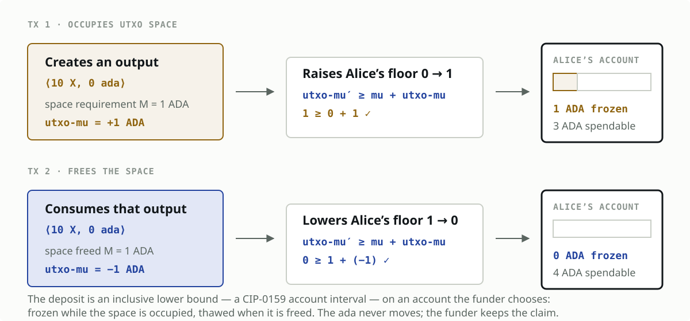
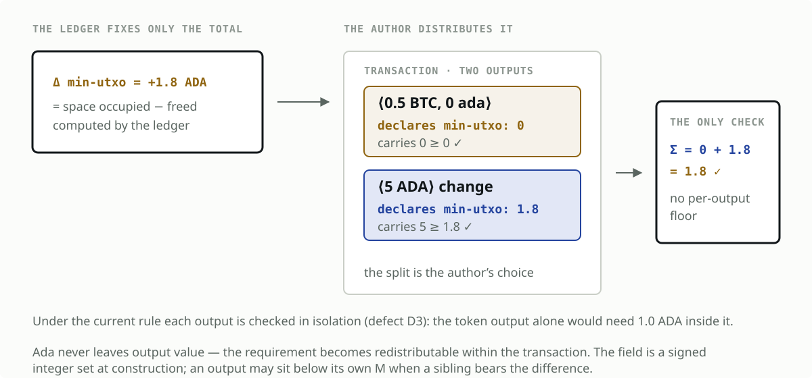

> **DESIGN SKETCH — not for submission.** This document turns the *implicit-minUTxO*
> view sketched by Alexey Kuleshevich at the Ledger Working Group meeting of
> 2026-08-03 into a concrete ledger model so that its invariants, trade-offs, and
> unresolved choices can be reviewed. Two further variants proposed by Polina
> Vinogradova are carried alongside it rather than discarded, and all three are
> compared in [section 3.5](#35-where-the-deposit-is-held). Text marked **OPEN**
> requires a decision. It is not a claim of Working Group consensus.

## Table of Contents

1. [Abstract](#1-abstract)
2. [Motivation](#2-motivation-why-is-this-cip-necessary)
3. [Specification](#3-specification)
   1. [Terminology](#31-terminology)
   2. [Core model](#32-core-model)
   3. [Deposit calculation](#33-deposit-calculation)
   4. [Transaction accounting](#34-transaction-accounting)
      1. [Net resource delta](#341-net-resource-delta)
      2. [Monetary settlement](#342-monetary-settlement)
      3. [Worked examples](#343-worked-examples)
      4. [The transaction view](#344-the-transaction-view)
   5. [Where the deposit is held](#35-where-the-deposit-is-held)
   6. [Persisted metadata](#36-persisted-metadata)
   7. [Validation rules](#37-validation-rules)
   8. [Migration](#38-migration)
   9. [Plutus and tooling](#39-plutus-and-tooling)
4. [Rationale](#4-rationale-how-does-this-cip-achieve-its-goals)
5. [Open Design Decisions](#5-open-design-decisions)
6. [Path to Active](#6-path-to-active)
7. [Copyright](#7-copyright)

## 1. Abstract

Cardano currently requires every transaction output to carry a minimum quantity of
ada derived from the output's size (`minUTxO`). That ada is indistinguishable from
the output's ordinary value, yet it behaves as a deposit: it is committed for as long
as the entry lives and becomes freely spendable again only when the entry is consumed.

This proposal makes that implicit deposit **explicit**. The `minUTxO` calculation is
left unchanged, so the state-growth bound and its security profile are preserved. What
changes is where the ada is accounted for. Instead of being embedded in
`TxOut.Value`, it is settled through two ledger-computed, transaction-level
quantities — **`utxoDeposit`** (ada locked for the state the transaction creates) and
**`utxoRefund`** (ada released for the state the transaction consumes) — in exactly
the way the ledger already accounts for stake-key, pool, and governance deposits.

An output may then carry as little ada as its owner chooses, down to zero for a pure
native-asset transfer. The ledger holds the difference between an output's `minUTxO`
requirement and the ada it actually carries as a recorded, refundable state deposit.
**Today's behaviour is the special case in which an output already carries at least
its full requirement: its deposit is zero and nothing changes.** That property is what
lets pre- and post-activation outputs coexist without a chain-wide migration.

The central accounting quantity is therefore the transaction's **net deposit delta**:
deposits created minus deposits released. State-growing transactions fund the
difference; state-reducing transactions are refunded it. Native assets, scripts, and
application state no longer need an unrelated ada amount embedded in every output.

This is the *implicit-minUTxO* view sketched by Alexey Kuleshevich at the Ledger
Working Group (2026-08-03). Two further variants from Polina Vinogradova preserve the
same aggregate accounting while changing where the ada ends up: holding the obligation
in an account the funder controls — the only option that keeps the funder's claim on
the deposit — or leaving the ada in outputs and letting the transaction redistribute
the requirement across them. All three are compared in
[section 3.5](#35-where-the-deposit-is-held).

## 2. Motivation: why is this CIP necessary?

The current rule combines two concerns in one `TxOut`:

1. the value and application state the output is intended to represent; and
2. the ada reserved to bound the node resources required by that output.

This coupling creates the problems documented by the companion CPS:

- low-value outputs can require more ada than the value being transferred;
- the creator funds the deposit but the recipient controls it;
- protocols must include min-ada in every state object;
- distribution costs scale with output count; and
- economically stranded outputs can remain in the UTxO set.

The proposal does **not** remove the cost of persistent state. It changes where that
cost is accounted for.


## 3. Specification

### 3.1 Terminology

- **minUTxO requirement, `M(o)`:** the ada an output must account for, computed from
  its serialised size. Unchanged from the current mechanism.
- **Carried ada, `adaIn(o)`:** the ada actually present in the output's `Value` and
  controlled by its owner.
- **State deposit, `d(o)`:** the part of an output's requirement that the ledger holds
  outside the output value, `d(o) = max(0, M(o) - adaIn(o))`. When
  `adaIn(o) \geq M(o)` the deposit is zero and the output behaves exactly as today.
- **Recorded deposit:** the exact `d(o)` stored with the UTxO at creation; it fixes
  the refund the UTxO produces when later consumed.
- **`utxoDeposit` (transaction level):** the total state deposit a transaction locks
  for the outputs it creates.
- **`utxoRefund` (transaction level):** the total recorded deposit a transaction
  releases for the inputs it consumes.
- **Net deposit delta:** `utxoDeposit - utxoRefund`; positive locks ada, negative
  refunds it. This mirrors how the ledger already nets certificate deposits and
  refunds within a transaction.
- **Billable state units:** the resource quantity priced by the requirement formula.
  Under the initial formula this is `160 + sizeInBytes(TxOut)` bytes.

This model needs **no separate "legacy" and "new-style" output types**: an output is
"legacy-equivalent" precisely when `adaIn(o) \geq M(o)`, and every output already in
the UTxO set at activation satisfies that by construction.

### 3.2 Core model

The existing minimum-ada calculation is retained unchanged as the requirement:

```math
M(o,p)
= \left(160 + \operatorname{sizeInBytes}(o)\right)
  \times p.\operatorname{coinsPerUTxOByte}
```

The validity condition changes from an **output-level** rule that forces the ada into
the output's value:

```math
o.\operatorname{coin} \geq M(o,p)
```

to a **transaction-level** rule in which each output's requirement is met partly by
the ada it carries and partly by an explicit ledger-held deposit:

```math
d(o) = \max\!\left(0,\ M(o,p) - \operatorname{adaIn}(o)\right)
```

The transaction must then fund the net of the deposits it creates against the deposits
it releases. No ada beyond the owner's chosen `adaIn(o)` is added to the output's
`Value`; a native-asset or script output may carry zero ada, subject to the
non-empty-output rule in [section 3.7](#37-validation-rules).

Because `d(o) = 0` whenever `adaIn(o) \geq M(o,p)`, an output funded the way wallets
fund outputs today produces no deposit and is indistinguishable from a current output.

### 3.3 Deposit calculation

For each output `o` the transaction creates, the ledger computes the deposit at the
current price:

```math
\operatorname{createdDeposit}(o)
= d(o, p_{\mathrm{current}})
= \max\!\left(0,\ M(o,p_{\mathrm{current}}) - \operatorname{adaIn}(o)\right)
```

For each input `i` the transaction consumes, the ledger reads the deposit recorded
when that output was created:

```math
\operatorname{releasedDeposit}(i) = i.\operatorname{recordedDeposit}
```

The exact recorded amount is used at consumption time. Recomputing the deposit using
current parameters would make live liabilities change when protocol parameters or
serialization rules change, breaking solvency.

**OPEN:** the 160-byte overhead and the current formula are retained here to preserve
the present growth bound for initial analysis. Their continued use is not endorsed by
this proposal and must be revalidated against the current node storage architecture.

### 3.4 Transaction accounting

The ledger accounts for two related quantities. The **resource delta** measures how
the transaction changes persistent UTxO state. The **monetary delta** determines how
much ada enters or leaves the held deposits. They are equal up to multiplication by the
price parameter only while that parameter and the deposit formula remain unchanged.

#### 3.4.1 Net resource delta

For each created output $o$, define its billable state units under the initial
formula as:

```math
\operatorname{createdStateUnits}(o)
= 160 + \operatorname{sizeInBytes}(o)
```

For a transaction $tx$, define:

```math
\begin{aligned}
B_{\mathrm{created}}(tx)
  &= \sum_{o \in \operatorname{newOutputs}(tx)}
     \operatorname{createdStateUnits}(o) \\
B_{\mathrm{released}}(tx)
  &= \sum_{i \in \operatorname{newInputs}(tx)}
     i.\operatorname{recordedStateUnits} \\
\Delta B_{\mathrm{state}}(tx)
  &= B_{\mathrm{created}}(tx) - B_{\mathrm{released}}(tx)
\end{aligned}
```

The sign has a direct ledger meaning:

- $\Delta B_{\mathrm{state}} > 0$: the transaction increases persistent UTxO state;
- $\Delta B_{\mathrm{state}} = 0$: it replaces the same quantity of state; and
- $\Delta B_{\mathrm{state}} < 0$: it reduces persistent UTxO state.

The delta is measured in resource units, not merely in entry count. A transaction
that consumes two small outputs and creates one large output may reduce cardinality
while still increasing the total state priced by the formula.

#### 3.4.2 Monetary settlement

For a transaction `tx`, define:

```math
\begin{aligned}
D_{\mathrm{created}}(tx)
  &= \sum_{o \in \operatorname{newOutputs}(tx)} \operatorname{createdDeposit}(o) \\
D_{\mathrm{consumed}}(tx)
  &= \sum_{i \in \operatorname{newInputs}(tx)} \operatorname{releasedDeposit}(i) \\
\Delta_{\mathrm{deposit}}(tx)
  &= D_{\mathrm{created}}(tx) - D_{\mathrm{consumed}}(tx)
\end{aligned}
```

While all affected UTxOs use the same price $p$, the relationship simplifies to:

```math
\Delta_{\mathrm{deposit}}(tx)
= p \times \Delta B_{\mathrm{state}}(tx)
```

This identity must not be used to reprice historical UTxOs after a parameter change.
The ledger charges newly created state at the current price, but releases the exact
deposit recorded when consumed state was created. Consequently,
$\Delta B_{\mathrm{state}}$ remains the resource measurement, while
$\Delta_{\mathrm{deposit}}$ remains the authoritative settlement amount.

The transaction exposes this settlement through two computed fields, in the same
shape as existing certificate deposits and refunds:

```math
\begin{aligned}
\operatorname{utxoDeposit}(tx) &= D_{\mathrm{created}}(tx) \\
\operatorname{utxoRefund}(tx)  &= D_{\mathrm{consumed}}(tx)
\end{aligned}
```

If `Δdeposit(tx) > 0`, the transaction locks `Δdeposit(tx)` ada as a state deposit.

If `Δdeposit(tx) < 0`, the transaction is refunded `abs(Δdeposit(tx))` ada.

If `Δdeposit(tx) = 0`, the amount held as state deposits is unchanged.

The value-conservation equation gains a `utxoRefund` term on the consumed side and a
`utxoDeposit` term on the produced side, alongside the deposits Cardano already
accounts for:

```math
\begin{aligned}
V_{\mathrm{consumed}} + V_{\mathrm{mint}} + V_{\mathrm{withdrawals}}
  + V_{\mathrm{utxoRefund}} + V_{\mathrm{otherRefunds}}
={}& V_{\mathrm{produced}} + V_{\mathrm{fees}} \\
 &+ V_{\mathrm{otherDeposits}} + V_{\mathrm{utxoDeposit}}
\end{aligned}
```

The ledger computes `utxoRefund` and `utxoDeposit`; they are not selected by the
transaction author. Wallets still need to balance the resulting delta, but output
recipients and application state no longer carry the deposit.

#### 3.4.3 Worked examples

**Net state growth in bytes.** A transaction releases 800 billable bytes and creates
1,100 billable bytes:

```math
\Delta B_{\mathrm{state}} = 1{,}100 - 800 = +300\ \mathrm{bytes}
```

At the current mainnet price of 4,310 lovelace per byte, assuming all consumed
outputs were recorded at the same price:

```math
\Delta_{\mathrm{deposit}}
= 300 \times 4{,}310
= 1{,}293{,}000\ \mathrm{lovelace}
= 1.293\ \mathrm{ada}
```

The transaction increases persistent state and must lock 1.293 ada as deposit.

**Net state reduction in bytes.** A transaction releases 1,100 billable bytes and
creates 500 billable bytes:

```math
\begin{aligned}
\Delta B_{\mathrm{state}}
  &= 500 - 1{,}100 \\
  &= -600\ \mathrm{bytes} \\
\Delta_{\mathrm{deposit}}
  &= -600 \times 4{,}310 \\
  &= -2{,}586{,}000\ \mathrm{lovelace}
   = -2.586\ \mathrm{ada}
\end{aligned}
```

The transaction reduces persistent state and is refunded 2.586 ada.

The following examples express the same rule directly in recorded deposit amounts.

**Net state growth.** A transaction consumes inputs with 3 ada of recorded deposits
and creates outputs requiring 5 ada:

```math
\Delta_{\mathrm{deposit}} = 5 - 3 = +2\ \mathrm{ada}
```

The transaction must lock 2 ada as deposit.

**Net state reduction.** A transaction consumes inputs with 5 ada of recorded
deposits and creates outputs requiring 2 ada:

```math
\Delta_{\mathrm{deposit}} = 2 - 5 = -3\ \mathrm{ada}
```

The transaction is refunded 3 ada.

#### 3.4.4 The transaction view

The Ledger Working Group sketch expresses the same rule directly on the transaction,
writing an output as `<assets, adaIn (M)>`: the ada the output carries, with its
`minUTxO` requirement in parentheses. The deposit the ledger holds for that output is
the shortfall `M - adaIn`. The examples below are internally balanced; they follow the
whiteboard from the meeting, with figures adjusted so value conservation closes
exactly.

**Create — send a native asset in a zero-cost-to-recipient output.** The recipient's
output carries only part of its own requirement; the ledger holds the rest:

```text
                          TxOut:<1BTC, 0.6ADA (1ADA)>
                         /
[ TxIn:<1BTC, 100ADA> ]
                         \
                          TxOut:<98.5ADA>
  fee         = 0.5ADA
  utxoRefund  = 0ADA
  utxoDeposit = 0.4ADA          # = M − adaIn = 1.0 − 0.6, recorded on the 1BTC output
```

Conservation: `100 = 0.6 + 98.5 + 0.5 (fee) + 0.4 (deposit)`. The 1BTC output stores
`recordedDeposit = 0.4`.

**Spend — consume that output, create net new state.** The consumed output returns its
recorded 0.4 ada; the two new outputs each lock their full requirement because they
carry no ada:

```text
                                       TxOut:<0.5BTC, 0ADA (1ADA)>
                                      /
[ TxIn:<1BTC, 0.6ADA (rec 0.4ADA)>, TxIn:<1.3ADA> ]
                                      \
                                       TxOut:<0.5BTC, 0ADA (0.8ADA)>
  fee         = 0.5ADA
  utxoRefund  = 0.4ADA          # recorded deposit of the consumed 1BTC output
  utxoDeposit = 1.8ADA          # = 1.0 + 0.8, recorded on the two new outputs
```

Conservation: `0.6 + 1.3 + 0.4 (refund) = 0 + 0 + 0.5 (fee) + 1.8 (deposit) = 2.3`.
The net locked is `utxoDeposit − utxoRefund = 1.4` ada.

Had the second output instead carried `0.2ADA (0.8ADA)`, its deposit would fall to
`0.6`, releasing `0.2` ada as ordinary change — showing that carried ada and held
deposit are interchangeable ways to satisfy the same requirement.

**OPEN — the offset convention.** These examples let an output's carried ada count
toward its own requirement, so the deposit is `max(0, M − adaIn)`. An alternative
convention always deposits the full `M` and treats carried ada as pure value. The two
differ only for outputs funded above zero ada but below their requirement; the choice
affects `recordedDeposit`, refund amounts, and whether "today's output" is bit-for-bit
unchanged. The prototype (§6.2) should pin this down.

**OPEN — who fixes each output's share.** A second, independent question is whether
each output's figure is *derived* by the ledger at all. This specification computes
`d(o)` from that output alone, so the per-output amounts are canonical and the
transaction total is merely their sum. Variant C in
[section 3.5](#35-where-the-deposit-is-held) inverts the direction: the ledger
constrains only the aggregate and the transaction author distributes it across the
outputs, with only the sum checked.

| | Ledger-derived per output (this specification) | Author-distributed over the aggregate (variant C) |
|---|---|---|
| Per-output figure | derived from `o` alone | chosen by the author, signed |
| Validity | each output satisfies its own share | only the total is constrained |
| Determinism | one canonical value per output | many valid distributions per transaction |

The consequence reaches beyond ergonomics. A canonical per-output figure is precisely
what [section 3.6](#36-persisted-metadata) records and
[section 3.3](#33-deposit-calculation) refunds; if the figure is author-chosen, the
recorded amount can no longer be reconstructed from the output and must be stored.
This must be settled before either section can be fixed.

### 3.5 Where the deposit is held

The state deposit is controlled by ledger rules, not by a payment credential. Users
cannot add to or draw from it except through the transaction accounting defined above.
Whatever structure holds it, the target solvency invariant is that the ada held equals
the sum of the deposits recorded against live outputs:

```math
\operatorname{heldDeposits}
= \sum_{u \in \operatorname{liveUTxOs}} \operatorname{recordedDeposit}(u)
```

Every transition must preserve `heldDeposits \geq 0`, and no transaction may refund
more than the recorded deposits of the inputs it consumes.

Three variants are on the table. All three keep that aggregate and the security
argument behind it; they differ in **where the ada ends up** and therefore in **who
owns it**:

**A — Deposit held by the ledger (implicit-minUTxO, Alexey Kuleshevich).** The
recorded deposit travels as a field on each UTxO and the netted
`utxoDeposit`/`utxoRefund` is absorbed by the ledger's existing protocol-deposit
accounting, exactly as it already does for stake-key, pool, and governance deposits.
No new account abstraction is introduced. This is the view specified above.

**B — Obligation held in the funder's own accounts (Polina Vinogradova).** The
per-output requirement is removed and each *account* carries a min-ada obligation
instead. Writing `mu` for the summed obligation of the accounts a transaction touches
and `utxo-mu` for the change in required min-ada implied by the UTxO space it frees
minus the space it occupies, the transaction updates those obligations to some
`utxo-mu'` subject to `utxo-mu' \geq mu + utxo-mu`. A transaction may only raise or
lower the obligation of accounts it holds keys for, and each account's obligation then
moves again with any change in its own size. CIP-0159's account-balance intervals can
express this directly: the `inclusive_lower_bound` the transaction sets on an account
*is* the obligation, so no new account field is required.



**C — Requirement redistributed across the transaction's outputs (Polina
Vinogradova).** The per-output requirement is removed, the ledger fixes only the
aggregate, and a new signed per-output `min-utxo` field lets the author spread that
aggregate across the outputs the transaction creates. Each output must carry at least
its own declared figure, but only the sum is checked, so a native-asset output may
carry no ada at all provided a sibling output absorbs its share. Unlike A and B, the
ada is **not** moved outside output value: it stays in outputs, and what changes is
that the floor is redistributable rather than fixed per output.



The distinction that matters for this proposal's goals is ownership:

| | Ada leaves `TxOut.Value` | Who holds it while the entry lives | Funder keeps a claim | New structure |
|---|---|---|---|---|
| **A** ledger-held | yes | protocol deposit pot | no — refund accrues to whoever consumes the output | recorded deposit per UTxO |
| **B** account-held | yes | an account the funder chooses | **yes** | reuses CIP-0159 intervals |
| **C** output-spread | **no** | the recipients of the outputs | no — same as today | signed field per output |

This is where the variants stop being interchangeable. Variant B is the only one that
resolves the payer/beneficiary mismatch that
[section 4.2](#42-restoring-the-output-abstraction) leaves open and that the companion
CPS lists as a required outcome: the ada is immobilised while the UTxO space is
occupied and becomes spendable again when that space shrinks, but it never leaves an
account the funder controls, so no explicit attribution reference is needed. Its cost
is that the obligation must be re-derived and re-checked across every account a
transaction touches, and that the rule interacts with the signing requirements of
accounts the transaction does not control.

Variant C is the cheapest to reason about and directly fixes the ada-coupling of
native-asset transfers, but it leaves the deposit inside transferred value: the funder
still hands the ada to the recipient. It therefore addresses the CPS's first
consequence without addressing its second.

**OPEN:** variants B and C remove the per-output requirement without giving each
output a canonical recorded deposit. Determine whether the solvency invariant above
still has a per-UTxO right-hand side under them, or whether it must be restated — over
account obligations for B, and over author-declared figures for C — and, for B, what
reconstructs a UTxO's contribution when it is consumed by someone other than its
funder.

**Relationship to CIP-0159.** CIP-0159 ("Account Address Enhancement", merged as
[PR #1061](https://github.com/cardano-foundation/CIPs/pull/1061) on 20 January 2026)
supplies account-like ledger state, a `direct_deposits` transaction field, and
**account balance intervals** — an `inclusive_lower_bound` and optional
`exclusive_upper_bound` a transaction asserts on an account, which preserve local
determinism because scripts observe only whether the constraint holds, not the exact
balance. It is delivered in two phases: phase 1 is ada-only, with multi-asset support
deferred precisely because forced token deposits would open a dust vector.

The three variants depend on it very differently. Variant B uses its interval
mechanism as the obligation itself and is the most tightly coupled; variants A and C
do not need it at all, A netting the deposit into the existing protocol-deposit
accounting and C leaving the ada in outputs. CIP-0159's ada-only phase 1 is sufficient
wherever it is used, since the deposit is denominated in ada. Its rule that total withdrawals across sub-transactions may not
exceed the pre-transaction balance is the same class of constraint as the solvency
condition above and should be checked for consistency.

> **Note (Robertino Martinez, 2026-08-04).** Even in variant A this is *not* purely "a
> different view": each UTxO gains fields that transaction builders, indexers, and
> explorers must account for, and existing protocols made assumptions about ada
> accounting for `minUTxO`. The compatibility surface in
> [section 3.9](#39-plutus-and-tooling) is real under every variant.

### 3.6 Persisted metadata

Each live UTxO carrying a deposit must retain enough information to determine both its
resource contribution and its refund exactly. The preferred initial
representation is:

```math
\begin{aligned}
\operatorname{recordedStateUnits} &: \operatorname{Natural} \\
\operatorname{recordedDeposit} &: \operatorname{Coin}
\end{aligned}
```

`recordedStateUnits` makes the resource delta explicit across era or formula changes.
`recordedDeposit` makes the release amount exact across price changes. Storing the
deposit is simpler than reconstructing a historical `coinsPerUTxOByte`; it remains
valid if the formula, fixed overhead, serialization, or parameter value later changes.

The metadata may be an explicit ledger field or derived from an era-indexed side
structure. It need not be part of the serialized `TxOut` exposed to applications.

**OPEN:** determine whether both fields must be stored or whether state units can be
derived canonically from the live output. The storage cost of this metadata must
itself be priced or avoided through a more compact derivation scheme.

### 3.7 Validation rules

A valid post-activation transaction must satisfy all of the following:

1. Every created output has a deterministic `createdDeposit = max(0, M − adaIn)`.
2. Every consumed input has exactly one `recordedDeposit` value (zero for outputs
   created carrying at least their requirement), or an equivalent canonical
   derivation.
3. The ledger computes a deterministic net deposit delta.
4. The transaction balance includes the computed `utxoDeposit` and `utxoRefund`.
5. The held-deposit total remains solvent after the transition.
6. A refund can arise only from consumed inputs, and never exceeds their recorded
   deposits.
7. An output created before activation carries its requirement in its `Value`, so its
   recorded deposit is zero and consuming it produces no refund — the general rule
   applied to `adaIn \geq M`, not a special case.
8. An output cannot be empty. **OPEN:** define whether zero-ada native-asset outputs,
   zero-ada script outputs, and ada-only outputs below a separate minimum are valid.
9. Existing maximum transaction-size, execution, and value-size rules continue to
   apply.

### 3.8 Migration

Activation requires no rewrite of the existing UTxO set, because the mechanism treats
current outputs as the `adaIn \geq M` case with a zero deposit:

- Every pre-activation output already carries at least its requirement, so its
  recorded deposit is zero and consuming it produces no refund — its ada is spent as
  ordinary `Value`, exactly as today.
- Post-activation outputs may carry less than their requirement; the ledger records
  and later refunds the shortfall.
- A single transaction may freely mix both: the deposit rule is uniform, so no output
  needs a legacy/new flag.

This avoids a chain-wide migration transaction and cannot credit a pre-activation
deposit twice, because that deposit is already in the output's own `Value`.

**OPEN:** confirm that the `max(0, M − adaIn)` rule, applied uniformly, is sufficient
to distinguish pre- and post-activation outputs without an explicit era flag on each
UTxO.

### 3.9 Plutus and tooling

The change affects the value visible in outputs and therefore requires explicit
compatibility analysis.

- Wallets and SDKs must calculate or query both the resource delta and the monetary
  deposit delta.
- Coin selection must include the ability to fund a positive delta and use a negative
  delta.
- Indexers should expose `recordedDeposit` separately from output `Value`.
- Explorers should distinguish value owned by the output from deposit held by the
  ledger.
- Plutus scripts that assume every input or output contains minimum ada may observe
  different values.
- Transaction and script contexts may need fields for created, consumed, or net
  state units and deposits.

**OPEN:** determine whether this requires a new Plutus language version, an era-level
semantic change, or both.

## 4. Rationale: how does this CIP achieve its goals?

### 4.1 Preserving the growth bound

Net UTxO growth still requires ada to be locked. An attacker creating many live
entries must fund `utxoDeposit` from the same requirement calculation used by the
current mechanism. The proposal changes custody and accounting, not the initial price
of growth: an output carrying zero ada still costs its full `M` as a locked deposit.

### 4.2 Restoring the output abstraction

An output carries the value and state intended for its recipient. The resource
deposit is held separately by the ledger and no longer appears as part of the
recipient's output value.

This separation does not by itself resolve deposit attribution. Under the current
strawman, the transaction consuming the output receives the refund. The
economic benefit can therefore still move from the party that funded state creation
to the party able to consume the output; it happens at consumption rather than at
creation. Returning value to the original funder would require an attribution model
that is still open.

### 4.3 Incentivising cleanup

Consuming more recorded liability than a transaction creates produces a release
credit. This rewards net state reduction without imposing a general penalty on
transactions that legitimately create multiple protocol outputs.

This direction is consistent with the state-efficient fee property developed by
Karakostas, Karayannidis, and Kiayias in
[*Efficient State Management in Distributed Ledgers*](https://doi.org/10.1007/978-3-662-64331-0_17):
the economic treatment of a transaction should reflect its effect on shared UTxO
state, rather than transaction size alone.

### 4.4 Limits of the improvement

This proposal does not eliminate all upper-layer awareness of state cost. A
transaction that grows the UTxO set must still fund a positive deposit delta, and
wallets must balance it. The narrower improvement is that protocols no longer embed
ada in each output or expose the deposit as part of the recipient's transferred
value. Who ultimately receives the economic benefit remains an open design choice.

### 4.5 Why not require inputs to outnumber outputs?

Many validators and protocols legitimately create multiple UTxOs to represent
independent state. Penalising `outputs > inputs` would price the shape of a protocol
rather than the resource cost of its state, and could discourage dApp activity. The
deposit-delta model instead charges the calculated liability created by the
transaction and credits liability removed.

## 5. Open Design Decisions

The following questions should be resolved before this becomes a submission:

1. **Refund beneficiary.** Should the refund belong to the transaction that consumes
   an output, the original funder, the output owner, or a global pool? This sketch
   gives it to the consuming transaction because it requires no additional ownership
   reference and directly rewards cleanup.
2. **Which variant.** A, ledger-held per-UTxO deposit; B, an obligation on accounts
   the funder controls; or C, the requirement redistributed across the transaction's
   outputs? Only B keeps the funder's claim, so this decides decision 1 with it; only
   C leaves the ada inside output value. See
   [section 3.5](#35-where-the-deposit-is-held).
3. **Offset convention.** Does an output's carried ada count toward its own
   requirement (`d = max(0, M − adaIn)`), or is the full `M` always deposited with
   carried ada treated as pure value? This decides whether a current output is
   bit-for-bit unchanged. See [section 3.4.4](#344-the-transaction-view).
4. **Per-output or per-transaction deposits.** Is `d(o)` derived canonically from each
   output, or does the ledger fix only the transaction aggregate and let the author
   distribute it across outputs through a signed field? This determines whether a
   recorded deposit is reconstructible from the output itself. See
   [section 3.4.4](#344-the-transaction-view).
5. **Persisted information.** Store the exact deposit amount, a historical rate, an
   era identifier, or derive the amount from immutable history?
6. **Formula.** Retain the current 160-byte calculation, price the current storage
   architecture, or charge a different measure such as net cardinality?
7. **Parameter changes.** Do they apply only to newly created UTxOs, or can existing
   liabilities be repriced without breaking deposit solvency?
8. **Empty and zero-ada outputs.** Which values remain invalid independently of the
   state-deposit mechanism?
9. **Script compatibility.** Which existing script assumptions break when min-ada is
   removed from `TxOut.Value`?
10. **CIP-0159 dependency.** Is the account machinery reusable, or should the reserve
   be a dedicated ledger component?
11. **Governance.** Which parameters control the mechanism, and which governance
   thresholds apply?
12. **Accounting visibility.** Is the delta implicit, explicitly committed in the
    transaction body, or both computed and asserted?
13. **Failure and recovery.** What invariant or recovery path applies if an
    implementation bug or migration error makes the held deposits insolvent?
14. **State overhead.** Does tracking the historical deposit materially increase the
    very state being priced?

## 6. Path to Active

### 6.1 Acceptance Criteria

- [ ] The companion CPS is accepted and linked from the preamble.
- [ ] The Ledger Working Group agrees on the refund beneficiary and where the deposit is held.
- [ ] A formal ledger transition preserves value conservation and deposit solvency.
- [ ] Adversarial analysis shows that the UTxO-growth cost is no weaker than under
      the current mechanism.
- [ ] Plutus, wallet, indexer, explorer, and hardware-wallet compatibility is
      documented.
- [ ] Parameter-update and hard-fork behavior is specified.
- [ ] Pre- and post-activation output coexistence is demonstrated on a testnet.
- [ ] Independent implementers confirm that the specification is deterministic.

### 6.2 Implementation Plan

1. Prototype the accounting rule in the ledger transition.
2. Add invariant and property tests for value conservation, deposit solvency, and
   no-unbacked-state creation, including transactions whose entry-count delta and
   byte delta have opposite signs.
3. Measure the extra state required for historical deposit metadata.
4. Implement wallet and CLI support for deposit-delta balancing.
5. Test pre- and post-activation UTxO coexistence across a development hard fork.
6. Publish migration guidance for protocols whose validators assume min-ada is part
   of output value.

## 7. Copyright

This CIP is licensed under
[CC-BY-4.0](https://creativecommons.org/licenses/by/4.0/legalcode).
