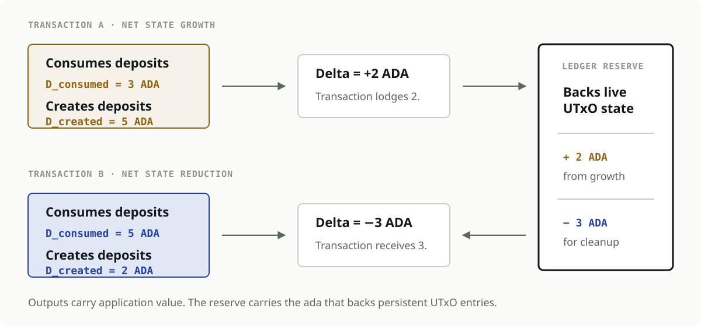

> **DESIGN SKETCH — not for submission.** This document turns the current
> `dust account` discussion into a concrete ledger model so that its invariants,
> trade-offs, and unresolved choices can be reviewed. Text marked **OPEN** requires
> a decision. It is not a claim of Working Group consensus.

## Table of Contents

1. [Abstract](#1-abstract)
2. [Motivation](#2-motivation-why-is-this-cip-necessary)
3. [Specification](#3-specification)
   1. [Terminology](#31-terminology)
   2. [Core model](#32-core-model)
   3. [Deposit calculation](#33-deposit-calculation)
   4. [Transaction accounting](#34-transaction-accounting)
      1. [Net resource delta](#341-net-resource-delta)
      2. [Monetary settlement](#342-monetary-settlement)
      3. [Worked examples](#343-worked-examples)
   5. [Ledger reserve](#35-ledger-reserve)
   6. [Persisted metadata](#36-persisted-metadata)
   7. [Validation rules](#37-validation-rules)
   8. [Migration](#38-migration)
   9. [Plutus and tooling](#39-plutus-and-tooling)
4. [Rationale](#4-rationale-how-does-this-cip-achieve-its-goals)
5. [Open Design Decisions](#5-open-design-decisions)
6. [Path to Active](#6-path-to-active)
7. [Copyright](#7-copyright)

## 1. Abstract

Cardano currently requires every transaction output to contain a minimum quantity
of ada derived from the output's size. This proposal preserves that state-growth
cost calculation but removes the requirement that the ada be carried inside the
output itself.

Instead, the ledger accounts for UTxO state deposits separately. A transaction that
creates more deposit liability than it consumes must lock the difference in a
ledger-controlled reserve. A transaction that consumes more liability than it
creates receives a corresponding release credit. Outputs carry their application
value; the reserve carries the ada that backs persistent UTxO state.

The central accounting quantity is therefore the transaction's **net state delta**:
billable state created minus billable state consumed. State-growing transactions pay
the difference; state-reducing transactions release the difference.

The intended security property remains: net growth of the UTxO set requires scarce
ada to be made unavailable elsewhere. The intended UX improvement is that native
assets, scripts, and application state no longer need an unrelated ada amount
embedded in every output.

## 2. Motivation: why is this CIP necessary?

The current rule combines two concerns in one `TxOut`:

1. the value and application state the output is intended to represent; and
2. the ada reserved to bound the node resources required by that output.

This coupling creates the problems documented by the companion CPS:

- low-value outputs can require more ada than the value being transferred;
- the creator funds the deposit but the recipient controls it;
- protocols must include min-ada in every state object;
- distribution costs scale with output count; and
- economically stranded outputs can remain in the UTxO set.

The proposal does **not** remove the cost of persistent state. It changes where that
cost is accounted for.



## 3. Specification

### 3.1 Terminology

- **State deposit:** ada locked by the ledger to back one new-style UTxO entry.
- **Recorded deposit:** the exact state-deposit amount associated with a new-style
  UTxO when it is created.
- **Reserve:** ledger-controlled ada containing the aggregate state deposits for all
  live new-style UTxOs.
- **Lodged deposit:** state deposit added to the reserve by a transaction.
- **Release credit:** state deposit removed from the reserve when the corresponding
  UTxO is consumed.
- **Billable state units:** the resource quantity priced by the state-deposit
  formula. Under the initial formula, this is `160 + sizeInBytes(TxOut)` bytes.
- **Net resource delta:** billable state units created by a transaction minus
  billable state units released by its consumed inputs.
- **Legacy output:** an output created before activation, whose minimum ada remains
  embedded in its `Value`.
- **New-style output:** an output created after activation, whose state deposit is
  accounted for separately.

### 3.2 Core model

The existing minimum-ada calculation is retained as the initial state-deposit
calculation:

```math
\operatorname{stateDeposit}(o,p)
= \left(160 + \operatorname{sizeInBytes}(o)\right)
  \times p.\operatorname{coinsPerUTxOByte}
```

The validity condition changes from:

```math
o.\operatorname{coin} \geq \operatorname{stateDeposit}(o,p)
```

to a transaction-level reserve condition:

```text
the transaction lodges enough ada to cover
the net new state-deposit liability it creates
```

No state deposit is added to the output's `Value`. A native-asset or script output
may therefore contain less ada than its computed state deposit, subject to the
non-empty-output rule in section 3.7.

### 3.3 Deposit calculation

For each new-style output `o`, the ledger computes:

```math
\operatorname{createdDeposit}(o)
= \operatorname{stateDeposit}(o,p_{\mathrm{current}})
```

For each consumed new-style input `i`, the ledger reads:

```math
\operatorname{releasedDeposit}(i) = i.\operatorname{recordedDeposit}
```

The exact recorded amount is used at consumption time. Recomputing the deposit using
current parameters would make reserve liabilities change when protocol parameters or
serialization rules change.

**OPEN:** the 160-byte overhead and the current formula are retained here to preserve
the present growth bound for initial analysis. Their continued use is not endorsed by
this proposal and must be revalidated against the current node storage architecture.

### 3.4 Transaction accounting

The ledger accounts for two related quantities. The **resource delta** measures how
the transaction changes persistent UTxO state. The **monetary delta** determines how
much ada enters or leaves the reserve. They are equal up to multiplication by the
price parameter only while that parameter and the deposit formula remain unchanged.

#### 3.4.1 Net resource delta

For each new-style output $o$, define its billable state units under the initial
formula as:

```math
\operatorname{createdStateUnits}(o)
= 160 + \operatorname{sizeInBytes}(o)
```

For a transaction $tx$, define:

```math
\begin{aligned}
B_{\mathrm{created}}(tx)
  &= \sum_{o \in \operatorname{newOutputs}(tx)}
     \operatorname{createdStateUnits}(o) \\
B_{\mathrm{released}}(tx)
  &= \sum_{i \in \operatorname{newInputs}(tx)}
     i.\operatorname{recordedStateUnits} \\
\Delta B_{\mathrm{state}}(tx)
  &= B_{\mathrm{created}}(tx) - B_{\mathrm{released}}(tx)
\end{aligned}
```

The sign has a direct ledger meaning:

- $\Delta B_{\mathrm{state}} > 0$: the transaction increases persistent UTxO state;
- $\Delta B_{\mathrm{state}} = 0$: it replaces the same quantity of state; and
- $\Delta B_{\mathrm{state}} < 0$: it reduces persistent UTxO state.

The delta is measured in resource units, not merely in entry count. A transaction
that consumes two small outputs and creates one large output may reduce cardinality
while still increasing the total state priced by the formula.

#### 3.4.2 Monetary settlement

For a transaction `tx`, define:

```math
\begin{aligned}
D_{\mathrm{created}}(tx)
  &= \sum_{o \in \operatorname{newOutputs}(tx)} \operatorname{createdDeposit}(o) \\
D_{\mathrm{consumed}}(tx)
  &= \sum_{i \in \operatorname{newInputs}(tx)} \operatorname{releasedDeposit}(i) \\
\Delta_{\mathrm{deposit}}(tx)
  &= D_{\mathrm{created}}(tx) - D_{\mathrm{consumed}}(tx)
\end{aligned}
```

While all affected UTxOs use the same price $p$, the relationship simplifies to:

```math
\Delta_{\mathrm{deposit}}(tx)
= p \times \Delta B_{\mathrm{state}}(tx)
```

This identity must not be used to reprice historical UTxOs after a parameter change.
The ledger charges newly created state at the current price, but releases the exact
deposit recorded when consumed state was created. Consequently,
$\Delta B_{\mathrm{state}}$ remains the resource measurement, while
$\Delta_{\mathrm{deposit}}$ remains the authoritative settlement amount.

If `Δdeposit(tx) > 0`, the transaction lodges `Δdeposit(tx)` ada in the reserve.

If `Δdeposit(tx) < 0`, the transaction receives a release credit of
`abs(Δdeposit(tx))` ada from the reserve.

If `Δdeposit(tx) = 0`, the reserve balance is unchanged.

The value-conservation equation is extended conceptually as follows:

```math
\begin{aligned}
V_{\mathrm{consumed}} + V_{\mathrm{mint}} + V_{\mathrm{withdrawals}}
  + V_{\mathrm{releasedDeposit}}
={}& V_{\mathrm{produced}} + V_{\mathrm{fees}} \\
 &+ V_{\mathrm{otherProtocolDeposits}} + V_{\mathrm{lodgedDeposit}}
\end{aligned}
```

The ledger computes `releasedDeposit` and `lodgedDeposit`; they are not selected by
the transaction author. Wallets still need to account for the resulting balance
delta, but output recipients and application state no longer carry the deposit.

#### 3.4.3 Worked examples

**Net state growth in bytes.** A transaction releases 800 billable bytes and creates
1,100 billable bytes:

```math
\Delta B_{\mathrm{state}} = 1{,}100 - 800 = +300\ \mathrm{bytes}
```

At the current mainnet price of 4,310 lovelace per byte, assuming all consumed
outputs were recorded at the same price:

```math
\Delta_{\mathrm{deposit}}
= 300 \times 4{,}310
= 1{,}293{,}000\ \mathrm{lovelace}
= 1.293\ \mathrm{ada}
```

The transaction increases persistent state and must lodge 1.293 ada.

**Net state reduction in bytes.** A transaction releases 1,100 billable bytes and
creates 500 billable bytes:

```math
\begin{aligned}
\Delta B_{\mathrm{state}}
  &= 500 - 1{,}100 \\
  &= -600\ \mathrm{bytes} \\
\Delta_{\mathrm{deposit}}
  &= -600 \times 4{,}310 \\
  &= -2{,}586{,}000\ \mathrm{lovelace}
   = -2.586\ \mathrm{ada}
\end{aligned}
```

The transaction reduces persistent state and receives a 2.586 ada release credit.

The following examples express the same rule directly in recorded deposit amounts.

**Net state growth.** A transaction consumes inputs with 3 ada of recorded deposits
and creates outputs requiring 5 ada:

```math
\Delta_{\mathrm{deposit}} = 5 - 3 = +2\ \mathrm{ada}
```

The transaction must lodge 2 ada in the reserve.

**Net state reduction.** A transaction consumes inputs with 5 ada of recorded
deposits and creates outputs requiring 2 ada:

```math
\Delta_{\mathrm{deposit}} = 2 - 5 = -3\ \mathrm{ada}
```

The transaction receives a 3 ada release credit.

### 3.5 Ledger reserve

The reserve is controlled by ledger rules, not by a payment credential. Users cannot
deposit into or withdraw from it except through the transaction accounting defined
above.

The target solvency invariant is:

```math
\operatorname{reserveBalance}
= \sum_{u \in \operatorname{liveNewUTxOs}} \operatorname{recordedDeposit}(u)
```

Every transition must preserve:

```math
\operatorname{reserveBalance} \geq 0
```

and no transaction may release more than the recorded deposits of the new-style
inputs it consumes.

**Relationship to CIP-0159.** CIP-0159 demonstrates account-like ledger state and
transaction-level deposits and withdrawals. This proposal may reuse implementation
patterns from that work, but a system-controlled reserve is not currently specified
by CIP-0159. CIP-0159 is therefore related prior art, not yet a normative dependency.

### 3.6 Persisted metadata

Each live new-style UTxO must retain enough information to determine both its
resource contribution and its release credit exactly. The preferred initial
representation is:

```math
\begin{aligned}
\operatorname{recordedStateUnits} &: \operatorname{Natural} \\
\operatorname{recordedDeposit} &: \operatorname{Coin}
\end{aligned}
```

`recordedStateUnits` makes the resource delta explicit across era or formula changes.
`recordedDeposit` makes the release amount exact across price changes. Storing the
deposit is simpler than reconstructing a historical `coinsPerUTxOByte`; it remains
valid if the formula, fixed overhead, serialization, or parameter value later changes.

The metadata may be an explicit ledger field or derived from an era-indexed side
structure. It need not be part of the serialized `TxOut` exposed to applications.

**OPEN:** determine whether both fields must be stored or whether state units can be
derived canonically from the live output. The storage cost of this metadata must
itself be priced or avoided through a more compact derivation scheme.

### 3.7 Validation rules

A valid post-activation transaction must satisfy all of the following:

1. Every new-style output has a deterministic `createdDeposit`.
2. Every consumed new-style input has exactly one `recordedStateUnits` and one
   `recordedDeposit` value, or an equivalent canonical derivation.
3. The ledger computes a deterministic net resource delta.
4. The transaction balance includes the computed monetary deposit delta.
5. The reserve remains solvent after the transition.
6. A release credit can arise only from consumed new-style inputs.
7. Legacy inputs do not generate a release credit; their ada is already present in
   their consumed `Value`.
8. An output cannot be empty. **OPEN:** define whether zero-ada native-asset outputs,
   zero-ada script outputs, and ada-only outputs below a separate minimum are valid.
9. Existing maximum transaction-size, execution, and value-size rules continue to
   apply.

### 3.8 Migration

Activation introduces new-style outputs without rewriting the existing UTxO set.

- Legacy outputs retain their embedded minimum ada.
- Consuming a legacy output exposes that ada through ordinary input value and creates
  no reserve release credit.
- New-style outputs lodge their deposits in the reserve and retain
  `recordedStateUnits` and `recordedDeposit`, or their canonical equivalents.
- A single transaction may consume legacy and new-style inputs and create new-style
  outputs.

This avoids a chain-wide migration transaction and prevents the same legacy deposit
from being credited twice.

**OPEN:** decide whether users may explicitly create legacy-style outputs for a
transition period or whether all post-activation outputs are new-style.

### 3.9 Plutus and tooling

The change affects the value visible in outputs and therefore requires explicit
compatibility analysis.

- Wallets and SDKs must calculate or query both the resource delta and the monetary
  deposit delta.
- Coin selection must include the ability to fund a positive delta and use a negative
  delta.
- Indexers should expose `recordedDeposit` separately from output `Value`.
- Explorers should distinguish value owned by the output from deposit held by the
  ledger.
- Plutus scripts that assume every input or output contains minimum ada may observe
  different values.
- Transaction and script contexts may need fields for created, consumed, or net
  state units and deposits.

**OPEN:** determine whether this requires a new Plutus language version, an era-level
semantic change, or both.

## 4. Rationale: how does this CIP achieve its goals?

### 4.1 Preserving the growth bound

Net UTxO growth still requires ada to be locked. An attacker creating many live
entries must increase the reserve by the same deposit calculation used by the current
mechanism. The proposal changes custody and accounting, not the initial price of
growth.

### 4.2 Restoring the output abstraction

An output carries the value and state intended for its recipient. The resource
deposit is held separately by the ledger and no longer appears as part of the
recipient's output value.

This separation does not by itself resolve deposit attribution. Under the current
strawman, the transaction consuming the output receives the release credit. The
economic benefit can therefore still move from the party that funded state creation
to the party able to consume the output; it happens at consumption rather than at
creation. Returning value to the original funder would require an attribution model
that is still open.

### 4.3 Incentivising cleanup

Consuming more recorded liability than a transaction creates produces a release
credit. This rewards net state reduction without imposing a general penalty on
transactions that legitimately create multiple protocol outputs.

This direction is consistent with the state-efficient fee property developed by
Karakostas, Karayannidis, and Kiayias in
[*Efficient State Management in Distributed Ledgers*](https://doi.org/10.1007/978-3-662-64331-0_17):
the economic treatment of a transaction should reflect its effect on shared UTxO
state, rather than transaction size alone.

### 4.4 Limits of the improvement

This proposal does not eliminate all upper-layer awareness of state cost. A
transaction that grows the UTxO set must still fund a positive deposit delta, and
wallets must balance it. The narrower improvement is that protocols no longer embed
ada in each output or expose the deposit as part of the recipient's transferred
value. Who ultimately receives the economic benefit remains an open design choice.

### 4.5 Why not require inputs to outnumber outputs?

Many validators and protocols legitimately create multiple UTxOs to represent
independent state. Penalising `outputs > inputs` would price the shape of a protocol
rather than the resource cost of its state, and could discourage dApp activity. The
deposit-delta model instead charges the calculated liability created by the
transaction and credits liability removed.

## 5. Open Design Decisions

The following questions should be resolved before this becomes a submission:

1. **Release beneficiary.** Should the release credit belong to the transaction that
   consumes an output, the original funder, the output owner, or a global pool? This
   sketch uses the consuming transaction because it requires no additional ownership
   reference and directly rewards cleanup.
2. **Reserve scope.** Is there one global reserve, one reserve per credential, or a
   different ledger structure?
3. **Persisted information.** Store the exact deposit amount, a historical rate, an
   era identifier, or derive the amount from immutable history?
4. **Formula.** Retain the current 160-byte calculation, price the current storage
   architecture, or charge a different measure such as net cardinality?
5. **Parameter changes.** Do they apply only to newly created UTxOs, or can existing
   liabilities be repriced without breaking reserve solvency?
6. **Empty and zero-ada outputs.** Which values remain invalid independently of the
   state-deposit mechanism?
7. **Script compatibility.** Which existing script assumptions break when min-ada is
   removed from `TxOut.Value`?
8. **CIP-0159 dependency.** Is the account machinery reusable, or should the reserve
   be a dedicated ledger component?
9. **Governance.** Which parameters control the mechanism, and which governance
   thresholds apply?
10. **Accounting visibility.** Is the delta implicit, explicitly committed in the
    transaction body, or both computed and asserted?
11. **Failure and recovery.** What invariant or recovery path applies if an
    implementation bug or migration error makes the reserve insolvent?
12. **State overhead.** Does tracking the historical deposit materially increase the
    very state being priced?

## 6. Path to Active

### 6.1 Acceptance Criteria

- [ ] The companion CPS is accepted and linked from the preamble.
- [ ] The Ledger Working Group agrees on the release beneficiary and reserve scope.
- [ ] A formal ledger transition preserves value conservation and reserve solvency.
- [ ] Adversarial analysis shows that the UTxO-growth cost is no weaker than under
      the current mechanism.
- [ ] Plutus, wallet, indexer, explorer, and hardware-wallet compatibility is
      documented.
- [ ] Parameter-update and hard-fork behavior is specified.
- [ ] Legacy/new-style coexistence is demonstrated on a testnet.
- [ ] Independent implementers confirm that the specification is deterministic.

### 6.2 Implementation Plan

1. Prototype the accounting rule in the ledger transition.
2. Add invariant and property tests for value conservation, reserve solvency, and
   no-unbacked-state creation, including transactions whose entry-count delta and
   byte delta have opposite signs.
3. Measure the extra state required for historical deposit metadata.
4. Implement wallet and CLI support for deposit-delta balancing.
5. Test legacy and new-style UTxO coexistence across a development hard fork.
6. Publish migration guidance for protocols whose validators assume min-ada is part
   of output value.

## 7. Copyright

This CIP is licensed under
[CC-BY-4.0](https://creativecommons.org/licenses/by/4.0/legalcode).
