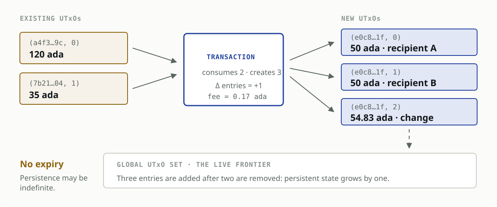
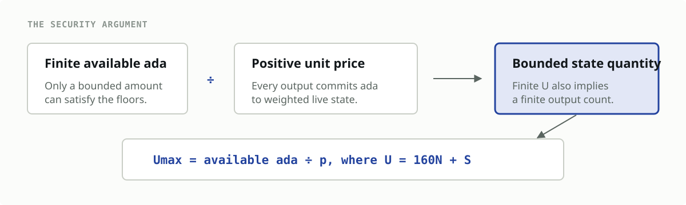
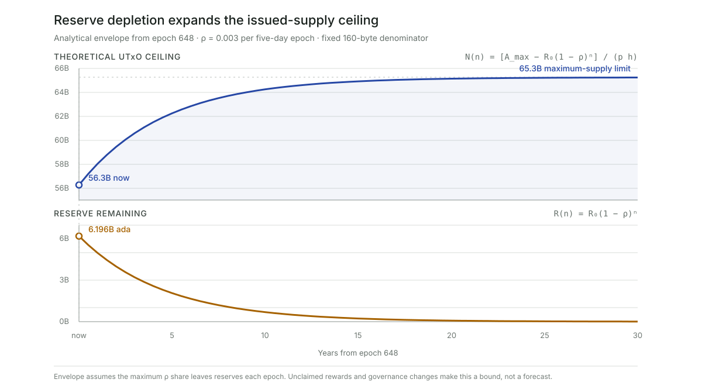
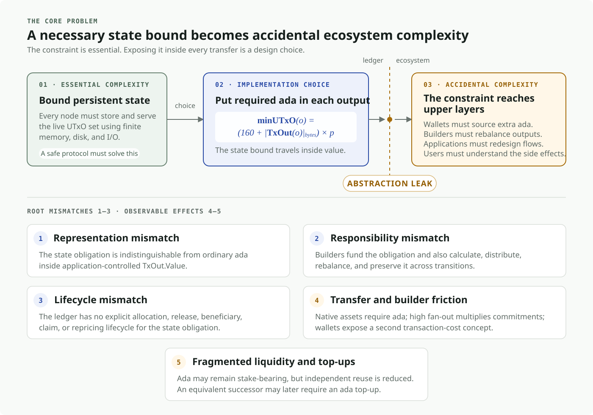
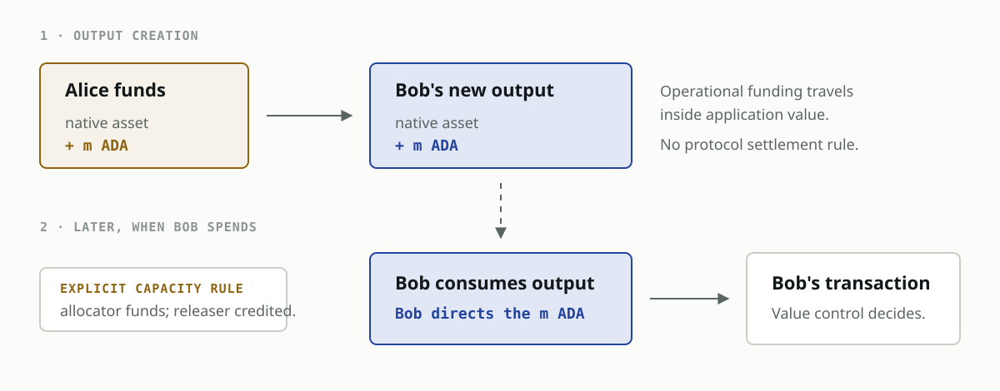

> **DRAFT — not for submission.** Items marked `TODO` require a decision or a
> verified figure before this goes anywhere near a PR. See `NOTES.md`.

## Table of Contents

1. [Abstract](#1-abstract)
2. [Problem](#2-problem)
   1. [How transactions grow the UTxO set](#21-how-transactions-grow-the-utxo-set)
   2. [How Cardano bounds UTxO-set growth](#22-how-cardano-bounds-utxo-set-growth)
      1. [Formula and fixed overhead](#221-formula-and-fixed-overhead)
      2. [Mainnet parameters](#222-mainnet-parameters)
      3. [How the mechanism evolved](#223-how-the-mechanism-evolved)
      4. [Why it bounds entry count](#224-why-it-bounds-entry-count)
      5. [A hierarchy of theoretical bounds](#225-a-hierarchy-of-theoretical-bounds)
         1. [Ledger compartments](#2251-ledger-compartments)
         2. [Maximum-supply ceiling](#2252-maximum-supply-ceiling)
         3. [Issued-supply ceiling](#2253-issued-supply-ceiling)
         4. [UTxO-resident-ada ceiling](#2254-utxo-resident-ada-ceiling)
         5. [How reserve depletion moves the ceiling](#2255-how-reserve-depletion-moves-the-ceiling)
      6. [How should `coinsPerUTxOByte` be adjusted?](#226-how-should-coinsperutxobyte-be-adjusted)
         1. [Current rules](#2261-current-rules)
         2. [Calibration test](#2262-calibration-test)
         3. [Limits of the pricing model](#2263-limits-of-the-pricing-model)
         4. [Required evidence](#2264-required-evidence)
   3. [The core problem: accidental complexity from an abstraction leak](#23-the-core-problem-accidental-complexity-from-an-abstraction-leak)
      1. [Ada coupling of native-asset transfers](#231-ada-coupling-of-native-asset-transfers)
      2. [No refund claim for the funder](#232-no-refund-claim-for-the-funder)
      3. [The output fixes an ada amount while its real value floats](#233-the-output-fixes-an-ada-amount-while-its-real-value-floats)
      4. [A second transaction-cost concept leaks into the user model](#234-a-second-transaction-cost-concept-leaks-into-the-user-model)
      5. [Reduced liquid reusability](#235-reduced-liquid-reusability)
3. [Use Cases](#3-use-cases)
   1. [Mass distribution and airdrops](#31-mass-distribution-and-airdrops)
   2. [Micropayments and stablecoin transfers](#32-micropayments-and-stablecoin-transfers)
   3. [NFT and creator workflows](#33-nft-and-creator-workflows)
   4. [Application state](#34-application-state)
   5. [Economically stranded dust](#35-economically-stranded-dust)
   6. [Unsolicited outputs](#36-unsolicited-outputs)
4. [Goals and Non-goals](#4-goals-and-non-goals)
   1. [Required outcomes](#41-required-outcomes)
   2. [Non-goals](#42-non-goals)
5. [Open Questions](#5-open-questions)
   1. [Measurement and evidence](#51-measurement-and-evidence)
   2. [Mechanism design](#52-mechanism-design)
   3. [Migration and governance](#53-migration-and-governance)
6. [References](#6-references)
7. [Copyright](#7-copyright)

## 1. Abstract

Cardano represents spendable value using the
[*extended unspent transaction output* (EUTxO) model](https://docs.cardano.org/about-cardano/learn/eutxo-explainer).
Each new output becomes an entry in the global UTxO set and remains there until it
is spent. The formal EUTxO model defines transactions as consuming prior outputs and
creating new outputs while preserving the graph-based properties of UTxO accounting
[[4]](#ref-4). Because nodes need this set to validate transactions, uncontrolled growth
would create an unbounded resource requirement.

Cardano limits that growth by requiring every output to contain a minimum quantity
of ada based on its serialised size. Because the ada supply is finite, this creates
a finite economic ceiling on the number of UTxO entries.

This CPS accepts the need for a bound. It identifies a narrower problem: the chosen
mechanism exposes a node-level resource constraint directly through Cardano's
value-transfer interface. Every output must carry ada whose amount is derived from a
global state-pricing parameter. That ada becomes ordinary output value rather than a
separately accounted deposit or fee.

The result is an abstraction leak. Native-asset transfers become coupled to ada; the
party funding the requirement retains no refund claim; historical outputs fix a
nominal ada amount while its policy and real-world value continue to move; users face
a second transaction-cost concept; and ada committed to outputs is less freely
reusable. Wallets and applications must model these effects to construct otherwise
ordinary transfers.

This CPS describes those UX, liquidity, and engineering consequences while accepting
that persistent UTxO state must remain bounded under adversarial conditions.

> **Problem in one sentence:** Cardano embeds a global node-state policy as ada
> inside every output, turning infrastructure accounting into transferred or
> committed value that every layer of the ecosystem must manage.

## 2. Problem

### 2.1 How transactions grow the UTxO set

Four facts are sufficient to derive the underlying resource problem:

1. A UTxO is a discrete, spendable output identified by `(transaction id, index)`.
2. A transaction removes all the UTxOs it consumes and inserts all the outputs it
   creates.
3. A transaction may create more entries than it consumes, so activity can grow the
   UTxO set even when the amount of ada in circulation does not change.
4. An unspent output has no expiry. It remains part of the ledger state until a later
   transaction consumes it, which may never happen.

For a more detailed introduction, Cardano's
[EUTxO explainer](https://docs.cardano.org/about-cardano/learn/eutxo-explainer#overview-of-the-utxo-model)
describes inputs, outputs, whole-output consumption, and the UTxO set maintained by
nodes.



The UTxO set is the collection of outputs that can still be spent—the live frontier
of the transaction history. Its growth is a shared infrastructure concern: users
choose how many outputs to create, while node operators collectively retain and
serve the resulting state. Without a countermeasure, transaction throughput could
be converted into persistent ledger entries at a cost too low to protect node
resources.

This CPS accepts the need for such a countermeasure. Its subject is the particular
interface Cardano uses to provide it.

### 2.2 How Cardano bounds UTxO-set growth

#### 2.2.1 Formula and fixed overhead

This rule was introduced with the
[Babbage ledger era](https://docs.cardano.org/about-cardano/evolution/eras-and-phases#babbage-era),
which added features such as reference inputs, inline datums, and reference scripts.
Babbage was activated on Cardano mainnet by the
[Vasil hard fork on 22 September 2022](https://cardano.org/hardforks/).

[CIP-55](https://github.com/cardano-foundation/CIPs/tree/master/CIP-0055#the-new-minimum-lovelace-calculation)
specifies that an output is valid only if it contains at least:

```math
\operatorname{minUTxO}(o)
= \left(160 + \operatorname{sizeInBytes}(\operatorname{TxOut}(o))\right)
  \times \operatorname{coinsPerUTxOByte}
```

The formula has three terms:

- `sizeInBytes(TxOut)` is the size of the serialised output.
- `coinsPerUTxOByte` is the updatable protocol parameter that prices each billable
  byte.
- `160` is a fixed overhead for the transaction input and the corresponding entry
  in the node's UTxO map. These bytes are not part of the serialised output.

This CPS uses **state deposit** as shorthand for the economic role of the required
ada. The ledger does not record a separate deposit, depositor, or refund claim: it
records only the output and its value.

Cardano defines no separate `maxOutputs` parameter. For ordinary outputs,
[`maxTxSize`](https://cips.cardano.org/cip/CIP-9) is the only general
transaction-wide rule that limits their number: every output consumes part of the
same serialised-size budget as the inputs, witnesses, scripts, and metadata.
Consequently, the maximum is indirect and depends on the rest of the transaction:

```math
N_{\mathrm{outputs}}
\le
\left\lfloor
\frac{\operatorname{maxTxSize} - B_{\mathrm{other}}}
     {B_{\mathrm{output}}}
\right\rfloor
```

Here, $B_{\mathrm{other}}$ is the space used by the rest of the transaction and
$B_{\mathrm{output}}$ is the serialised size of the output under consideration.
Plutus execution budgets can further constrain a script transaction, and block-body
size limits aggregate creation per block. Neither defines a separate maximum number
of ordinary outputs. Collateral limits apply only to Plutus collateral inputs.

If the formula returns *m* ada, the output must contain at least *m* ada—even when
the value the user intends to transfer is entirely in another asset. This ada is not
paid to the protocol as a fee. It becomes part of the output and passes under the
output owner's control.

The fixed overhead makes the abstraction leak concrete: a quantity derived from a
node's internal data representation is embedded in a consensus-level rule that every
transaction builder must satisfy.

> **Verification required:** the 160-byte overhead was derived for an in-memory
> ledger state. If UTxO-HD changes the binding resource to disk footprint and I/O,
> that derivation must be restated against the current node architecture before this
> claim is submitted.

#### 2.2.2 Mainnet parameters

At mainnet epoch 647, current on 3 August 2026, `coinsPerUTxOByte` is
**4,310 lovelace per byte**. The pinned
[epoch-647 parameter response](https://api.koios.rest/api/v1/epoch_params?_epoch_no=647)
reports this as `coins_per_utxo_size` and also reports `max_tx_size = 16,384` bytes.
Applying that `coinsPerUTxOByte` value gives:

```math
\begin{aligned}
\operatorname{minUTxO}(o)
  &= \left(160 + \operatorname{sizeInBytes}(\operatorname{TxOut}(o))\right)
     \times 4{,}310\ \mathrm{lovelace} \\
  &= 689{,}600
     + 4{,}310 \times \operatorname{sizeInBytes}(\operatorname{TxOut}(o))
     \ \mathrm{lovelace}
\end{aligned}
```

For example, if a serialised output is 100 bytes, its billable size is 260 bytes and
its minimum is:

```math
\operatorname{minUTxO}
= (160 + 100) \times 4{,}310
= 1{,}120{,}600\ \mathrm{lovelace}
= 1.1206\ \mathrm{ada}
```

The value `4,310` has a specific historical origin. The
[Alonzo mainnet genesis configuration](https://github.com/input-output-hk/cardano-configurations/blob/master/network/mainnet/genesis/alonzo.json#L2)
set `lovelacePerUTxOWord` to `34,482` lovelace per eight-byte word. At the Babbage
transition, [CIP-55 required](https://github.com/cardano-foundation/CIPs/tree/master/CIP-0055#translation-from-the-alonzo-era-to-the-babbage-era)
that value to be divided by eight and rounded down:

```math
\operatorname{coinsPerUTxOByte}
= \left\lfloor \frac{34{,}482}{8} \right\rfloor
= 4{,}310\ \text{lovelace per byte}
```

The Babbage value was therefore inherited by unit conversion from the Alonzo
per-word parameter. It was not introduced as a new empirical estimate of the
contemporary cost of RAM, storage, or I/O.

Because this is an updatable protocol parameter, governance may change it. The
[protocol-parameter guide](https://docs.cardano.org/about-cardano/explore-more/parameter-guide#types-of-protocol-parameters-on-cardano)
explains that such parameters can evolve without changing the formula itself. A
dated mainnet value is therefore more precise than presenting `4,310` as a constant.

#### 2.2.3 How the mechanism evolved

The mechanism changed as outputs became more expressive. Each step refined how output
size is measured, while preserving the same premise: every output must reserve ada.

| Era | Mechanism | Rationale for the change |
|---|---|---|
| [Shelley](https://github.com/cardano-foundation/CIPs/tree/master/CIP-0009) | `minUTxOValue`, a flat constant | Outputs were uniform in size |
| [Mary](https://docs.cardano.org/developer-resources/native-tokens) | Size-dependent formula | Multi-asset outputs vary in size |
| [Alonzo](https://github.com/cardano-foundation/CIPs/tree/master/CIP-0028) | `coinsPerUTxOWord` (per 8-byte word) | `minUTxOValue` deprecated |
| [Babbage](https://github.com/cardano-foundation/CIPs/tree/master/CIP-0055) | `coinsPerUTxOByte` | Per-byte is simpler to reason about |
| [Conway](https://docs.cardano.org/about-cardano/evolution/eras-and-phases#conway-era) | Unchanged, moved under governance | — |

#### 2.2.4 Why it bounds entry count

The intended protection follows a simple chain:



The bound ultimately relies on ada having a
[finite maximum supply](https://docs.cardano.org/about-cardano/explore-more/monetary-policy).
This produces a worst-case bound on the *number of entries*. It does not directly
price the marginal RAM, disk space, or I/O consumed by an entry. Instead, it makes
every output reserve part of a scarce asset. Because the ada remains spendable with
the output, its economic function resembles a deposit rather than a fee. It is not,
however, represented as a separate deposit in ledger state.

#### 2.2.5 A hierarchy of theoretical bounds

The word *size* can mean either the number of live UTxOs or the physical resources
used by nodes. The current mechanism gives a theoretical bound on the former. It
does not provide a direct bound on RAM, disk footprint, or I/O.

##### 2.2.5.1 Ledger compartments

There is no single useful ceiling. A progressively tighter argument must account for
which ada can actually reside in transaction outputs at a given point in time. Let:

- $S_{\max}$ be the maximum supply;
- $R(t)$ be ada that remains in the monetary reserves;
- $T(t)$ be the treasury balance;
- $W(t)$ be aggregate reward-account balances;
- $D(t)$ be ada held by protocol deposits;
- $F(t)$ be fees collected but not yet distributed; and
- $A_{\mathrm{UTxO}}(t)$ be the total ada contained in all live transaction outputs.

At a simplified whole-ledger level, these compartments give:

```math
\begin{aligned}
S_{\mathrm{issued}}(t)
  &= S_{\max} - R(t) \\
A_{\mathrm{UTxO}}(t)
  &= S_{\mathrm{issued}}(t)
     - T(t) - W(t) - D(t) - F(t)
\end{aligned}
```

The exact ledger accounting should be used when evaluating these terms at a specific
era boundary. The important point is structural: ada outside transaction outputs
cannot fund minimum ada inside those outputs.

For a concrete application, the
[mainnet totals at epoch 647](https://api.koios.rest/api/v1/totals?_epoch_no=647) report the
following ledger compartments (rounded to three decimal places):

| Compartment | Epoch-647 balance |
|---|---:|
| Maximum supply, $S_{\max}$ | 45.000 billion ada |
| Reserves, $R$ | 6.206 billion ada |
| Treasury, $T$ | 1.446 billion ada |
| Reward accounts, $W$ | 0.832 billion ada |
| Protocol deposits, $D$ | 0.00584 billion ada |
| Fee pot, $F$ | 0.000031 billion ada |

Applying the accounting identity gives:

```math
\begin{aligned}
S_{\mathrm{issued}}
  &= 45.000 - 6.206 \\
  &= 38.794\ \text{billion ada} \\
A_{\mathrm{UTxO}}
  &= 38.794 - 1.446 - 0.832 - 0.00584 - 0.000031 \\
  &= 36.509\ \text{billion ada}
\end{aligned}
```

Approximately **8.491 billion ada**, or **18.9% of maximum supply**, therefore
cannot back transaction outputs at that snapshot. The reserve alone contributes
6.206 billion ada—approximately **73.1% of that exclusion**.

Delegated ada is **not** subtracted. Cardano delegation does not transfer the ada
into a staking contract or separate staking account; the delegated value remains in
the owner's UTxOs. Likewise, ada controlled by a script still belongs to the UTxO
set. Economic illiquidity and absence from the UTxO set are different concepts.

##### 2.2.5.2 Maximum-supply ceiling

The [mainnet Shelley genesis configuration](https://github.com/input-output-hk/cardano-configurations/blob/master/network/mainnet/genesis/shelley.json#L60)
caps the ada supply at 45 quadrillion lovelace, or 45 billion ada:

```math
S_{\max} = 45{,}000{,}000{,}000{,}000{,}000\ \mathrm{lovelace}
```

Let $p = 4{,}310\ \mathrm{lovelace/byte}$ and let
$h = 160\ \mathrm{bytes}$ be the fixed overhead. Ignoring
the non-zero serialised size of an output gives the loosest possible entry-count
ceiling:

```math
N_{\max}^{\mathrm{absolute}}
\leq
\left\lfloor \frac{S_{\max}}{p h} \right\rfloor
= 65{,}255{,}220{,}417
```

This **65.3-billion-UTxO** figure is a protocol-wide ceiling: it remains valid across
all future reserve distributions, but assumes that every lovelace—including ada not
yet issued—is available to fund outputs. It is therefore mathematically valid and
operationally remote.

##### 2.2.5.3 Issued-supply ceiling

At time $t$, reserves have not yet entered circulation and cannot back UTxOs. A
tighter time-dependent ceiling is therefore:

```math
N_{\max}^{\mathrm{issued}}(t)
\leq
\left\lfloor
  \frac{S_{\max}-R(t)}{p h}
\right\rfloor
```

At epoch 647 this becomes:

```math
\begin{aligned}
N_{\max}^{\mathrm{issued}}
&\leq
\left\lfloor
  \frac{38{,}793{,}748{,}392.725155\ \mathrm{ada}}
       {0.6896\ \mathrm{ada/UTxO}}
\right\rfloor \\
&= 56{,}255{,}435{,}604\ \mathrm{UTxOs}
\end{aligned}
```

This removes ada that does not yet exist as ledger value outside the reserve pot. It
still overstates the amount available to outputs because issued ada is also held in
non-UTxO ledger compartments.

##### 2.2.5.4 UTxO-resident-ada ceiling

At a fixed ledger snapshot, the number of live outputs is bounded by the ada currently
resident in those outputs. The tighter instantaneous ceiling is consequently:

```math
\begin{aligned}
N_{\max}^{\mathrm{UTxO}}(t)
&\leq
\left\lfloor
  \frac{A_{\mathrm{UTxO}}(t)}{p h}
\right\rfloor \\
&=
\left\lfloor
  \frac{S_{\max}-R(t)-T(t)-W(t)-D(t)-F(t)}{p h}
\right\rfloor
\end{aligned}
```

Using the epoch-647 UTxO-resident balance gives:

```math
\begin{aligned}
N_{\max}^{\mathrm{UTxO}}
&\leq
\left\lfloor
  \frac{36{,}509{,}015{,}447.189975\ \mathrm{ada}}
       {0.6896\ \mathrm{ada/UTxO}}
\right\rfloor \\
&= 52{,}942{,}307{,}783\ \mathrm{UTxOs}
\end{aligned}
```

This is still deliberately loose because $h$ accounts only for the fixed overhead.
Every valid `TxOut` has a non-zero serialised size. If $q_{\min}$ is the smallest
serialised output admitted by the current era, the stronger form is:

```math
N_{\max}^{\mathrm{valid}}(t)
\leq
\left\lfloor
  \frac{A_{\mathrm{UTxO}}(t)}
       {p\left(h+q_{\min}\right)}
\right\rfloor
```

$q_{\min}$ must be derived from the canonical encoding rules for the era rather than
guessed from a typical wallet output. Outputs carrying native assets, datum, or a
reference script are larger and therefore require more ada; they can only reduce the
maximum count relative to this minimal-output construction.

This is an instantaneous ceiling, not a forward invariant for the same numerator.
Withdrawals, deposit refunds, treasury movements, and reserve distribution can move
ada from other ledger compartments into outputs, changing $A_{\mathrm{UTxO}}(t)$.

Until $q_{\min}$ is verified, a 100-byte serialised `TxOut` provides an explicit
scenario rather than a claimed minimum. Its required ada is 1.1206 ada, giving:

```math
\begin{aligned}
N_{100\mathrm{B}}
&\leq
\left\lfloor
  \frac{36{,}509{,}015{,}447.189975}{1.1206}
\right\rfloor \\
&= 32{,}579{,}881{,}712\ \mathrm{UTxOs}
\end{aligned}
```

The successive refinements therefore change the headline number materially:

| Bound | Available ada | Maximum entry count |
|---|---:|---:|
| Maximum supply; 160-byte overhead only | 45.000B | 65.255B |
| Issued supply; 160-byte overhead only | 38.794B | 56.255B |
| UTxO-resident ada; 160-byte overhead only | 36.509B | 52.942B |
| UTxO-resident ada; illustrative 100-byte output | 36.509B | 32.580B |

The hierarchy can be summarised as:

```math
N_{\mathrm{actual}}(t)
\leq N_{\max}^{\mathrm{valid}}(t)
\leq N_{\max}^{\mathrm{UTxO}}(t)
\leq N_{\max}^{\mathrm{issued}}(t)
\leq N_{\max}^{\mathrm{absolute}}
```

##### 2.2.5.5 How reserve depletion moves the ceiling

The reserve is not a static subtraction. Cardano's monetary expansion parameter
$\rho$ determines the maximum fraction of the remaining reserve that can enter the
reward pot each epoch. The [monetary-policy description](https://docs.cardano.org/about-cardano/explore-more/monetary-policy)
documents the current value as $\rho = 0.003$, or 0.3% per epoch. If that maximum amount
left reserves every epoch and $\rho$ remained unchanged, the reserve after $n$ epochs
would follow:

```math
R_n = R_0(1-\rho)^n
```

Substituting this trajectory into the issued-supply ceiling gives:

```math
N_{\max}^{\mathrm{issued}}(n)
\leq
\left\lfloor
  \frac{S_{\max}-R_0(1-\rho)^n}{p h}
\right\rfloor
```

This function rises asymptotically: reserve depletion relaxes the economic ceiling
on UTxO count, but can never raise it above the maximum-supply ceiling. Using the
epoch-647 reserve balance of **6.206 billion ada** reported by the live
[mainnet ledger totals](https://api.koios.rest/api/v1/totals?_epoch_no=647) as $R_0$, and retaining
the deliberately loose 160-byte denominator, the issued-supply ceiling begins at
approximately **56.3 billion UTxOs** and approaches **65.3 billion**.



This is a fast-depletion envelope, not a forecast. Actual reserve withdrawals can be
smaller because unclaimed rewards remain in or return to reserves, and governance
can change $\rho$. A five-day epoch was used only to express $n$ on the chart in years.

At the same snapshot, reserves account for approximately **73% of the ada excluded
from UTxOs** by the compartments above. With the 160-byte denominator, the reserve
reduces the absolute ceiling by roughly **9.0 billion entries**, compared with about
**3.3 billion** for treasury, reward accounts, deposits, and the fee pot combined.
The reserve is therefore the dominant current subtraction, but it is not the only
one—and its influence mechanically declines as monetary expansion proceeds.

This distinction is important. Minimum ada proves that the number of entries cannot
grow without limit. Refining the numerator removes ada that cannot back outputs, and
refining the denominator accounts for the smallest valid output. Neither refinement
shows that nodes could safely serve a UTxO set approaching the resulting bound. A
finite economic ceiling is not by itself a safe resource target.

#### 2.2.6 How should `coinsPerUTxOByte` be adjusted?

Changing $p = \operatorname{coinsPerUTxOByte}$ tunes one trade-off: a higher value
makes UTxO growth more expensive for attackers and legitimate users alike. For an
output with billable size $b$ and an ada budget $A$:

```math
\operatorname{minUTxO}=p b
\qquad\text{and}\qquad
N_{\max}=\left\lfloor\frac{A}{p b}\right\rfloor
```

For the 260 billable-byte example used above, the minimum is 0.78 ada at $p=3{,}000$,
1.1206 ada at the current $p=4{,}310$, and 1.69 ada at $p=6{,}500$. Parameter tuning
changes incidence and attack cost; it does not fix the abstraction leak.

##### 2.2.6.1 Current rules

The Constitution classifies `utxoCostPerByte`—the governance name for this
parameter—as [critical to blockchain operation](https://cardano.org/constitution/#2-1-critical-protocol-parameters).
Its [specific guardrails](https://cardano.org/constitution/#utxo-cost-per-byte-utxocostperbyte)
require:

```math
3{,}000 \leq p \leq 6{,}500\quad\text{lovelace/byte}
```

`PARAM-03a` requires an SPO vote above 50% of active block-production stake in
addition to a DRep vote; `PARAM-04a` normally expects 90 days between an off-chain
proposal and its on-chain submission. `UCPB-05a` says a change should consider:

1. acceptable attack cost and attack duration;
2. acceptable full-node memory configuration;
3. UTxO sizes; and
4. current total node memory usage.

These are criteria, not a formula. In 2024, the Parameter Committee therefore
[recommended no change](https://forum.cardano.org/t/pcp-002-utxocostperbyte-rationale/130547):
it expected the parameter eventually to fall, but deferred calibration until on-disk
UTxO storage provided a clearer resource model.

##### 2.2.6.2 Calibration test

Let $H_B$ be the additional billable UTxO state nodes can safely absorb, derived from
benchmarked RAM, disk, and I/O headroom. Let $C_{\min}$ be the minimum ada an attack
must immobilise, $L_{\max}$ the largest acceptable deposit for a representative
output of size $b_{\mathrm{ref}}$, and $g_B$ the maximum state-growth rate per epoch.
The admissible interval is:

```math
\max\left(3{,}000,\frac{C_{\min}}{H_B}\right)
\leq p \leq
\min\left(6{,}500,\frac{L_{\max}}{b_{\mathrm{ref}}}\right)
```

The associated fastest exhaustion time is:

```math
T_{\mathrm{fill}}=\frac{H_B}{g_B}
```

Governance must choose the security and UX targets; benchmarks supply the remaining
terms. If the lower bound exceeds the upper bound, no parameter value satisfies both
objectives and the mechanism itself must change. Ada's fiat price belongs in the
sensitivity analysis, not as the sole input, because node-resource prices do not
track it.

##### 2.2.6.3 Limits of the pricing model

Calibration cannot remove two structural limitations of the price itself. First,
$p$ is denominated in ada while node memory, storage, and I/O are purchased in other
currencies. Governance can adjust $p$, but there is no automatic relationship between
the two prices. An ada-price movement can therefore change the real-world burden and
deterrent effect without changing the resources consumed by an output.

Second, the formula prices size but contains no explicit duration component. Two
otherwise identical outputs require the same deposit whether they remain live for
five minutes or five years. A long-lived owner bears a greater opportunity cost, but
the protocol neither collects nor adjusts the deposit over time. Work on state-aware
fee design argues that both additional bytes and their lifetime matter [[1]](#ref-1).

These limitations concern how persistent state is priced. Section 2.3.3 shows how
ada-price volatility reaches historical outputs; Section 2.3 addresses the broader
architectural question of why that price is exposed inside every output.

##### 2.2.6.4 Required evidence

A proposal should publish the current UTxO footprint and growth rate, UTxO-size
distribution, node RAM/disk/I/O benchmarks, the chosen $H_B$, $C_{\min}$ and
$L_{\max}$ targets, worst-case attack cost and fill time, and the change in deposits
for representative transactions. It must also include the
[monitoring and reversion plan required by the Constitution](https://cardano.org/constitution/#2-6-monitoring-and-reversion-of-parameter-changes).

The current value of 4,310 is inside the permitted range; that alone does not show it
is calibrated. Calibration requires current measurements and explicit security and
UX targets.

This calibration analysis is necessary context, but it is not the core problem
addressed by this CPS. Even a perfectly calibrated
`coinsPerUTxOByte` would preserve the same interface: every output would still carry
its own state deposit, wallets and applications would still have to model it, and the
reserved ada would still become value controlled through the output.

The central problem is therefore the design of the mechanism and the side effects
that this design propagates throughout the ecosystem. The next section describes
this as an **abstraction leak**.

### 2.3 The core problem: accidental complexity from an abstraction leak

This section states the core problem addressed by this CPS. Bounding persistent
ledger state is
**essential complexity**: any safe design must account for the finite resources of
the nodes that maintain the ledger. Requiring every output to carry an ada deposit
intended to bound that resource consumption is **accidental complexity**: it follows
from the chosen mechanism, not from the EUTxO model or from value transfer itself.

The mechanism therefore creates an **abstraction leak**: wallets, transaction
builders, applications, and users must understand and account for an internal
node-state constraint in order to use the value-transfer interface correctly.

The objection is therefore not that the constraint exists. It is that the constraint
crosses the ledger boundary in a form that every upper layer must model.

Exposing the constraint in this way creates five direct consequences. They concern
the representation and ownership of the state guarantee, not whether additional
ledger state should be bounded or priced.



#### 2.3.1 Ada coupling of native-asset transfers

Cardano's native assets cannot be transferred independently of ada. An output whose
intended value is entirely in another asset must still contain the ada returned by
the minimum-UTxO formula.

```text
Application intent:     transfer 10 units of token X
Ledger representation: transfer 10 units of token X + minimum ada
```

The application must therefore source ada, select suitable inputs, and expose the
additional value in the resulting payment. Availability of ada and the value of
`coinsPerUTxOByte` become operational dependencies of every native-asset workflow.

This is more precise than calling the rule value-blind. A state price can legitimately
depend on bytes rather than the economic value transferred. The abstraction leak is
that this price changes the value-transfer interface itself.

#### 2.3.2 No refund claim for the funder

Consider Alice sending a native asset to Bob. Alice creates Bob's output and supplies
the required *m* ada. Once the transaction is confirmed, both the asset and the *m*
ada belong to Bob's output. When Bob spends it, Bob controls where that ada goes.

The ada is not lost or protocol-locked: it remains ledger value. What is absent is a
claim returning it to the party that supplied it. The ledger preserves the deposit
as value but does not preserve a refund relationship between Alice and that deposit.



| Stage | Conventional refundable deposit | Minimum ada in Bob's output |
|---|---|---|
| Funding | Alice supplies the deposit | Alice supplies the minimum ada |
| Custody | Separate from the payment | Embedded in Bob's output |
| Release | Returns to Alice | Controlled by Bob when he spends |

The distinction is especially material when one party creates outputs for many
unrelated recipients.

#### 2.3.3 The output fixes an ada amount while its real value floats

The current design evaluates `coinsPerUTxOByte` when an output is created and embeds
the resulting ada requirement in that output's value. The parameter itself is not
stored in the output; its economic result is materialised there and remains unchanged
for the lifetime of the UTxO. Governance, meanwhile, can change the parameter for
future outputs.

The design therefore combines three different temporal models:

```text
Output-carried ada:   fixed at creation
State-price policy:   mutable through governance
Real value of ada:    continuously repriced by the market
```

This is the abstraction leak: a snapshot of a global node-state policy persists
inside individual user outputs. Wallets and applications must reconcile historical
outputs created under different policy values with the rule in force when constructing
their next transaction. They must also absorb changes in the real-world value of the
ada committed by that historical snapshot.

Let $m(o)$ be the ada carried to satisfy the rule when output $o$ is created, and let
$P_{\mathrm{ada}}(t)$ be the market price of one ada at time $t$. The real-world value
committed to the output is:

```math
V_{\mathrm{real}}(o,t) = m(o) \times P_{\mathrm{ada}}(t)
```

The output bytes and nominal ada amount can remain unchanged while this value moves
by orders of magnitude:

| Market scenario | Real value of a 1 ada requirement | Effect on the mechanism |
|---|---:|---|
| `1 ada = $100` | 100 USD | The same output commits substantial capital; low-value and high-fan-out activity becomes harder to justify, while state inflation becomes more expensive in fiat terms. |
| `1 ada = $0.001` | 0.001 USD | The user burden falls, but so does the fiat-denominated cost of creating persistent state, even though node resource use is unchanged. |

Neither price movement changes the output's size, its nominal minimum ada, or the
finite-supply entry-count ceiling. It changes the economic incidence and the real
cost of attacking that ceiling. Governance can respond by adjusting
`coinsPerUTxOByte`, but that intervention is discrete and prospective; market pricing
is continuous, and historical outputs keep the ada amount already materialised in
them.

Parameter underfunding is a second concrete consequence. An output may
contain more than its required minimum; the risk arises when it was funded at or near
that minimum. Let an output of billable size $b$ be created under parameter $p_0$ with
exactly the required amount:

```math
m_0 = b \times p_0
```

If governance subsequently raises the parameter to $p_1$, an equivalent new output
must contain:

```math
m_1 = b \times p_1
\qquad\text{with}\qquad
p_1 > p_0 \Longrightarrow m_1 > m_0
```

The existing UTxO is not retroactively invalidated or prevented from being consumed.
The ledger applies the minimum-ada check to the outputs produced by the new
transaction, as shown by the
[Babbage UTxO validation rule](https://github.com/IntersectMBO/cardano-ledger/blob/b7bec217307c43c18e2fa65cd626d92fffcae317/eras/babbage/impl/src/Cardano/Ledger/Babbage/Rules/Utxo.hs#L383-L385).
However, recreating an equivalent output now requires an ada top-up of:

```math
\Delta m = m_1 - m_0
```

> **Example:** an output containing 10 tokens and 1 ada remains consumable after the
> minimum for an equivalent output rises to 1.5 ada. Preserving those tokens in an
> equivalent replacement output requires another 0.5 ada from a separate input.

Without that additional ada, the UTxO is not frozen at the protocol level, but its
assets or application state can be **operationally stranded**: the intended state
transition cannot produce a valid replacement output. This is especially relevant to
script workflows that require a continuing output of a prescribed form.

#### 2.3.4 A second transaction-cost concept leaks into the user model

Users already have a simple model for the economic overhead of a transaction: they
transfer value and pay a transaction fee. The transaction builder calculates that fee
once for the transaction and the sender pays it.

Minimum ada introduces a second resource-related concept into the same construction
flow, but with different semantics. It is calculated separately for every output, is
added to the value transferred, and becomes controlled by the output recipient.

```text
Expected user model:  intended transfer + transaction fee
Current token flow:   intended transfer + transaction fee + ada in each output
```

| Property | Transaction fee | Minimum ada |
|---|---|---|
| Scope | One transaction | Every output |
| Builder action | Calculate and pay | Calculate, source, and distribute |
| Destination | Collected as a fee | Embedded in recipient value |
| Subsequent control | Not recoverable as value | Controlled by the output owner |

Both mechanisms allow the ledger to impose an economic condition during transaction
construction, but only minimum ada exposes the resource policy inside the transferred
value. Builders must consequently recalculate outputs, source additional ada,
rebalance change, and explain underfunded-output failures to users.

This CPS does not assume that persistent-state protection should necessarily be folded
into the transaction fee. It identifies the accidental complexity created by exposing
it as a second, per-output economic concept throughout the user and application model.

#### 2.3.5 Reduced liquid reusability

The ada required by the minimum-ada rule is better described as **committed to the output**
than as universally locked. It remains spendable when the UTxO is consumed, but the
owner cannot redeploy that portion independently while preserving the asset or
application state in an equivalent output: the replacement must satisfy its own
minimum-ada rule.

> **Example:** an output contains 10 tokens and exactly 1.5 ada, which is also the
> current minimum for an equivalent output. The owner can consume the UTxO, but cannot
> send the full 1.5 ada elsewhere while retaining the 10 tokens in an equivalent new
> output. Doing so requires another 1.5 ada from a different input.

The balance is therefore owned and usable in transaction construction, yet part of it
is not independently liquid. Across many outputs, this fragments ada into amounts
committed to maintaining each output's validity.

This does not automatically prevent staking. Ada held at a
[base address](https://developers.cardano.org/docs/learn/core-concepts/addresses/)
with a registered and delegated staking credential can continue to contribute to
delegated stake without being moved. An enterprise address has no staking credential
and therefore no staking rights. The leak is reduced **liquid** reusability, not a
universal loss of staking rewards.

## 3. Use Cases

<!-- CIP-9999 is explicit: without use cases there is no problem, and disliking a
design is not itself a problem. This section carries the document. Each entry below
needs at least one concrete, citable instance before submission. -->

### 3.1 Mass distribution and airdrops

A distributor sending tokens to $n$ recipients creates $n$ outputs, each of which
must independently satisfy the minimum-ada rule. For otherwise identical outputs
requiring $m$ ada each, the gross output-side requirement is:

```math
A_{\mathrm{outputs}}(n) = n \times m
```

The same token quantity therefore requires more ada when divided among more
recipients. Assuming 1 ada per output, sending 100 tokens to one recipient requires
1 ada on the output side; dividing the same 100 tokens among 100 recipients requires
100 ada. Ada from consumed inputs can fund this amount, but it is transferred into
the recipient outputs rather than retained as a protocol fee or returned to the
distributor.

At 10,000 recipients, the gross requirement would be approximately 10,000 ada under
that simplifying assumption. **TODO:** replace the assumption with a real distribution
and verified output sizes.

### 3.2 Micropayments and stablecoin transfers

A user cannot receive a small native-asset payment in an independent output unless
that output also contains minimum ada. When the required ada exceeds the value of the
payment, the transfer can become economically unattractive even though the recipient
ultimately controls the accompanying ada.

This affects tipping, metering, pay-per-use services, machine-to-machine settlement,
and fees charged by wallets or batchers.

### 3.3 NFT and creator workflows

[CIP-68 reference-token](https://github.com/cardano-foundation/CIPs/tree/master/CIP-0068)
designs use additional outputs to hold datums. Each output must carry its own minimum
ada, so the required ada commitment grows with the number and size of the objects
maintained rather than only with the creator's intended transfer.

**TODO:** cite the live CIP-68 discussion describing this as an operational friction
point as the ada price rose.

### 3.4 Application state

Protocols may represent each unit of application state as a separate script output.
Order books, oracles, batchers, and beacon-token designs such as
[CIP-89](https://github.com/cardano-foundation/CIPs/tree/master/CIP-0089) therefore
commit ada in proportion to the number and size of their state objects,
even when the state object itself governs little economic value.

If `coinsPerUTxOByte` rises, a state UTxO funded near the previous minimum remains
consumable, but a validator that requires an equivalent continuing output may force
the protocol user to supply additional ada before the state transition can proceed.

### 3.5 Economically stranded dust

An output may remain valid yet become uneconomical to spend. When the net value
released by consuming it approaches the incremental fee and operational cost, an
owner has little economic reason to sweep it. The output can then remain in the UTxO
set indefinitely despite the economic bound imposed at creation.

Empirical analysis of Bitcoin, Bitcoin Cash, and Litecoin found the same general
recoverability condition: outputs can remain live because spending them costs more
than the value recovered [[2]](#ref-2). Cardano's fee and minimum-output rules differ,
so the prevalence of this effect must be measured independently on Cardano.

This overlaps
[CPS-0009 (Coin Selection Including Native Tokens)](https://github.com/cardano-foundation/CIPs/tree/master/CPS-0009)
and [CPS-0022](https://github.com/cardano-foundation/CIPs/tree/master/CPS-0022).
**TODO:** quantify how many such outputs exist today.

### 3.6 Unsolicited outputs

Anyone may create an output at another user's address. The recipient cannot decline
it. Such outputs can increase coin-selection complexity and add state the recipient
did not choose. The accompanying ada belongs to the recipient, but extracting it may
require consuming the unsolicited assets and constructing valid replacement outputs.

**TODO:** confirm the relationship to the scope of
[CPS-0009](https://github.com/cardano-foundation/CIPs/tree/master/CPS-0009).

## 4. Goals and Non-goals

### 4.1 Required outcomes

Ranked by importance.

1. **Keep the UTxO set bounded.** Any solution must preserve a defensible bound on
   ledger state growth under adversarial conditions. Weakening the bound in exchange
   for better ergonomics is not an acceptable trade.
2. **Restore the abstraction boundary.** Users and application developers should not
   need to model an implementation-derived node-resource quantity to construct a valid
   transaction.
3. **Separate resource accounting from value transfer.** A node-state
   constraint should not automatically become value carried by the output.
   Any refundable mechanism should preserve a clear relationship between the party
   that funds the resource and the party entitled to recover the deposit.
4. **Preserve predictable output usability.** A governance change should not leave
   historical outputs unable to continue their intended asset or application-state
   transition without a clearly specified top-up or migration rule.
5. **Make liquidity and recovery semantics explicit.** Any amount committed to state
   protection should have a clearly identified owner, recovery condition, and effect
   on independently reusable liquidity.
6. **Provide a migration path.** Lowering the parameter does not retroactively release
   ada held in existing outputs; holders must re-spend them, at their own cost. Any
   solution must state what happens to the existing set.

### 4.2 Non-goals

- Setting a specific value for `coinsPerUTxOByte`. Parameter tuning changes the
  severity of the burden but does not address how the constraint is exposed.
- Redesigning the UTxO model itself.
- Addressing ledger state growth arising from sources other than UTxO entries.
- Selecting account-style balances as the general solution. CIP-0159 provides
  relevant evidence and a partial mitigation, but this CPS does not prescribe
  extending its account model to use cases that require independent outputs.

## 5. Open Questions

### 5.1 Measurement and evidence

1. What is the actual marginal cost to a stake pool operator of one additional UTxO
   entry today, and what is its trend? Without this figure the parameter cannot be
   said to price anything in particular.
2. How much of the ada in live outputs corresponds to their current minimum-ada
   floors, split by ada-only, token-bearing, and script outputs? Because the ledger
   stores no separate deposit, this must be computed rather than queried directly.
3. If ledger state is no longer memory-resident, what is the correct resource to
   ration, and what bound does it imply? *(Depends on the UTxO-HD verification above.)*
4. What is the cost to an adversary of inflating the UTxO set at various parameter
   values, and what set size actually degrades node operation?

### 5.2 Mechanism design

1. Can accounting for ledger-state deposits be separated from the value carried by
   outputs — for example through account-like protocol accounting — while preserving
   payer attribution, local determinism, and a defensible bound on state growth? If
   one party funds an output and another consumes it, to whom should any released
   deposit belong?
2. Can the cost of creating state be expressed as a function of the UTxO set *delta*
   in fees — charging for net entries created, rebating for entries consumed — and
   what are the second-order effects on coin selection and on batching? Karakostas,
   Karayannidis, and Kiayias formalise this problem for UTxO ledgers and show that a
   byte-priced transaction fee can make a state-reducing transaction more expensive
   than one that increases the UTxO set [[3]](#ref-3).
3. Should storage be priced over time, and if so what happens to an output whose rent
   is exhausted? Any answer that permits deletion changes the ledger's guarantees.

### 5.3 Migration and governance

1. What happens to the existing UTxO set under any change? Who bears the migration
   cost, and does a lowered parameter create an incentive to churn outputs purely to
   release deposits?
2. How does this interact with throughput increases under
   [Leios (CIP-0164)](https://github.com/cardano-foundation/CIPs/tree/master/CIP-0164),
   which raise the rate at which the UTxO set can grow?
3. `coinsPerUTxOByte` is security-relevant, so changing it requires an SPO vote above
   50% of active block-production stake in addition to DRep approval. Does any
   proposed replacement remain governable in practice under the
   [constitutional guardrails](https://cardano.org/constitution/#utxo-cost-per-byte-utxocostperbyte)?

## 6. References

<a id="ref-1"></a>

1. Alexander Chepurnoy, Vasily Kharin, and Dmitry Meshkov, [*A Systematic
   Approach to Cryptocurrency Fees*](https://eprint.iacr.org/2018/078.pdf),
   2018. The paper models blockchain state as unspent outputs and proposes charging
   for both the additional state created and its lifetime.

<a id="ref-2"></a>

2. Cristina Pérez-Solà, Sergi Delgado-Segura, Guillermo Navarro-Arribas, and Jordi
   Herrera-Joancomartí, [*Another coin bites the dust: an analysis of dust in
   UTXO-based cryptocurrencies*](https://doi.org/10.1098/rsos.180817), *Royal
   Society Open Science*, volume 6, issue 1, 2019. The paper measures dust and
   outputs whose spending cost exceeds their recoverable value.

<a id="ref-3"></a>

3. Dimitris Karakostas, Nikos Karayannidis, and Aggelos Kiayias, [*Efficient State
   Management in Distributed Ledgers*](https://doi.org/10.1007/978-3-662-64331-0_17),
   in *Financial Cryptography and Data Security 2021*, LNCS 12675, pp. 319–338,
   2021. The paper defines state-efficient fees for UTxO ledgers and transaction
   strategies that favour consuming state over creating it.

<a id="ref-4"></a>

4. Manuel M. T. Chakravarty, James Chapman, Kenneth MacKenzie, Orestis Melkonian,
   Michael Peyton Jones, and Philip Wadler, [*The Extended UTXO
   Model*](https://plutus.cardano.intersectmbo.org/resources/eutxo-paper.pdf),
   2020. This paper provides the formal foundation for Cardano's EUTxO model; it
   supplies architectural context but does not analyse minimum ada or its UX effects.

## 7. Copyright

This CPS is licensed under [CC-BY-4.0](https://creativecommons.org/licenses/by/4.0/legalcode).
