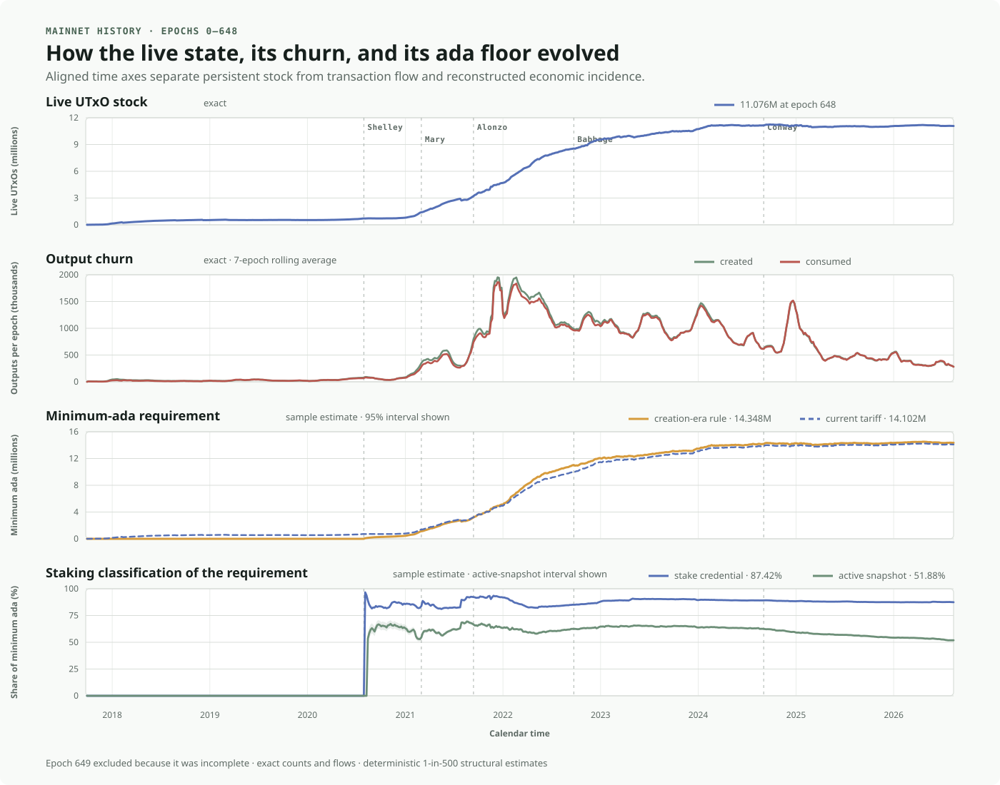
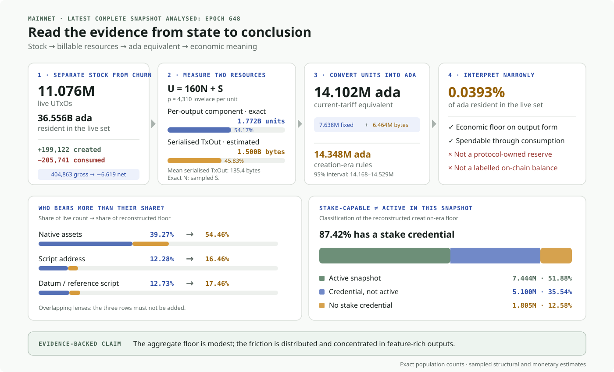

> **DRAFT — not for submission.** Items marked “verification required” need a
> decision, a reproducible artifact, or an independently checked figure before this
> document is proposed. See the [draft notes](../NOTES.md).

## Table of Contents

- [1. Abstract](#1-abstract)
- [2. Problem](#2-problem)
  - [2.1 Persistent UTxO state is a shared resource](#21-persistent-utxo-state-is-a-shared-resource)
  - [2.2 The current mainnet mechanism](#22-the-current-mainnet-mechanism)
    - [2.2.1 Output-level rule and representation](#221-output-level-rule-and-representation)
    - [2.2.2 The bound it provides](#222-the-bound-it-provides)
    - [2.2.3 How the rule evolved](#223-how-the-rule-evolved)
  - [2.3 What the mainnet data shows](#23-what-the-mainnet-data-shows)
    - [2.3.1 Stock is not churn](#231-stock-is-not-churn)
    - [2.3.2 From resource units to ada](#232-from-resource-units-to-ada)
    - [2.3.3 Where the incidence falls](#233-where-the-incidence-falls)
    - [2.3.4 Stake credential is not active stake](#234-stake-credential-is-not-active-stake)
    - [2.3.5 What this evidence does and does not establish](#235-what-this-evidence-does-and-does-not-establish)
  - [2.4 The solution-neutral mechanism](#24-the-solution-neutral-mechanism)
    - [2.4.1 Outputs occupy capacity](#241-outputs-occupy-capacity)
    - [2.4.2 Transactions allocate and release capacity](#242-transactions-allocate-and-release-capacity)
    - [2.4.3 A complete mechanism must preserve a bound](#243-a-complete-mechanism-must-preserve-a-bound)
    - [2.4.4 Pricing and settlement are separate from measurement](#244-pricing-and-settlement-are-separate-from-measurement)
  - [2.5 The core problem: the implementation crosses the abstraction boundary](#25-the-core-problem-the-implementation-crosses-the-abstraction-boundary)
    - [2.5.1 Representation mismatch](#251-representation-mismatch)
    - [2.5.2 Responsibility mismatch](#252-responsibility-mismatch)
    - [2.5.3 Lifecycle mismatch](#253-lifecycle-mismatch)
    - [2.5.4 Observable consequences](#254-observable-consequences)
  - [2.6 A non-overlapping design-space framework](#26-a-non-overlapping-design-space-framework)
    - [2.6.1 Invariants are not implementation choices](#261-invariants-are-not-implementation-choices)
    - [2.6.2 Four decisions define a complete mechanism](#262-four-decisions-define-a-complete-mechanism)
    - [2.6.3 What the explored mechanisms actually specify](#263-what-the-explored-mechanisms-actually-specify)
    - [2.6.4 Findings that already constrain the design space](#264-findings-that-already-constrain-the-design-space)
- [3. Use Cases](#3-use-cases)
  - [3.1 High-fan-out distribution](#31-high-fan-out-distribution)
  - [3.2 Small native-asset payments](#32-small-native-asset-payments)
  - [3.3 Token-rich and script-based application state](#33-token-rich-and-script-based-application-state)
  - [3.4 Continuing outputs after a parameter change](#34-continuing-outputs-after-a-parameter-change)
  - [3.5 Economically stranded and unsolicited outputs](#35-economically-stranded-and-unsolicited-outputs)
- [4. Goals and Non-goals](#4-goals-and-non-goals)
  - [4.1 Properties that must be preserved](#41-properties-that-must-be-preserved)
  - [4.2 Outcomes to improve](#42-outcomes-to-improve)
  - [4.3 Non-goals](#43-non-goals)
- [5. Open Questions](#5-open-questions)
  - [5.1 Capacity and evidence](#51-capacity-and-evidence)
  - [5.2 Settlement and representation](#52-settlement-and-representation)
  - [5.3 Transition and governance](#53-transition-and-governance)
- [Appendix A. Quantifying and calibrating the current bound](#appendix-a-quantifying-and-calibrating-the-current-bound)
  - [A.1 Economic ceilings](#a1-economic-ceilings)
  - [A.2 Relationship between the scalar bound and a resource envelope](#a2-relationship-between-the-scalar-bound-and-a-resource-envelope)
  - [A.3 Calibration requirements](#a3-calibration-requirements)
- [Appendix B. Conditional accounting tests for refundable designs](#appendix-b-conditional-accounting-tests-for-refundable-designs)
- [6. References](#6-references)
- [7. Copyright](#7-copyright)

## 1. Abstract

Cardano’s EUTxO ledger represents spendable value and application state as unspent
transaction outputs [[4]](#ref-4). Every live output must be retained, indexed, and served by
nodes until a later transaction consumes it. Since outputs do not expire, unlimited
low-cost creation would turn transaction throughput into an unbounded persistent
resource requirement.

Cardano protects against that outcome by requiring every created output to contain a
minimum quantity of ada. The amount depends on a fixed per-entry overhead and the
serialised size of the output. Because the ada supply is finite, the rule creates an
indirect economic ceiling on the weighted amount of live UTxO state. This CPS accepts
the need for such a bound.

The current rule is effective in a specific sense, but its implementation blends two
different concerns. The application uses `TxOut.Value` to transfer assets and
represent state. The protocol uses a floor on that same value to ration a shared node
resource. The ledger records neither a distinct state obligation nor its allocation,
release, beneficiary, or repricing lifecycle.

An epoch-648 reconstruction of Cardano mainnet makes the problem more precise. The
live set contained 11,076,329 UTxOs and 36.556 billion ada. The era-specific minimum
requirements associated with those outputs are estimated at 14.348 million ada
(95% interval: 14.168–14.529 million), or 0.0393% of ada resident in the UTxO set.
This is not evidence that a large fraction of Cardano’s supply is frozen. It is
evidence that a node-state policy is distributed across millions of application
objects and that its incidence is concentrated in output-heavy, token-rich, and
script-based workflows.

The same data also rejects a common simplification about staking. An estimated
87.42% of the minimum-ada amount is associated with addresses carrying a stake
credential, while 51.88% is associated with credentials present in the active
epoch-stake snapshot. Delegation capability and active snapshot membership are
different properties; ada committed to a UTxO is not universally excluded from
staking.

The core problem is therefore architectural rather than a claim of immediate
mainnet insolvency or unsafe scale. Wallets, transaction builders, and applications
must implement the funding and lifecycle consequences of an internal state-control
mechanism inside ordinary value transfer. A replacement must restore that abstraction
boundary without weakening the adversarial bound.

This CPS defines the resource lifecycle independently of ada, fees, reserves,
accounts, tokens, or migration strategy. It then separates the implementation design
space into four decisions: capacity control, economic settlement, ledger
representation, and transition. It does not select a solution.

> **Problem in one sentence:** Cardano makes application outputs carry and preserve
> the value used to protect shared ledger state, so upper layers must implement a
> resource-accounting lifecycle that the ledger does not represent explicitly.

## 2. Problem

### 2.1 Persistent UTxO state is a shared resource

Four facts establish the underlying resource problem:

1. A UTxO is a discrete live entry identified by `(transaction id, output index)`.
2. A transaction consumes complete prior outputs and creates complete new outputs.
3. A transaction may create more entries or more bytes than it consumes.
4. An unspent output has no expiry and can remain live indefinitely.

The live UTxO set is therefore the frontier of transaction history that nodes must
retain to validate future transactions. Users decide which outputs to create; node
operators collectively retain and serve the resulting state.


This distinction separates a **flow** from a **stock**. Created and consumed outputs
are transaction flows. The live UTxO set is the persistent stock left after those
flows net against one another:

```math
N_{t+1}
=
N_t
+ |\mathrm{outputs}(tx)|
- |\mathrm{inputs}(tx)|
```

A chain can process a large gross flow while its persistent stock remains stable or
declines. Conversely, a small sustained excess of output creation can accumulate
state indefinitely. Transaction fees may make the flow expensive, but a reusable
fee payment does not by itself cap the stock [[3]](#ref-3).

The protocol therefore needs an admission or economic mechanism that keeps persistent
state within a defensible bound under adversarial transaction sequences. The question
addressed by this CPS is not whether that protection should exist, but how it should
meet the application interface.

### 2.2 The current mainnet mechanism

#### 2.2.1 Output-level rule and representation

Since Babbage, an output is valid only if it contains at least the amount specified
by [CIP-55](https://github.com/cardano-foundation/CIPs/tree/master/CIP-0055#the-new-minimum-lovelace-calculation):

```math
\mathrm{minUTxO}(o)
=
\left(160+\mathrm{sizeInBytes}(\mathrm{TxOut}(o))\right)
\times \mathrm{coinsPerUTxOByte}
```

The terms are:

- `sizeInBytes(TxOut)` — the serialised output size;
- `coinsPerUTxOByte` — an updatable protocol parameter; and
- `160` — a fixed accounting overhead for the input and map entry associated with
  one live output.

At mainnet epoch 648, the
[parameter response](https://api.koios.rest/api/v1/epoch_params?_epoch_no=648)
reports `coins_per_utxo_size = 4,310` lovelace. A 100-byte serialised output therefore
has 260 billable units and requires:

```math
(160+100)\times4{,}310
=1{,}120{,}600\ \mathrm{lovelace}
=1.1206\ \mathrm{ada}
```

If an output transfers only a native asset, the creator must nevertheless put the
required ada in that output. The amount is not paid to a protocol pot and is not
recorded as a separate deposit. It is ordinary ada in `TxOut.Value` and comes under
the control of whoever can spend the output.

The
[constitutional guardrail description](https://cardano.org/constitution/#utxo-cost-per-byte-utxocostperbyte)
calls the amount a deposit that is returned when the UTxO is no longer active. This
is an economic description of the effect. In ledger representation, no separate
deposit claim is returned: consuming the output gives its transaction control over
the complete `TxOut.Value`.

This CPS uses **minimum-ada commitment** for the economic role of that amount.
“Locked” is too strong: the ada is spendable when the UTxO is consumed. “Protocol
deposit” is also inaccurate: the ledger does not separately identify a deposit,
depositor, liability, or refund.

#### 2.2.2 The bound it provides

For a live output with serialised size `s(o)`, define the quantity priced by the
current rule:

```math
u(o)=160+s(o)
```

Across the live set:

```math
U(t)
=
\sum_{o\in\mathrm{UTxO}(t)}u(o)
=
160N(t)+S(t)
```

where `N(t)` is the number of live outputs and `S(t)` is their aggregate billable
serialised size. If `p` is the price per unit and `A` ada is available to satisfy
the floor, then:

```math
p\,U(t)\leq A
\qquad\Longrightarrow\qquad
U(t)\leq\left\lfloor\frac{A}{p}\right\rfloor
```


The current mechanism therefore provides a finite economic ceiling on the weighted
quantity `160N+S`. Since every output contributes a positive fixed amount, it also
implies a finite worst-case output count.

That proof has a limited but important scope:

- it establishes finiteness, not a measured safe operating point;
- it constrains one scalar combination of entry count and bytes, not independently
  calibrated limits for both dimensions;
- it does not show that 160 accounting units still represent current RAM, disk,
  lookup, rollback, snapshot, or synchronisation costs; and
- it does not show that the current price balances attack resistance and legitimate
  application friction.

The existence of a bound and the calibration of that bound are separate questions.
Appendix A retains the detailed quantitative test without making it the entry point
to the problem narrative.

#### 2.2.3 How the rule evolved

The rule changed as outputs became more expressive, while preserving the same basic
premise: every output must carry ada.

| Era | Mechanism | Mainnet value or basis | Change in representation |
|---|---|---:|---|
| Shelley | Flat `minUTxOValue` | 1 ada | One floor for outputs without native-asset bundles |
| Mary | Size-dependent formula derived from `minUTxOValue` [[5]](#ref-5) | 1 ada over the documented 27-unit ada-only entry | Token bundles made output sizes variable |
| Alonzo | `coinsPerUTxOWord` | 34,482 lovelace per eight-byte word | Per-size pricing became a protocol parameter |
| Babbage | `coinsPerUTxOByte` | 4,310 = ⌊34,482 / 8⌋ | Per-byte pricing and the current formula |
| Conway | Same formula under governance | 4,310 at epoch 648 | Parameter updates governed as a critical protocol change |

The current value was inherited by unit conversion from the
[Alonzo genesis configuration](https://github.com/input-output-hk/cardano-configurations/blob/master/network/mainnet/genesis/alonzo.json#L2).
It was not introduced as a new empirical estimate of contemporary node costs.

> **Verification required:** the Mary documentation derives 37,037 per documented
> size unit while Alonzo genesis records 34,482 per word. The intended Mary unit and
> the reason for this change must be independently reconciled before submission.

### 2.3 What the mainnet data shows

This section uses two views of mainnet through the latest complete snapshot analysed,
epoch 648. Epoch 649 is excluded because it is incomplete. Counts and flows are
exact; minimum-ada and staking amounts are reconstructed because the ledger does not
label any lovelace as “the minimum”.



The history shows three different behaviours. The live stock grew rapidly from 2020
to 2024 and then broadly plateaued. Creation and consumption remained much larger
than their net effect and moved closely together. The reconstructed floor followed
the expansion of the live set, while active-snapshot participation increasingly
diverged from the presence of a stake credential.

The endpoint below then makes the reasoning explicit: separate stock from churn,
measure the two priced dimensions, convert them into ada, and only then interpret
who bears the incidence.



#### 2.3.1 Stock is not churn

Epoch 648 ended with **11.076 million live UTxOs** and **36.556 billion ada** in
them. During the epoch, 199,122 outputs were created and 205,741 were consumed:
**404,863 gross changes produced a net reduction of 6,619 outputs**. A state-control
mechanism must therefore account for both allocation and release, not creation alone.

#### 2.3.2 From resource units to ada

Under the current tariff, `D = p(160N + S)`. The exact output count contributes
**7.638 million ada (54.17%)**; the estimated 1.500 billion serialised `TxOut` bytes
contribute **6.464 million ada (45.83%)**. Together they revalue the live set at
**14.102 million ada**.

Applying each output’s creation-era rule gives **14.348 million ada**
(95% interval: 14.168–14.529 million), or **0.0393%** of the ada resident in the
live set. This is an economic floor attached to output form, not a protocol reserve
or a separately identifiable coin balance: the ada remains spendable, but cannot all
be reused elsewhere while preserving an equivalent output.

#### 2.3.3 Where the incidence falls

Feature-rich outputs carry more of the reconstructed floor than their share of the
live count: **native assets 39.27% → 54.46%**, **script addresses 12.28% → 16.46%**,
and **datum/reference-script outputs 12.73% → 17.46%**. These overlapping lenses must
not be summed. They show concentrated application-level friction, not a large
system-wide ada lock-up.

#### 2.3.4 Stake credential is not active stake

Of the reconstructed floor, **87.42%** is at addresses with a stake credential, but
only **51.88%** is associated with a credential in the epoch-648 active snapshot
(95% interval: 50.97%–52.79%). Snapshot timing and registration/delegation state
explain part of the gap. The rule limits independently reusable liquidity; it does
not universally prevent the same ada from contributing to stake.

#### 2.3.5 What this evidence does and does not establish

The mainnet analysis supports five conclusions:

1. The current mechanism protects a live set already containing more than eleven
   million outputs.
2. Its reconstructed ada commitment is small relative to total UTxO-held ada, but
   economically concentrated in feature-rich outputs and potentially large relative
   to low-value transfers.
3. Much of that ada remains structurally compatible with delegation, although active
   snapshot participation is materially lower.
4. At the current tariff, the fixed per-output component accounts for 54.17% of the
   reconstructed requirement and serialised output content for 45.83%. Both entry
   count and content size are therefore material to the design.
5. Gross output churn is much larger than net state change, making transaction-level
   allocation and release a relevant design boundary.

The analysis does **not** establish that the current weighted ceiling is safe for
node operation, that `coinsPerUTxOByte` is calibrated to current infrastructure, or
that a replacement would be cheaper or more secure. Those questions require
benchmarks and a complete alternative.

This evidence changes the emphasis of the CPS. The problem is not “mainnet has
already locked too much ada”. The problem is that a necessary state-control policy
is exposed through application value and lacks an explicit ledger-owned lifecycle.

### 2.4 The solution-neutral mechanism

This section describes the common mechanism that every alternative must implement in
some form. It is an analytical model, not a claim that the current ledger stores
capacity counters, deposits, or release claims.


#### 2.4.1 Outputs occupy capacity

Every live output consumes at least two resource dimensions:

1. one distinct entry in the global set — the **box**; and
2. a variable serialised representation — the **object**.

Represent the capacity occupied by output `o` as:

```math
c(o)=(1,s(o))
```

Across the live set:

```math
N(t)=|\mathrm{UTxO}(t)|
\qquad
S(t)=\sum_{o\in\mathrm{UTxO}(t)}s(o)
```

The dimensions proxy different concerns:

| Dimension | Operational concern | Adversarial shape |
|---|---|---|
| Entry count, `N` | Keys, lookups, rows, indices, cache locality, and per-entry bookkeeping | Many minimal outputs maximise cardinality |
| Serialised content, `S` | Disk footprint, I/O, snapshots, synchronisation, and serialisation | Larger outputs maximise aggregate bytes |

The dimensions are coupled because every valid output has a positive serialised size.
They are not interchangeable: storage architecture can change byte and per-entry
costs at different rates.

Cardano’s current formula projects this vector into one scalar:

```math
U(t)=(160,1)\cdot(N(t),S(t))=160N(t)+S(t)
```

That is one implementation choice. The solution-neutral model retains `N` and `S`
separately so a candidate can justify its measurement and bound explicitly.

#### 2.4.2 Transactions allocate and release capacity

Outputs are the persistent objects. Transactions are the operations that change the
live allocation.

For transaction `tx`:

```math
\Delta_N(tx)
=
|\mathrm{outputs}(tx)|
-|\mathrm{inputs}(tx)|
```

```math
\Delta_S(tx)
=
\sum_{o\in\mathrm{outputs}(tx)}s(o)
-
\sum_{i\in\mathrm{inputs}(tx)}s(i)
```

```math
\Delta_C(tx)=(\Delta_N(tx),\Delta_S(tx))
```

The ledger transition is:

```math
C_{t+1}=C_t+C_{\mathrm{created}}(tx)-C_{\mathrm{consumed}}(tx)
```

This yields the central abstraction:

> **Outputs determine the capacity retained. Transactions allocate and release that
> capacity atomically.**

Per-output measurement may be necessary because each output has a different size.
It does not follow that the application must fund, represent, or settle the
obligation separately inside every output.

#### 2.4.3 A complete mechanism must preserve a bound

Let:

```math
C(t)=(N(t),S(t))
\qquad\text{and}\qquad
C_{\max}=(N_{\max},S_{\max})
```

The analytical safety objective is:

```math
C(t)\preceq C_{\max}
```

`N_{\max}` and `S_{\max}` are defensible operating limits to be established by
measurement; they are not current Cardano protocol parameters.

A mechanism can preserve safety in different ways:

- an **economic bound** can require allocations to consume a finite scarce resource;
- an **explicit capacity rule** can reject a transaction whose post-state exceeds a
  consensus limit; or
- a **hybrid** can combine a hard safety ceiling with economic congestion and cleanup
  incentives.

Whatever implementation is chosen, it must make unlimited free allocation
unavailable under adversarial sequences. If consuming state produces a credit or
release, that benefit must be derived from a unique live input so the same capacity
cannot be released twice.

The whole-output and unique-out-ref properties of EUTxO provide the conservation
anchor: capacity can be released only by consuming an allocation that is currently
live. They do not by themselves choose a price, beneficiary, backing asset, reserve,
or migration policy.

#### 2.4.4 Pricing and settlement are separate from measurement

If a candidate prices the two capacity dimensions, define:

```math
p(t)=(p_{\mathrm{box}}(t),p_{\mathrm{byte}}(t))
```

and the priced occupation of output `o`:

```math
D(o,t)
=
p_{\mathrm{box}}(t)
+s(o)p_{\mathrm{byte}}(t)
```

At fixed prices, the net priced state change of a transaction is:

```math
\Delta_D(tx)
=
p_{\mathrm{box}}(t)\Delta_N(tx)
+p_{\mathrm{byte}}(t)\Delta_S(tx)
```

A positive delta allocates more priced capacity than it releases. A negative delta
releases more than it allocates. This arithmetic does not decide whether settlement
is gross or net, immediate or deferred, refundable or non-refundable, denominated in
ada or another unit, or credited to any particular beneficiary.

Price changes are a separate transition. Repricing already live capacity by
`\Delta p_{\mathrm{box}}` and `\Delta p_{\mathrm{byte}}` creates:

```math
\Delta_P
=
N(t)\Delta p_{\mathrm{box}}
+S(t)\Delta p_{\mathrm{byte}}
```

No application transaction created or removed state in that transition. A candidate
that applies new prices to existing claims must identify a counterparty and preserve
solvency. A candidate that applies prices only prospectively must specify the rule
for historical outputs and their successors.

This separation is the basis for diagnosing the current interface.

### 2.5 The core problem: the implementation crosses the abstraction boundary

Bounding persistent state is **essential complexity**. Representing its economic
obligation as ordinary ada in every output and exporting its lifecycle to every
transaction builder is **accidental complexity**.

The desired boundary is familiar from transaction fees: a builder determines and
funds a ledger obligation, while the ledger owns its validation, collection, and
subsequent accounting. Funding a protocol obligation does not require the application
to implement the protocol’s balance sheet.

Minimum ada crosses this boundary in three distinct ways.

#### 2.5.1 Representation mismatch

The ledger validates:

```math
\forall o\in\mathrm{outputs}(tx),
\qquad
\mathrm{coin}(o)\geq M(o,p)
```

It does not record `M(o,p)` as a separate state obligation. Once the output is
created, the ada that satisfied the rule is indistinguishable from value the
application intended to transfer.

Two concepts are therefore represented by one field:

| Concept | Intended role | Current representation |
|---|---|---|
| Application value | Transfer assets or preserve application state | `TxOut.Value` |
| State-protection obligation | Ration persistent node capacity | A lower bound on the ada inside the same `TxOut.Value` |

This is why a native-asset-only intent cannot be represented as an independent output
without ada. The state obligation changes the value-transfer interface itself.

#### 2.5.2 Responsibility mismatch

Under the current mechanism, a builder must:

1. measure every output;
2. calculate its floor;
3. source sufficient ada;
4. distribute that ada across outputs;
5. rebalance change; and
6. preserve sufficient value through later state transitions.

The transaction creator funds the obligation, but also implements its output-level
allocation. Wallets and applications must expose a second economic concept beside
the transaction fee:

```text
intended transfer
+ transaction fee
+ ada carried by every output
```

The last term is neither a normal fee nor a separately visible deposit. Its
application-facing complexity follows from the representation, not from the fact
that state must be protected.

#### 2.5.3 Lifecycle mismatch

The current ledger records no explicit:

- allocation separate from output value;
- payer or policy-defined beneficiary;
- release condition;
- claim value;
- reserve or backing account; or
- settlement rule for parameter changes.

Consider Alice creating a token output for Bob. Alice supplies the required ada.
When Bob consumes the output, Bob’s transaction controls the ada because it controls
the complete output. That result may resemble a protocol policy that rewards the
transaction releasing capacity, but the ledger does not express such a policy. It
arises indirectly from application-value ownership.


Likewise, an output created at price `p_0` retains its nominal ada while governance
may later apply `p_1` to new outputs. If an equivalent successor now requires more
ada, the spending transaction must source the difference. The historical output
remains consumable, but its intended continuing state transition can require a
top-up.

The issue is not that every design must refund the original payer. A common-resource
policy could charge the allocator and credit the transaction that later releases
capacity without retaining payer identity. The requirement is that the lifecycle be
explicit rather than accidentally inherited from `TxOut.Value` ownership.

#### 2.5.4 Observable consequences


The three mismatches produce observable symptoms:

| Symptom | Why it occurs |
|---|---|
| Native-asset transfers require ada | The state obligation is represented inside application value |
| High-fan-out and state-heavy workflows multiply the commitment | The obligation is funded gross, output by output |
| Builders expose a second transaction-cost concept | Applications implement allocation as well as funding |
| Ada is less independently reusable while state remains equivalent | The floor is fragmented across live output balances |
| Historical continuing outputs may need a top-up | Creation-time output value and future policy prices follow different timelines |
| Release and beneficiary semantics are implicit | Control follows output ownership rather than an explicit settlement rule |

The liquidity statement must remain precise. Ada in a live UTxO is not frozen and may
contribute to stake when its address and credential state permit. The restriction is
on redeploying that ada **independently while preserving equivalent output state**.

> **The abstraction leak:** upper layers should fund a ledger-defined state
> obligation; they should not have to represent and manage that obligation as part
> of the application value carried by every output.

### 2.6 A non-overlapping design-space framework

This CPS does not compare names such as “negative fees”, “reserve”, and “capacity
token” as if each were a complete alternative. They answer different questions.

#### 2.6.1 Invariants are not implementation choices

Every viable mechanism must satisfy the following properties:

1. **Bounded live state.** An adversary cannot grow admitted persistent state beyond
   the mechanism’s defensible limit.
2. **Local deterministic validation.** A node can validate a transaction from
   consensus state without relying on uncertain future revenue or off-chain actors.
3. **Conservation.** A state release or credit can arise only from capacity actually
   released by uniquely consumed live inputs.
4. **No double claim.** The same allocation cannot remain live and also generate a
   release.
5. **Solvency where payment is guaranteed.** Every promised credit or refund has an
   identified, isolated, sufficient source of funds.
6. **Unambiguous legacy treatment.** Existing outputs cannot acquire claims against
   backing they never funded.

These are evaluation criteria. A proposal cannot trade one away merely by choosing a
different representation.

#### 2.6.2 Four decisions define a complete mechanism

The implementation space is split into four layers. Each layer asks one different
question:

| Layer | Question | Representative choices |
|---|---|---|
| **1. Capacity control** | What resource is measured, and what makes an unsafe stock unreachable? | `160N+S` or separate `N` and `S`; finite scarce backing; explicit hard cap; hybrid |
| **2. Economic settlement** | Who funds an allocation, who benefits from a release, at what price, and when? | Gross per-output funding; transaction-level net charge/credit; non-refundable charge; refundable claim; creation-time or current-price release; immediate or epoch settlement |
| **3. Ledger representation** | Where is the obligation recorded and, if applicable, where is it backed? | Ada in `TxOut.Value`; separate ledger liability and reserve; credential/account balance; internal capacity unit or specialised token |
| **4. Transition** | How do legacy and new state coexist? | Forced migration; grandfathering; lazy migration with legacy inputs and post-fork outputs under different rules |

A complete design is a coherent tuple:

```text
(capacity control,
 settlement policy,
 ledger representation,
 transition rule)
```

Options from different rows are not substitutes. For example, “use a reserve” does
not answer how state is bounded or who receives a release. “Use a negative fee” does
not identify the liability’s backing. “Use a hard cap” does not define allocation
prices or migration.

#### 2.6.3 What the explored mechanisms actually specify

The following terms can now be placed without overlap:

| Term | Layer it primarily specifies | Decisions it leaves open |
|---|---|---|
| **Negative state fee / state credit** | Economic settlement interface | Capacity bound, backing, beneficiary, repricing, and legacy treatment |
| **Fee pot or capacity reserve** | Ledger representation and custody of backing | Resource measurement, price, admission rule, and release policy |
| **Specialised capacity token** | Ledger representation of the accounting unit | Whether scarcity actually enforces the bound, redemption, price stability, distribution, staking treatment, and migration |
| **Explicit UTxO cap** | Capacity control | Admission priority, economic incidence, cleanup incentive, and transition |
| **Dust account** | Application-state architecture adjacent to this mechanism | It can reduce output creation for some uses, but does not define base-ledger capacity accounting |

If a specialised token’s finite supply is itself relied upon to bound state, that
claim belongs in the capacity-control proof as well. Calling a counter a token does
not create scarcity automatically; issuance, redemption, and conservation rules must
make the bound real.

The current mechanism can itself be described as one tuple:

| Layer | Current answer |
|---|---|
| Capacity control | Economic ceiling on `160N+S` through positive minimum ada and finite ada supply |
| Economic settlement | Gross funding in every created output; release follows control of a consumed output implicitly |
| Ledger representation | Ordinary ada inside `TxOut.Value`; no separate claim or reserve |
| Transition | Prospective parameter changes; historical outputs remain spendable under their existing value |

This decomposition permits like-for-like comparison without treating current or
candidate mechanisms as indivisible packages.

#### 2.6.4 Findings that already constrain the design space

The exploration so far establishes:

1. **Ordinary reusable fees do not bound the stock.** They raise the cost or slow the
   rate of growth, but redistributed ada can fund later state creation.
2. **A guaranteed state-reduction credit is a liability.** Calling it a negative fee
   does not eliminate the need for an isolated solvent source of funds.
3. **A reserve is not a complete mechanism.** It describes custody or backing, not
   measurement, pricing, beneficiary semantics, or admission.
4. **Economic backing and a hard cap protect different properties.** Scarce backing
   creates an economic stock bound; a hard cap makes a post-state unreachable. A
   hybrid may use both.
5. **Measurement and settlement may have different granularity.** Outputs can be
   measured individually while the transaction funds or receives one net delta.
6. **Epoch settlement cannot make transaction validity depend on future fee income.**
   Deferred accounting is possible only when every guaranteed credit is already
   backed or otherwise bounded.
7. **Reserve staking is a policy choice.** A common reserve must state whether its ada
   is stake-bearing and who benefits from the rewards.
8. **Legacy coexistence is possible.** A lazy migration can allow legacy inputs while
   requiring post-fork outputs to use the new mechanism, provided legacy state still
   counts toward the bound and cannot mint an unfunded release claim.

The remaining work is to construct complete tuples and compare them under the same
security, solvency, abstraction, liquidity, staking, compatibility, and governance
criteria. That comparison belongs to a subsequent alternatives report or proposed
solution, not to the CPS problem statement.

## 3. Use Cases

### 3.1 High-fan-out distribution

A transaction or batch distributing tokens to `n` independent recipients creates
`n` outputs. If output `i` requires `m_i` ada, the gross output-side requirement is:

```math
A_{\mathrm{outputs}}
=
\sum_{i=1}^{n}m_i
```

The same token quantity therefore requires more ada when divided among more
recipients. The ada becomes recipient-controlled output value rather than a protocol
fee, but the distributor must source and allocate it at construction time.

This affects airdrops, reward distribution, exchange withdrawals, and any service
that deliberately creates many independent outputs. Before submission, this use case
should include at least one named, citable Cardano transaction set with verified
recipient count and output sizes.

### 3.2 Small native-asset payments

An independent native-asset payment output must also contain ada. For a payment with
economic value `v`, transaction fee `f`, and output commitment `m`, the sender-facing
capital requirement is:

```math
v+f+m
```

The permanent protocol cost is not necessarily `f+m` because the recipient controls
the output ada. Nevertheless, `m` can dominate the payment value, require additional
input selection, and impose an exchange-rate exposure unrelated to the asset being
transferred.

This affects tipping, metering, stablecoin payments, machine-to-machine settlement,
and pay-per-use services. The relevant metric is both absolute ada commitment and
its percentage of the intended payment.

### 3.3 Token-rich and script-based application state

[CIP-68 reference-token](https://github.com/cardano-foundation/CIPs/tree/master/CIP-0068)
designs use outputs carrying native assets and datum. Beacon-token designs such as
[CIP-89](https://github.com/cardano-foundation/CIPs/tree/master/CIP-0089) use outputs
to identify application state. Order books, oracles, and other protocols can likewise
represent each live state object as a separate script output.

The mainnet analysis provides direct ecosystem-scale context without attributing
outputs to a particular application:

- native-asset outputs account for an estimated 39.27% of live outputs but 54.46% of
  reconstructed minimum ada;
- script-address outputs account for 12.28% of live outputs but 16.46% of minimum
  ada; and
- outputs with datum or reference-script data account for 12.73% of live outputs but
  17.46% of minimum ada.

These feature groups overlap. Their purpose is to show that the rule is more visible
for richer application objects, not to form an additive market segmentation.

### 3.4 Continuing outputs after a parameter change

Suppose an output of billable size `b` was created under price `p_0` with exactly:

```math
m_0=bp_0
```

If governance later sets `p_1>p_0`, an equivalent new output requires:

```math
m_1=bp_1
\qquad\text{and}\qquad
\Delta m=b(p_1-p_0)
```

The historical output remains consumable. A validator or application that requires
an equivalent continuing output may nevertheless force the spending transaction to
source `\Delta m` from another input. Without that top-up, the intended state
transition can be operationally unavailable even though the input itself is valid.

This use case matters for long-lived script protocols whose transition rules require
a continuing output of a prescribed form.

### 3.5 Economically stranded and unsolicited outputs

An output can remain valid yet be uneconomical to consume when:

```math
\mathrm{recoverableValue}(o)
<
\mathrm{marginalConsumptionCost}(o)
```

Research on Bitcoin, Bitcoin Cash, and Litecoin documents the general dust condition
in which spending costs exceed recoverable value [[2]](#ref-2). Cardano’s fee and
minimum-output rules differ, so its prevalence must be measured independently.

Anyone may also create an output at another user’s address. The recipient cannot
decline it. The accompanying ada belongs to the recipient, but consuming unsolicited
assets and constructing valid replacements can increase coin-selection and
transaction-building complexity.

These cases overlap with
[CPS-0009](https://github.com/cardano-foundation/CIPs/tree/master/CPS-0009) and
[CPS-0022](https://github.com/cardano-foundation/CIPs/tree/master/CPS-0022). This CPS
uses them only where the minimum-ada representation changes recoverability or builder
behaviour.

## 4. Goals and Non-goals

### 4.1 Properties that must be preserved

Any proposed solution must:

1. preserve a defensible adversarial bound on live UTxO state;
2. remain locally and deterministically validatable;
3. prevent double release of consumed capacity;
4. identify solvent backing for every guaranteed payment;
5. keep legacy and post-change claims unambiguous; and
6. retain Cardano’s whole-output consumption semantics.

### 4.2 Outcomes to improve

A successful solution should:

1. restore the abstraction boundary so applications fund a ledger obligation without
   implementing its accounting lifecycle;
2. separate state protection from application value where practical;
3. expose one explicit allocation and release policy;
4. make liquidity, staking, custody, and beneficiary consequences inspectable;
5. define how price changes affect live and successor outputs;
6. allow builders to reason at transaction level even when outputs are measured
   individually; and
7. provide a credible transition for the existing UTxO set.

### 4.3 Non-goals

This CPS does not:

- claim that persistent state should be free or unbounded;
- claim that the current 14.348-million-ada estimate is a protocol-owned balance or a
  large fraction of Cardano’s supply;
- prove that current mainnet state is operationally unsafe;
- set a new value for `coinsPerUTxOByte`;
- select a reserve, negative-fee, token, account, hard-cap, or hybrid design;
- prescribe state rent or deletion on expiry; lifetime pricing is a separate design
  family [[1]](#ref-1);
- redesign the EUTxO model; or
- address non-UTxO sources of ledger-state growth.

## 5. Open Questions

### 5.1 Capacity and evidence

1. Which resource dimensions and operational deadlines define defensible
   `N_{\max}` and `S_{\max}` for current `InMemory` and `OnDisk` node backends?
2. Does the fixed 160-to-1 weighting remain defensible under current storage,
   indexing, snapshot, rollback, and synchronisation architectures?
3. What are the smallest and largest complete valid `TxOut` encodings in each
   relevant era?
4. What UTxO-set size and growth path materially degrade node operation, and what
   capital and transaction throughput would an adversary require to reach them?
5. Can the monetary estimates be reproduced with independent samples and an
   independent implementation of the historical rules?
6. Which named application and transaction datasets should provide citable evidence
   for high fan-out, continuing state, and economically stranded outputs?

### 5.2 Settlement and representation

1. Should safety rely on finite economic backing, explicit count and byte caps, or a
   hybrid?
2. Should transactions fund gross created capacity or one net allocation delta?
3. If state reduction earns a credit, should the beneficiary be the consuming
   transaction, an identified credential, an original funder, or another policy
   recipient?
4. Should a release use creation-time price, current price, or a different index?
5. If live claims are repriced, who funds an increase, who receives a decrease, and
   what invariant keeps the mechanism solvent?
6. If backing is held in ada, can it be staked, and who receives or benefits from the
   rewards?
7. If a specialised capacity token is used, what makes its supply, redemption, and
   exchange value suitable for an adversarial bound?
8. Can an epoch-level fee-pot settlement guarantee state-reduction credits without
   depending on uncertain future fee revenue?

### 5.3 Transition and governance

1. Can legacy outputs remain valid while all post-fork outputs use the new mechanism?
2. How does legacy state count toward a new cap or economic bound without acquiring
   unfunded refund claims?
3. Is migration voluntary, lazy on spend, or mandatory, and who bears its transaction
   cost?
4. How should a replacement interact with throughput increases under
   [Leios (CIP-0164)](https://github.com/cardano-foundation/CIPs/tree/master/CIP-0164)?
5. Which parameters remain constitutionally critical, and what monitoring and
   reversion plan is required?

## Appendix A. Quantifying and calibrating the current bound

This appendix retains the theoretical analysis needed to evaluate the current
mechanism without allowing extreme ceilings to dominate the problem narrative.

### A.1 Economic ceilings

For any ada budget `A` available to satisfy the rule:

```math
p(160N+S)\leq A
```

and:

```math
U_{\max}(A,p)
=
\left\lfloor\frac{A}{p}\right\rfloor
```

The [Shelley genesis configuration](https://github.com/input-output-hk/cardano-configurations/blob/master/network/mainnet/genesis/shelley.json#L60)
caps maximum supply at 45 billion ada. With `p=0.00431` ada and the deliberately
unreachable projection `S=0` for `N>0`:

```math
N_{\mathrm{ceiling}}^{\mathrm{absolute}}
\leq
\left\lfloor
\frac{45{,}000{,}000{,}000}
     {160\times0.00431}
\right\rfloor
=65.255\ \mathrm{billion}
```

Using the exact epoch-648 UTxO-resident balance of 36.556 billion ada gives:

| Scenario | Denominator per output | Algebraic count projection |
|---|---:|---:|
| Maximum supply, fixed overhead only | 0.6896 ada | 65.255 billion |
| Epoch-648 UTxO-resident ada, fixed overhead only | 0.6896 ada | 53.010 billion |
| Epoch-648 UTxO-resident ada, illustrative 100-byte output | 1.1206 ada | 32.622 billion |

These values are not reachable capacity targets. The first two use zero serialised
output bytes in the denominator. The third is an explicit size scenario, not a
verified current-era minimum. Ada resident in the UTxO set is also ordinary
application value, not a protocol capacity reserve.

The hierarchy establishes only that the current rule is finite. It does not show that
nodes can safely operate anywhere near the projections.

### A.2 Relationship between the scalar bound and a resource envelope

The relaxed scalar region is:

```math
\mathcal{R}_{\mathrm{scalar}}(U_{\max})
=
\{(N,S)\in\mathbb{R}_{\geq0}^{2}\mid160N+S\leq U_{\max}\}
```

The complete relaxed triangle fits inside
`C_{\max}=(N_{\max},S_{\max})` if and only if:

```math
U_{\max}
\leq
\min(160N_{\max},S_{\max})
```

This is conservative for actual ledger states because its non-zero axis intercepts
are impossible. Let `q_{\min}` be the smallest complete serialised output and
`s_{\max}^{\mathrm{out}}` the largest output admitted in a minimally valid
transaction. Reachable non-empty states also satisfy:

```math
Nq_{\min}\leq S\leq Ns_{\max}^{\mathrm{out}}
```

The coupled scalar region implies:

```math
N
\leq
\frac{U_{\max}}{160+q_{\min}}
\qquad\text{and}\qquad
S
\leq
\frac{U_{\max}s_{\max}^{\mathrm{out}}}
     {160+s_{\max}^{\mathrm{out}}}
```

Both output-size extrema require era-specific derivation from canonical encoding and
transaction-validity rules, including the indirect constraints imposed by
`maxTxSize` and `maxValueSize` [[6]](#ref-6).

### A.3 Calibration requirements

The Constitution treats
[`utxoCostPerByte` as critical](https://cardano.org/constitution/#2-1-critical-protocol-parameters)
and its
[specific guardrails](https://cardano.org/constitution/#utxo-cost-per-byte-utxocostperbyte)
currently constrain it to:

```math
3{,}000
\leq p
\leq6{,}500
\quad\mathrm{lovelace/byte}
```

The guardrails require consideration of attack cost and duration, full-node memory,
UTxO sizes, and total node memory. They do not define a calibration formula.

Current Developer Portal pages also provide provisioning guidance rather than
`N_{\max}` or `S_{\max}`. They disagree on storage recommendations, and the current
`OnDisk` backend is not equivalent to the proposed write-optimised LSM design
[[7]](#ref-7) [[8]](#ref-8) [[9]](#ref-9).

A defensible calibration must publish:

- the live UTxO footprint, size distribution, and growth;
- RAM, disk, I/O, lookup, rollback, restart, and synchronisation benchmarks;
- the reference node configurations;
- the safety envelope and headroom derived from those deadlines;
- adversarial fill cost and fill time;
- representative legitimate transaction effects; and
- a monitoring and reversion plan.

The fact that 4,310 is inside the constitutional range does not establish that it is
calibrated. Its historical lineage is a policy choice and unit conversion, not a
current marginal-resource measurement.

## Appendix B. Conditional accounting tests for refundable designs

This appendix applies only to designs that promise a release, rebate, or refund. It
is not a requirement that every alternative use a reserve.

Let `q_t(o)` be the payable claim associated with live output `o` and `B_t` the
isolated backing balance. Exact backing requires:

```math
B_t
=
\sum_{o\in\mathrm{UTxO}(t)}q_t(o)
```

For a transaction consuming inputs `I` and creating outputs `O`:

```math
B_{t+1}
=
B_t
-
\sum_{i\in I}q_t(i)
+
\sum_{o\in O}q_{t+1}(o)
```

If no unrelated transition can debit `B`, the claims of valid consumed inputs are
already backed. Unique out-refs and whole-output consumption prevent the same live
claim from being released twice.

If a governance transition changes the claim value of already live outputs, it must
also settle:

```math
\Delta B
=
\sum_{o\in\mathrm{UTxO}(t)}
\left(q_{t+1}(o)-q_t(o)\right)
```

before new-value releases are guaranteed. Otherwise a price increase creates
unfunded liabilities and a price decrease creates unexplained surplus.

These identities do not select the backing asset, beneficiary, price index, or
settlement time. They are solvency tests for any candidate that promises payment.

## 6. References

<a id="ref-1"></a>

1. Alexander Chepurnoy, Vasily Kharin, and Dmitry Meshkov, [*A Systematic
   Approach to Cryptocurrency Fees*](https://eprint.iacr.org/2018/078.pdf),
   2018. The paper models blockchain state as unspent outputs and proposes charging
   for both additional state and its lifetime.

<a id="ref-2"></a>

2. Cristina Pérez-Solà, Sergi Delgado-Segura, Guillermo Navarro-Arribas, and Jordi
   Herrera-Joancomartí, [*Another coin bites the dust: an analysis of dust in
   UTXO-based cryptocurrencies*](https://doi.org/10.1098/rsos.180817), *Royal
   Society Open Science*, volume 6, issue 1, 2019.

<a id="ref-3"></a>

3. Dimitris Karakostas, Nikos Karayannidis, and Aggelos Kiayias, [*Efficient State
   Management in Distributed Ledgers*](https://doi.org/10.1007/978-3-662-64331-0_17),
   in *Financial Cryptography and Data Security 2021*, LNCS 12675, pp. 319–338,
   2021. The paper defines state-efficient fees for UTxO ledgers and strategies that
   favour consuming state over creating it.

<a id="ref-4"></a>

4. Manuel M. T. Chakravarty, James Chapman, Kenneth MacKenzie, Orestis Melkonian,
   Michael Peyton Jones, and Philip Wadler, [*The Extended UTXO
   Model*](https://plutus.cardano.intersectmbo.org/resources/eutxo-paper.pdf),
   2020.

<a id="ref-5"></a>

5. IntersectMBO, [*Min-Ada-Value Requirement (Mary
   era)*](https://cardano-ledger.readthedocs.io/en/latest/explanations/min-utxo-mary.html).
   The ledger documentation derives the size-dependent minimum from the flat
   `minUTxOValue` and states its UTxO-set protection objective.

<a id="ref-6"></a>

6. Cardano Foundation, [*CIP-28: Protocol Parameters (Alonzo
   Era)*](https://cips.cardano.org/cip/CIP-28) and
   [*CIP-9: Protocol Parameters (Shelley Era)*](https://cips.cardano.org/cip/CIP-9).
   `maxValueSize` limits serialised `Value`; `maxTxSize` indirectly limits complete
   outputs and output count.

<a id="ref-7"></a>

7. Cardano Developer Portal, [*Minimum hardware requirements to run a stake
   pool*](https://developers.cardano.org/docs/operate-a-stake-pool/hardware-requirements/)
   and [*Installing cardano-node*](https://developers.cardano.org/docs/get-started/infrastructure/node/installing-cardano-node/).

<a id="ref-8"></a>

8. Duncan Coutts, [*Storing the Cardano ledger state on disk: requirements for a
   high performance backend*](https://ouroboros-consensus.cardano.intersectmbo.org/assets/files/utxo-db-lsm-1f1ffaa7c42ba448665a3dbca4a9f554.pdf).

<a id="ref-9"></a>

9. Ouroboros Consensus documentation, [*High Level Overview of
   UTxO-HD*](https://ouroboros-consensus.cardano.intersectmbo.org/docs/references/miscellaneous/utxo-hd/).

## 7. Copyright

This CPS is licensed under [CC-BY-4.0](https://creativecommons.org/licenses/by/4.0/legalcode).
