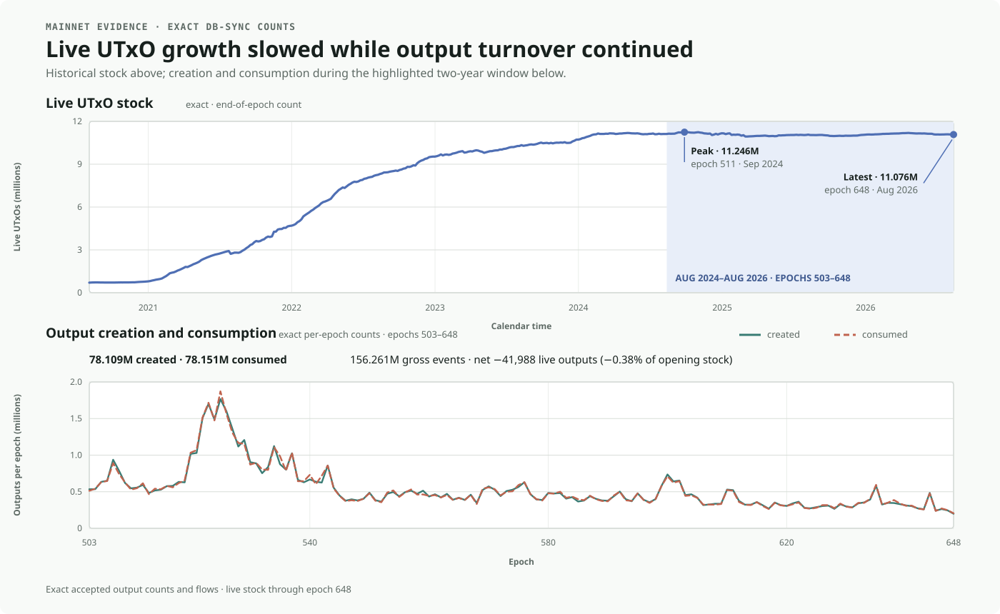

## Abstract

Cardano's current minUTxO rule requires every new transaction output to contain a
minimum amount of ada based on a fixed per-output overhead and the output's serialised
size. This size-sensitive requirement provides **economic coordination** for
persistent UTxO state. However, the required ada is represented as ordinary output
value, which creates additional friction.

The minimum is determined from the complete serialised `TxOut`, including application
content such as a datum or reference script. The ada used to satisfy it remains
ordinary coin in `TxOut.Value`, alongside the ada and native assets the application
intends the output to carry. The ledger records no separate deposit or backing
balance, and control of all ada follows the output's spending condition.

This coupling creates **accidental implementation friction** beyond the **necessary
resource friction** of protecting the live UTxO set. It can prevent an otherwise valid
transition from funding its own fee, prevent a standalone payment below minUTxO, make
a token sender supply ada later controlled by the recipient, and require ada in
application state that does not participate in staking. High fan-out and
successor-output top-ups amplify the funding and transaction-building burden.

This CPS documents these frictions, their current workarounds, and mainnet evidence
on live-UTxO behaviour under the current rule.

## Problem

### The current minUTxO rule

Under the current Babbage and Conway rule, every newly created output `o` must
satisfy [[1]](#ref-1):

```math
\mathrm{coin}(o)
\geq
\mathrm{minUTxO}(o)
=
\left(
160+\mathrm{sizeInBytes}(\mathrm{TxOut}(o))
\right)
\times
\mathrm{coinsPerUTxOByte}
```

Four properties of the rule are relevant here:

1. it applies separately to every newly created output;
2. larger encoded outputs generally require more ada;
3. the required ada is ordinary ada inside `TxOut.Value`; and
4. control of that ada follows the output's spending condition.

The required ada is not a transaction fee, a payment to an SPO or the treasury, or a
burn. Nor is it recorded as a separate ledger deposit: it remains part of the
output's value and is consumed with the rest of that value.

This ada is not necessarily lost. It remains spendable with the output and may
participate in staking, depending on the output's address and stake credential.
Friction arises when an operation needs additional ada, coordination, or
transaction-building logic solely to satisfy the minimum.

### Application content, applicative value, and operational backing

The discussion uses three related concepts:

| Concept | Meaning | Current representation |
|---|---|---|
| **Application content** | The complete output content selected by the application, including its address, value, datum, and any reference script | The complete `TxOut` |
| **Applicative value** | The ada and native assets the application intends the output to carry | Present in `TxOut.Value`, but not identified separately from operational backing |
| **Operational backing** | The economic role played by the output's ada in satisfying minUTxO | Not represented separately; enforced as a lower bound on ada in the same `Value` |

These roles can overlap: ada carried for an application purpose may also satisfy
minUTxO. Conversely, a datum or reference script can increase the required ada even
though neither is stored in `Value`. The creating transaction must source enough ada;
once the output exists, its spending condition controls it.

### Necessary resource friction and accidental implementation friction

The current mechanism provides economic coordination for persistent ledger state:
keeping an output in the live UTxO set requires ada to remain assigned to it. This
**necessary resource friction** is intentional.

The current representation also creates **accidental implementation friction**.
Because operational backing is not represented separately from applicative value,
applications and builders must source and allocate enough ada whenever they create an
affected output.

Lowering `coinsPerUTxOByte` would reduce the ada involved, but would not remove these
funding, control, and transaction-construction effects.

### Evidence



During epochs 503–648, mainnet added **78,109,428** outputs to the UTxO set and
consumed **78,151,416**. Despite this turnover, the end-of-epoch live count fell from
**11,118,317** to **11,076,329**, a difference of only **41,988 outputs** (**0.378%**).
It reached **11,245,565** in epoch 511.

The graph shows that high output turnover and a broadly stable live set coexisted
under the current minUTxO rule. This is consistent with the rule's intended economic
coordination: keeping more outputs live requires more ada to remain assigned to them.

These data show coexistence, not causality. They do not establish that minUTxO caused
the plateau, that the current price is correctly calibrated, or that the observed
live-set size is within a safe operating range. The query, data, and figure generator
are included in the [evidence materials](./evidence/README.md).

## Use Cases

The use cases are grouped by where the friction appears:

- **Business-flow friction:** what the application can represent, who must supply the
  required ada, and what coordination the operation requires.
  - [1. The frozen wallet](#use-case-frozen-wallet)
  - [2. Sending less than minUTxO](#use-case-below-minutxo)
  - [3. Funding ada controlled by the recipient](#use-case-fund-for-someone-else)
  - [4. Ada held in non-staking application state](#use-case-non-staking-state)
- **Transaction-builder friction:** the work required to size outputs, source ada,
  and balance a valid transaction.
  - [5. Transaction construction and change balancing](#use-case-transaction-construction)
  - [6. High-fan-out distribution](#use-case-high-fan-out)
  - [7. Successor-output top-up](#use-case-continuing-output)

### Business-flow friction

<a id="use-case-frozen-wallet"></a>

#### 1. The frozen wallet

An available output contains an asset or application state that must be preserved. At
the current protocol parameters, it contains exactly the minimum ada required by an
equivalent successor. No other source of ada is available to the transaction.

| Aspect | Explanation |
|---|---|
| **Why minUTxO matters** | The output is spendable, but all of its ada is needed by the successor. The transaction cannot satisfy both the successor's minimum and its own minimum fee. |
| **Current workarounds** | Supply ada from another input or withdrawal, obtain a fee sponsor, or consolidate funds in advance. Each requires extra liquidity, preparation, or another participant. |

<a id="use-case-below-minutxo"></a>

#### 2. Sending less than minUTxO

A user wants to create an independent output containing either `x` ada, where
`0 < x < minUTxO(o)`, or a native token with no intended ada transfer.

| Aspect | Explanation |
|---|---|
| **Why minUTxO matters** | The small ada payment cannot be represented exactly as a new output. The token must be accompanied by ada. |
| **Current workarounds** | Aggregate payments, or co-spend and recreate an existing recipient output. These options change the flow or require recipient coordination. |

<a id="use-case-fund-for-someone-else"></a>

#### 3. Funding ada controlled by the recipient

Use case 2 is about what a new output can contain. This case is about who supplies and
later controls the additional ada. A sender wants to push a native token to a new
recipient output without transferring ada. The recipient does not contribute an input
or sponsor.

| Aspect | Explanation |
|---|---|
| **Why minUTxO matters** | The sender must source the ada required by the new output, but the recipient controls that ada after the output is created. |
| **Current workarounds** | Co-spend and recreate an existing recipient output, use a recipient-funded pull or claim flow instead of a push flow, or reduce the new output's size. The first two require coordination or change the flow; the last only reduces the amount. |

<a id="use-case-non-staking-state"></a>

#### 4. Ada held in non-staking application state

When application state is held at an address that does not participate in staking,
each state output must still carry minUTxO.

| Aspect | Explanation |
|---|---|
| **Why minUTxO matters** | While the output remains live, its ada remains spendable but does not contribute to staking rewards. |
| **Current workarounds** | Use a suitable stake credential where the application design permits it, reduce the output size, or represent the state with fewer outputs. |

### Transaction-builder friction

A transaction builder must reason about three different economic roles:

- **applicative value:** the ada and native assets the application intends to carry;
- **transaction fee:** the cost of the transaction; and
- **operational backing:** the ada needed to satisfy each output's minUTxO.

Applicative value and operational backing share `TxOut.Value`, even though they serve
different purposes. The minimum depends on the complete serialised `TxOut`, so changes
to its address, `Value`, datum, or reference script can change the required ada. This
includes changes to the asset bundle of a change output during balancing.

<a id="use-case-transaction-construction"></a>

#### 5. Transaction construction and change balancing

A builder constructs a multi-asset transfer or state transition that creates
token-bearing, script-locked, or change outputs, some carrying a datum or reference
script. CIP-68 and CIP-89 provide examples of such output patterns [[2]](#ref-2)
[[3]](#ref-3).

| Aspect | Explanation |
|---|---|
| **Why minUTxO matters** | The builder must calculate the minimum for every output and allocate enough ada. Adding an input can change the asset bundle, size, and minUTxO of the change output, requiring another balancing pass. |
| **Current workarounds** | Libraries and wallets can automate the calculation and balancing passes. Automation cannot eliminate the need for sufficient ada or make an underfunded transaction valid. |

<a id="use-case-high-fan-out"></a>

#### 6. High-fan-out distribution

This case repeats the sender-funded output from use case 3 across many recipients, as
in an airdrop, reward distribution, or exchange-withdrawal batch.

| Aspect | Explanation |
|---|---|
| **Why minUTxO matters** | Every recipient output requires its own minimum. The sender must fund the sum of those minima, and the builder must calculate each minimum and balance the resulting transaction. |
| **Current workarounds** | Reduce output sizes, split the distribution across transactions, or use a pull or claim flow. Splitting adds transactions without reducing the minimum required by each output. |

<a id="use-case-continuing-output"></a>

#### 7. Successor-output top-up

An application consumes a state output and creates a larger successor, or recreates it
after `coinsPerUTxOByte` has increased.

| Aspect | Explanation |
|---|---|
| **Why minUTxO matters** | The ada in the consumed output may no longer be enough to satisfy the successor's minimum. |
| **Current workarounds** | Keep an ada buffer in the state or add an input when a top-up is needed. The first retains more ada; the second adds a funding path to the application. |

If the consumed output contains exactly its previous minimum, the external top-up is
the positive difference between the successor's new minimum and the ada recovered
from the consumed output.

## Goals

### Properties that must be preserved

Any proposed solution must:

1. **Protect persistent ledger state.** The ledger must continue to prevent
   unconstrained growth in the count and size of live outputs through a rule it can
   validate locally and deterministically.
2. **Preserve ledger correctness.** Value must remain conserved, existing outputs
   must remain spendable, and the transition to any new rules must be unambiguous.

### Outcomes to improve

1. **Reduce accidental implementation friction.** Reduce the need for applications to
   mix resource-protection concerns with applicative value.
2. **Reduce business-flow friction.** Reduce the funding and coordination burdens
   identified in the use cases without shifting them invisibly to another participant
   or layer.
3. **Simplify transaction building.** Reduce output-sizing, funding, balancing, and
   top-up logic in wallets, SDKs, and applications.
4. **Limit ecosystem disruption.** Avoid unnecessary trust, infrastructure, and
   migration requirements.

### Evaluation requirements

A proposed solution should:

- compare its behaviour for every use case with the current rule and available
  workarounds;
- state whether each pain point is removed, reduced, unchanged, or shifted, and
  identify who bears any remaining burden; and
- use reproducible transaction examples that account separately for fees, applicative
  value, and any amount used for resource protection.

## Open Questions

1. **What prevents unconstrained growth in the count and size of live outputs?**
2. **Which documented pain points are removed, reduced, left unchanged, or shifted to
   another participant or layer?**
3. **If value is used for resource protection, who supplies it, who controls it while
   the state is live, and who receives it when the state is removed?**
4. **What must wallets and transaction builders still do, and how are existing
   outputs handled during the transition?**
5. **What new trust assumptions, dependencies, or failure modes does the design
   introduce?**

## References

<a id="ref-1"></a>

1. [*CIP-55: Protocol Parameters (Babbage
   Era)*](https://cips.cardano.org/cip/CIP-0055). The specification defines the
   per-byte minUTxO calculation for Babbage outputs.

<a id="ref-2"></a>

2. [*CIP-68: Datum Metadata
   Standard*](https://cips.cardano.org/cip/CIP-0068).

<a id="ref-3"></a>

3. [*CIP-89: Distributed DApps and Beacon
   Tokens*](https://cips.cardano.org/cip/CIP-0089).

## Copyright

This CPS is licensed under
[CC-BY-4.0](https://creativecommons.org/licenses/by/4.0/legalcode).
