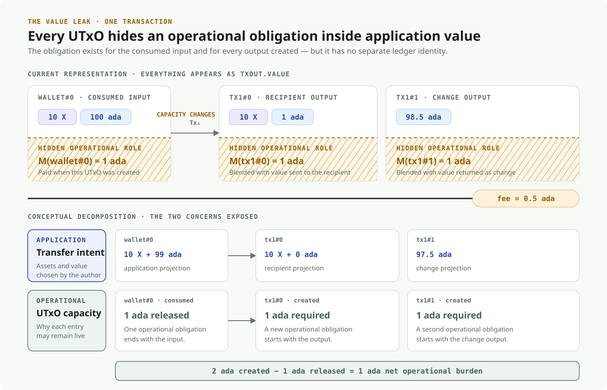

> **DRAFT — not for submission.** Items marked `TODO` require a decision or a
> verified figure before this goes anywhere near a PR. See the
> [draft notes](../NOTES.md).

## Table of Contents

- [1. Abstract](#1-abstract)
- [2. Problem](#2-problem)
  - [2.1 How transactions grow the UTxO set](#21-how-transactions-grow-the-utxo-set)
  - [2.2 How Cardano bounds UTxO-set growth](#22-how-cardano-bounds-utxo-set-growth)
    - [2.2.1 Formula and fixed overhead](#221-formula-and-fixed-overhead)
    - [2.2.2 Mainnet parameters](#222-mainnet-parameters)
    - [2.2.3 How the mechanism evolved](#223-how-the-mechanism-evolved)
    - [2.2.4 Why it creates a finite economic bound](#224-why-it-creates-a-finite-economic-bound)
  - [2.3 The operational nature of UTxO capacity](#23-the-operational-nature-of-utxo-capacity)
    - [2.3.1 The live set must remain inside a capacity envelope](#231-the-live-set-must-remain-inside-a-capacity-envelope)
    - [2.3.2 A UTxO is a box containing an object](#232-a-utxo-is-a-box-containing-an-object)
    - [2.3.3 Transactions allocate and release capacity](#233-transactions-allocate-and-release-capacity)
    - [2.3.4 Price changes revalue live capacity](#234-price-changes-revalue-live-capacity)
  - [2.4 Quantifying the bound: is current protection sufficient?](#24-quantifying-the-bound-is-current-protection-sufficient)
    - [2.4.1 A hierarchy of theoretical bounds](#241-a-hierarchy-of-theoretical-bounds)
      - [2.4.1.1 Ledger compartments](#2411-ledger-compartments)
      - [2.4.1.2 Maximum-supply ceiling](#2412-maximum-supply-ceiling)
      - [2.4.1.3 Issued-supply ceiling](#2413-issued-supply-ceiling)
      - [2.4.1.4 UTxO-resident-ada ceiling](#2414-utxo-resident-ada-ceiling)
      - [2.4.1.5 Ada-budget orders of magnitude](#2415-ada-budget-orders-of-magnitude)
      - [2.4.1.6 How reserve depletion moves the ceiling](#2416-how-reserve-depletion-moves-the-ceiling)
    - [2.4.2 Is current pricing calibrated?](#242-is-current-pricing-calibrated)
      - [2.4.2.1 Current rules](#2421-current-rules)
      - [2.4.2.2 Calibration test](#2422-calibration-test)
      - [2.4.2.3 What standard SPO hardware establishes](#2423-what-standard-spo-hardware-establishes)
      - [2.4.2.4 Limits of the pricing model](#2424-limits-of-the-pricing-model)
      - [2.4.2.5 Required evidence](#2425-required-evidence)
  - [2.5 The core problem: accidental complexity from an abstraction leak](#25-the-core-problem-accidental-complexity-from-an-abstraction-leak)
    - [2.5.1 Ada coupling of native-asset transfers](#251-ada-coupling-of-native-asset-transfers)
    - [2.5.2 Operational funding has no explicit settlement rule](#252-operational-funding-has-no-explicit-settlement-rule)
    - [2.5.3 The output fixes an ada amount while its real value floats](#253-the-output-fixes-an-ada-amount-while-its-real-value-floats)
    - [2.5.4 A second transaction-cost concept leaks into the user model](#254-a-second-transaction-cost-concept-leaks-into-the-user-model)
    - [2.5.5 Reduced liquid reusability](#255-reduced-liquid-reusability)
  - [2.6 Accounting implications for alternatives](#26-accounting-implications-for-alternatives)
    - [2.6.1 Transaction-level funding](#261-transaction-level-funding)
    - [2.6.2 Conservation and reserve solvency](#262-conservation-and-reserve-solvency)
    - [2.6.3 Revaluation requires a counterparty](#263-revaluation-requires-a-counterparty)
- [3. Use Cases](#3-use-cases)
  - [3.1 Mass distribution and airdrops](#31-mass-distribution-and-airdrops)
  - [3.2 Micropayments and stablecoin transfers](#32-micropayments-and-stablecoin-transfers)
  - [3.3 NFT and creator workflows](#33-nft-and-creator-workflows)
  - [3.4 Application state](#34-application-state)
  - [3.5 Economically stranded dust](#35-economically-stranded-dust)
  - [3.6 Unsolicited outputs](#36-unsolicited-outputs)
- [4. Goals and Non-goals](#4-goals-and-non-goals)
  - [4.1 Required outcomes](#41-required-outcomes)
  - [4.2 Non-goals](#42-non-goals)
- [5. Open Questions](#5-open-questions)
  - [5.1 Measurement and evidence](#51-measurement-and-evidence)
  - [5.2 Mechanism design](#52-mechanism-design)
  - [5.3 Migration and governance](#53-migration-and-governance)
- [6. References](#6-references)
- [7. Copyright](#7-copyright)

## 1. Abstract

Cardano represents spendable value using the
[*extended unspent transaction output* (EUTxO) model](https://docs.cardano.org/about-cardano/learn/eutxo-explainer).
Each new output becomes an entry in the global UTxO set and remains there until it
is spent. The formal EUTxO model defines transactions as consuming prior outputs and
creating new outputs while preserving the graph-based properties of UTxO accounting
[[4]](#ref-4). Because nodes need this set to validate transactions, uncontrolled growth
would create an unbounded resource requirement.

Cardano limits that growth by requiring every output to contain a minimum quantity
of ada based on a fixed per-entry overhead and its serialised size. Because the ada
supply is finite, this creates a finite economic ceiling on a weighted combination
of UTxO count and aggregate output size—and therefore also on UTxO count alone.

This CPS accepts the need for a bound. It identifies a narrower problem: the chosen
mechanism exposes a node-level resource constraint directly through Cardano's
value-transfer interface. Every output must carry ada whose amount is derived from a
global state-pricing parameter. That ada becomes ordinary output value rather than a
separately accounted deposit or fee.

The result is an abstraction leak. Native-asset transfers become coupled to ada;
control of operational funding is determined indirectly by output ownership rather
than an explicit settlement rule; historical outputs fix a nominal ada amount while
its policy and real-world value continue to move; users face a second transaction-cost
concept; and ada committed to outputs is less freely reusable. Wallets and applications
must model these effects to construct otherwise ordinary transfers.

This CPS describes those UX, liquidity, and engineering consequences while accepting
that persistent UTxO state must remain bounded under adversarial conditions.

> **Problem in one sentence:** Cardano embeds a global node-state policy as ada
> inside every output, turning infrastructure accounting into transferred or
> committed value that every layer of the ecosystem must manage.

## 2. Problem

### 2.1 How transactions grow the UTxO set

Four facts are sufficient to derive the underlying resource problem:

1. A UTxO is a discrete, spendable output identified by `(transaction id, index)`.
2. A transaction removes all the UTxOs it consumes and inserts all the outputs it
   creates.
3. A transaction may create more entries than it consumes, so activity can grow the
   UTxO set even when the amount of ada in circulation does not change.
4. An unspent output has no expiry. It remains part of the ledger state until a later
   transaction consumes it, which may never happen.

For a more detailed introduction, Cardano's
[EUTxO explainer](https://docs.cardano.org/about-cardano/learn/eutxo-explainer#overview-of-the-utxo-model)
describes inputs, outputs, whole-output consumption, and the UTxO set maintained by
nodes.


The UTxO set is the collection of outputs that can still be spent—the live frontier
of the transaction history. Its growth is a shared infrastructure concern: users
choose how many outputs to create, while node operators collectively retain and
serve the resulting state. Without a countermeasure, transaction throughput could
be converted into persistent ledger entries at a cost too low to protect node
resources.

This CPS accepts the need for such a countermeasure. Its subject is the particular
interface Cardano uses to provide it.

### 2.2 How Cardano bounds UTxO-set growth

#### 2.2.1 Formula and fixed overhead

This rule was introduced with the
[Babbage ledger era](https://docs.cardano.org/about-cardano/evolution/eras-and-phases#babbage-era),
which added features such as reference inputs, inline datums, and reference scripts.
Babbage was activated on Cardano mainnet by the
[Vasil hard fork on 22 September 2022](https://cardano.org/hardforks/).

[CIP-55](https://github.com/cardano-foundation/CIPs/tree/master/CIP-0055#the-new-minimum-lovelace-calculation)
specifies that an output is valid only if it contains at least:

```math
\mathrm{minUTxO}(o)
= \left(160 + \mathrm{sizeInBytes}(\mathrm{TxOut}(o))\right)
  \times \mathrm{coinsPerUTxOByte}
```

The formula has three terms:

- `sizeInBytes(TxOut)` is the size of the serialised output.
- `coinsPerUTxOByte` is the updatable protocol parameter that prices each billable
  byte.
- `160` is a fixed overhead for the transaction input and the corresponding entry
  in the node's UTxO map. These bytes are not part of the serialised output.

This CPS uses **state deposit** as shorthand for the economic role of the required
ada. The ledger does not record a separate deposit, depositor, or refund claim: it
records only the output and its value.

Cardano defines no separate `maxOutputs` parameter. For ordinary outputs,
[`maxTxSize`](https://cips.cardano.org/cip/CIP-9) is the only general
transaction-wide rule that limits their number: every output consumes part of the
same serialised-size budget as the inputs, witnesses, scripts, and metadata.
Consequently, the maximum is indirect and depends on the rest of the transaction:

```math
N_{\mathrm{outputs}}
\le
\left\lfloor
\frac{\mathrm{maxTxSize} - B_{\mathrm{other}}}
     {B_{\mathrm{output}}}
\right\rfloor
```

Here, $B_{\mathrm{other}}$ is the space used by the rest of the transaction and
$B_{\mathrm{output}}$ is the serialised size of the output under consideration.
Plutus execution budgets can further constrain a script transaction, and block-body
size limits aggregate creation per block. Neither defines a separate maximum number
of ordinary outputs. Collateral limits apply only to Plutus collateral inputs.

If the formula returns *m* ada, the output must contain at least *m* ada—even when
the value the user intends to transfer is entirely in another asset. This ada is not
paid to the protocol as a fee. It becomes part of the output and passes under the
output owner's control.

The fixed overhead makes the abstraction leak concrete: a quantity derived from a
node's internal data representation is embedded in a consensus-level rule that every
transaction builder must satisfy.

> **Verification required:** the 160-byte overhead was derived for an in-memory
> ledger state. If UTxO-HD changes the binding resource to disk footprint and I/O,
> that derivation must be restated against the current node architecture before this
> claim is submitted.

#### 2.2.2 Mainnet parameters

At mainnet epoch 648, current on 11 August 2026, `coinsPerUTxOByte` is
**4,310 lovelace per byte**. The pinned
[epoch-648 parameter response](https://api.koios.rest/api/v1/epoch_params?_epoch_no=648)
reports this as `coins_per_utxo_size` and also reports `max_tx_size = 16,384` bytes.
Applying that `coinsPerUTxOByte` value gives:

```math
\begin{aligned}
\mathrm{minUTxO}(o)
  &= \left(160 + \mathrm{sizeInBytes}(\mathrm{TxOut}(o))\right)
     \times 4{,}310\ \mathrm{lovelace} \\
  &= 689{,}600
     + 4{,}310 \times \mathrm{sizeInBytes}(\mathrm{TxOut}(o))
     \ \mathrm{lovelace}
\end{aligned}
```

For example, if a serialised output is 100 bytes, its billable size is 260 bytes and
its minimum is:

```math
\mathrm{minUTxO}
= (160 + 100) \times 4{,}310
= 1{,}120{,}600\ \mathrm{lovelace}
= 1.1206\ \mathrm{ada}
```

The value `4,310` has a specific historical origin. The
[Alonzo mainnet genesis configuration](https://github.com/input-output-hk/cardano-configurations/blob/master/network/mainnet/genesis/alonzo.json#L2)
set `lovelacePerUTxOWord` to `34,482` lovelace per eight-byte word. At the Babbage
transition, [CIP-55 required](https://github.com/cardano-foundation/CIPs/tree/master/CIP-0055#translation-from-the-alonzo-era-to-the-babbage-era)
that value to be divided by eight and rounded down:

```math
\mathrm{coinsPerUTxOByte}
= \left\lfloor \frac{34{,}482}{8} \right\rfloor
= 4{,}310\ \text{lovelace per byte}
```

The Babbage value was therefore inherited by unit conversion from the Alonzo
per-word parameter. It was not introduced as a new empirical estimate of the
contemporary cost of RAM, storage, or I/O.

The 1-ada base value this descends from was itself a policy choice rather than a
resource measurement. Shelley set a flat `minUTxOValue` of 1 ada; the
[Mary-era derivation](#ref-5) [[5]](#ref-5) then generalised it to a size-dependent
floor by holding the ada-per-byte ratio of that 1 ada fixed against a 27-byte ada-only
entry, so larger multi-asset entries scale proportionally. The derivation's stated aim
is to keep the UTxO set servable by nodes meeting the recommended hardware
specification; the specific 1-ada figure was chosen to bound worst-case growth while
leaving the large majority of existing transactions unaffected, with dust accumulation
observed on other UTXO chains [[2]](#ref-2) as the security concern it addresses. This
lineage reinforces the point above: the number encodes a tolerance for UTxO growth and
transaction impact, not a measured price of RAM, storage, or I/O. At the current
parameter the floor is approximately 0.85 ada for a minimal ada-only output and rises
with output size.

Because this is an updatable protocol parameter, governance may change it. The
[protocol-parameter guide](https://docs.cardano.org/about-cardano/explore-more/parameter-guide#types-of-protocol-parameters-on-cardano)
explains that such parameters can evolve without changing the formula itself. A
dated mainnet value is therefore more precise than presenting `4,310` as a constant.

#### 2.2.3 How the mechanism evolved

The mechanism changed as outputs became more expressive. Each step refined how output
size is measured, while preserving the same premise: every output must reserve ada.

| Era | Mechanism | Value | Rationale for the change |
|---|---|---|---|
| [Shelley](https://github.com/cardano-foundation/CIPs/tree/master/CIP-0009) | `minUTxOValue`, a flat constant | 1 ada | Outputs were uniform in size |
| [Mary](https://docs.cardano.org/developer-resources/native-tokens) | Size-dependent formula derived from `minUTxOValue` [[5]](#ref-5) | 1 ada over a 27-unit ada-only entry | Multi-asset outputs vary in size |
| [Alonzo](https://github.com/cardano-foundation/CIPs/tree/master/CIP-0028) | `coinsPerUTxOWord` (per 8-byte word) | 34,482 | `minUTxOValue` deprecated |
| [Babbage](https://github.com/cardano-foundation/CIPs/tree/master/CIP-0055) | `coinsPerUTxOByte` | 4,310 = ⌊34,482 / 8⌋ | Per-byte is simpler to reason about |
| [Conway](https://docs.cardano.org/about-cardano/evolution/eras-and-phases#conway-era) | Unchanged, moved under governance | 4,310 | — |

Each step re-expressed the same underlying 1-ada floor in a finer unit. The Mary
derivation [[5]](#ref-5) fixes the rate as `minUTxOValue` divided by the size of an
ada-only entry, giving 37,037 per unit for the 1 ada / 27-unit pair it documents.
Alonzo's genesis instead records 34,482, and Babbage divides that by eight.

> **Verification required:** the Mary derivation's 37,037 and the Alonzo genesis
> 34,482 are close but not equal, and the Mary document's `adaOnlyUTxOSize = 27` is
> stated in bytes while the arithmetic `⌊1,000,000 / 27⌋ = 37,037` only yields a
> per-word rate. Confirm the unit and the reason for the change from 37,037 to 34,482
> before relying on this lineage in a submission.

#### 2.2.4 Why it creates a finite economic bound

The intended protection follows a simple chain:


The bound ultimately relies on ada having a
[finite maximum supply](https://docs.cardano.org/about-cardano/explore-more/monetary-policy).
Because each output has both a positive fixed overhead and a non-negative serialised
size, finite ada bounds the aggregate quantity priced by the formula. A finite bound
on that quantity necessarily implies a worst-case bound on entry count. It does not,
however, establish that the formula's fixed weight and byte price correspond to the
marginal RAM, disk, lookup, or I/O costs borne by nodes. Instead, every output reserves
part of a scarce asset. Because the ada remains spendable with the output, its
economic function resembles a deposit rather than a fee. It is not represented as a
separate deposit in ledger state.

### 2.3 The operational nature of UTxO capacity

The preceding sections described the current implementation: Cardano places an ada
floor inside every created `TxOut.Value`. This section temporarily abstracts from that
representation. It identifies the resource lifecycle that any mechanism protecting
the live UTxO set must account for. It does not claim that the current ledger contains
explicit capacity allocations, deposits, or counters.

#### 2.3.1 The live set must remain inside a capacity envelope

The operational objective is not merely to assign a cost to outputs. It is to keep
the aggregate live set within a resource envelope that nodes are expected to retain
and serve. Let $N_{\max}$ be a defensible limit on the number of live entries and
$S_{\max}$ a defensible limit on their total billable size. The analytical target is:

```math
N(t) \leq N_{\max}
\qquad\text{and}\qquad
S(t) \leq S_{\max}
```

Equivalently, define the live-capacity vector and its envelope as:

```math
C(t)=(N(t),S(t))
\qquad\text{and}\qquad
C_{\max}=(N_{\max},S_{\max})
```

with component-wise ordering:

```math
C(t) \preceq C_{\max}
```

An allocation mechanism must preserve this invariant under adversarial transaction
sequences. In an explicit-capacity design, a transaction whose post-state would exceed
the envelope cannot allocate the requested capacity. A pricing mechanism can instead
enforce an economic bound by making allocations consume a scarce funding resource.
Cardano follows the latter approach: positive minimum ada combined with finite ada
supply creates an indirect ceiling rather than explicit `Nmax` and `Smax` protocol
counters.

The distinction matters. The **capacity envelope** states the security property the
system needs. The **deposit and pricing rule** is the mechanism chosen to ration access
to that envelope. Changing the representation of the deposit is acceptable only if
the alternative preserves a defensible bound.

The remainder of this section describes what consumes that capacity and how the live
allocation changes.

#### 2.3.2 A UTxO is a box containing an object

Every live UTxO consumes at least two operational resource dimensions:

1. one distinct entry in the global set — the **box**; and
2. the variable serialised representation stored inside it — the **object**.

For analysis, represent the capacity occupied by output $o$ as:

```math
c(o) = (1, s(o))
```

where $s(o)$ is its billable serialised size. Across the live set:

```math
N(t) = |\mathrm{UTxO}(t)|
\qquad\text{and}\qquad
S(t) = \sum_{o\in\mathrm{UTxO}(t)}s(o)
```

These dimensions proxy different performance concerns:

| Dimension | Primary node concern | Adversarial shape |
|---|---|---|
| Entry count, $N(t)$ | Per-entry indexing, keys, lookups, database rows, cache locality, and bookkeeping | Many minimal outputs maximize cardinality while keeping average output size low |
| Content size, $S(t)$ | Disk footprint, read/write bandwidth, serialization, snapshots, and state synchronization | Fewer large outputs increase total bytes without maximizing entry count |

The dimensions are related but not interchangeable. Every entry contributes bytes,
and a fixed overhead can translate some per-entry cost into an equivalent byte count.
That translation nevertheless assumes a stable exchange rate between cardinality-
sensitive work and byte-sensitive work. Their real costs may evolve differently as
storage architecture, indexing, caching, and synchronization mechanisms change.

The fixed component matters even for a minimal output: nodes must retain, index,
locate, and serve a distinct entry. Addresses, multi-assets, datums, and reference
scripts increase the variable component. Cardano's current formula already combines
a fixed overhead with variable serialised size, but prices both through one
`coinsPerUTxOByte` coefficient. This is equivalent to choosing one fixed conversion
between the two performance concerns.

More precisely, the current formula converts the entry-count dimension into
byte-denominated accounting units. Each output contributes 160 fixed units in addition
to its billable serialised size:

```math
u(o)=160+s(o)
```

Across the live set, the total priced quantity is therefore:

```math
U(t)
=
\sum_{o\in\mathrm{UTxO}(t)}(160+s(o))
=
160N(t)+S(t)
```

This is a scalar projection of the two-dimensional capacity vector
$(N(t),S(t))$. It implicitly sets:

```math
p_{\mathrm{box}}(t)=160p(t)
\qquad\text{and}\qquad
p_{\mathrm{byte}}(t)=p(t)
```

where $p(t)$ is `coinsPerUTxOByte`. The model consequently treats one additional
UTxO entry as operationally equivalent to 160 additional bytes of content.

For example, one output carrying 100 bytes of content contributes:

```math
160+100=260
```

priced units. Splitting the same 100 content bytes between two 50-byte outputs
contributes:

```math
(160+50)+(160+50)=420
```

priced units. The additional 160 units represent the second box, even though total
content size is unchanged. Conversely, adding 160 bytes to an existing output has the
same weight as creating one additional output with no change in aggregate content.

The resulting economic ceiling applies to the weighted sum:

```math
160N(t)+S(t)\leq U_{\max}
```

The notation distinguishes two different bounds. $C_{\max}=(N_{\max},S_{\max})$ is
the two-dimensional resource envelope introduced in section 2.3.1. $U_{\max}$ is the
maximum number of scalar accounting units admitted by the current weighted model.
Using the weight vector $w=(160,1)$:

```math
U(t)=w\cdot C(t)=160N(t)+S(t)
```

The current mechanism economically constrains $U(t)$, not the two components of
$C(t)$ against independently calibrated limits. Writing $C_{\max}$ on the right-hand
side would therefore conflate the desired multidimensional safety envelope with the
scalar ceiling implemented by the present formula.

The scalar ceiling does imply loose component bounds, such as
$N(t)\leq U_{\max}/160$ and $S(t)\leq U_{\max}$, but it permits the two dimensions to
trade against one another at the fixed rate of one entry to 160 bytes. This makes
validation and governance simpler while preventing entry pressure and byte pressure
from being calibrated or repriced independently.

The dimensions are nevertheless not unconstrained relative to one another. Cardano
has no single explicit `maxTxOutSize` parameter, but every output is part of a
transaction bounded by `maxTxSize`—16,384 bytes at epoch 648. In addition,
`maxValueSize` limits the serialised `Value` inside each output to 5,000 bytes
[[6]](#ref-6). If $s_{\max}^{\mathrm{out}}$ denotes the largest complete output that
can fit inside the smallest otherwise-valid transaction, then every reachable live
set also satisfies:

```math
S(t)\leq N(t)s_{\max}^{\mathrm{out}}
```

$s_{\max}^{\mathrm{out}}$ is an indirect era- and transaction-dependent ceiling,
not the `maxValueSize` parameter: the latter covers only `Value`, while addresses,
datum, reference scripts, and encoding overhead contribute to the complete `TxOut`.
This coupling rules out the literal $N=0,S>0$ axis, but it does not remove the need
for an aggregate $S_{\max}$. Billions of individually valid outputs can still exceed
a safe total state footprint.

Every live UTxO occupies these resources, including a large-ada input. Its operational
role may be economically hidden because its value already exceeds the minimum, but
the entry and its contents still impose the same categories of node burden.



#### 2.3.3 Transactions allocate and release capacity

An output determines the resources occupied while it remains live. It does not itself
perform the transition that changes the live set. Only a transaction does that: it
atomically consumes one set of entries and creates another.

For the fixed-entry dimension:

```math
\Delta_N(tx) =
|\mathrm{outputs}(tx)|-|\mathrm{inputs}(tx)|
```

For the variable-size dimension:

```math
\Delta_S(tx) =
\sum_{o\in\mathrm{outputs}(tx)}s(o)
-
\sum_{i\in\mathrm{inputs}(tx)}s(i)
```

The transaction's operational effect is therefore:

```math
\Delta_C(tx)=(\Delta_N(tx),\Delta_S(tx))
```

> **Outputs are the persistent objects being retained. Transactions are the
> operations that allocate and release retention capacity.**

Per-output measurement remains necessary to determine the resources occupied. It
does not follow that the application must implement the funding lifecycle separately
inside every output.

#### 2.3.4 Price changes revalue live capacity

Capacity allocation and capacity pricing are different transitions. A transaction
changes $N(t)$ and $S(t)$. Governance may change the economic price of those resources
while the existing allocations remain live.

Using the analytical price vector:

```math
p(t)=(p_{\mathrm{box}}(t),p_{\mathrm{byte}}(t))
```

the operational valuation of the live set is:

```math
V(t)=
N(t)p_{\mathrm{box}}(t)
+
S(t)p_{\mathrm{byte}}(t)
```

A price change revalues capacity already allocated by:

```math
\Delta_P=
N(t)\Delta p_{\mathrm{box}}
+
S(t)\Delta p_{\mathrm{byte}}
```

No application transaction created or removed capacity in this transition. Any
mechanism that applies new prices to live allocations must therefore identify who
funds an increase, who receives a decrease, and what invariant keeps the resulting
accounting solvent.

This operational model now provides the basis for evaluating Cardano's chosen
representation.

### 2.4 Quantifying the bound: is current protection sufficient?

Section 2.3 provides the formal quantities needed to evaluate the current mechanism.
The first question is mathematical: what ceilings follow from finite ada and the
weighted quantity $U(t)=160N(t)+S(t)$? The second is empirical: are those ceilings,
the current price, and the implied attack cost compatible with measured node limits?
A finite ceiling is necessary, but finiteness alone does not establish that the bound
is operationally safe.

#### 2.4.1 A hierarchy of theoretical bounds

The word *size* can mean the number of live UTxOs, their aggregate serialised size,
the weighted accounting quantity $U(t)=160N(t)+S(t)$, or the physical resources used
by nodes. The current mechanism places an economic ceiling on the weighted quantity.
That ceiling implies extreme one-dimensional ceilings for $N(t)$ and $S(t)$, but it
does not independently constrain those dimensions or directly bound RAM, disk
footprint, lookup cost, or I/O. The hierarchy below therefore establishes what is
mathematically unreachable; calibration must still establish whether the reachable
region is operationally safe.

For any ada budget $A$ available to fund live outputs, the minimum-ada rule implies:

```math
p\,U(t)=p\left(160N(t)+S(t)\right)\leq A
```

and therefore:

```math
U(t)\leq U_{\max}(A,p)=\left\lfloor\frac{A}{p}\right\rfloor
```

The following hierarchy progressively tightens $A$. It then projects the resulting
weighted ceiling onto the entry-count axis by using the deliberately loose case
$S(t)=0$. These are consequently entry-count projections of the current scalar
model—not independently chosen operational values of $N_{\max}$.

##### 2.4.1.1 Ledger compartments

There is no single useful ceiling. A progressively tighter argument must account for
which ada can actually reside in transaction outputs at a given point in time. Let:

- $A_{\max}$ be the maximum ada supply;
- $R(t)$ be ada that remains in the monetary reserves;
- $T(t)$ be the treasury balance;
- $W(t)$ be aggregate reward-account balances;
- $D(t)$ be ada held by protocol deposits;
- $F(t)$ be fees collected but not yet distributed; and
- $A_{\mathrm{UTxO}}(t)$ be the total ada contained in all live transaction outputs.

At a simplified whole-ledger level, these compartments give:

```math
\begin{aligned}
A_{\mathrm{issued}}(t)
  &= A_{\max} - R(t) \\
A_{\mathrm{UTxO}}(t)
  &= A_{\mathrm{issued}}(t)
     - T(t) - W(t) - D(t) - F(t)
\end{aligned}
```

The exact ledger accounting should be used when evaluating these terms at a specific
era boundary. The important point is structural: ada outside transaction outputs
cannot fund minimum ada inside those outputs.

For a concrete application, the
[mainnet totals at epoch 648](https://api.koios.rest/api/v1/totals?_epoch_no=648) report the
following ledger compartments (rounded to three decimal places):

| Compartment | Epoch-648 balance |
|---|---:|
| Maximum supply, $A_{\max}$ | 45.000 billion ada |
| Reserves, $R$ | 6.196 billion ada |
| Treasury, $T$ | 1.450 billion ada |
| Reward accounts, $W$ | 0.798 billion ada |
| Protocol deposits, $D$ | 0.00543 billion ada |
| Fee pot, $F$ | 0.000029 billion ada |

Applying the accounting identity gives:

```math
\begin{aligned}
A_{\mathrm{issued}}
  &= 45.000 - 6.196 \\
  &= 38.804\ \text{billion ada} \\
A_{\mathrm{UTxO}}
  &= 38.804 - 1.450 - 0.798 - 0.00543 - 0.000029 \\
  &= 36.550\ \text{billion ada}
\end{aligned}
```

Approximately **8.450 billion ada**, or **18.8% of maximum supply**, therefore
cannot back transaction outputs at that snapshot. The reserve alone contributes
6.196 billion ada—approximately **73.3% of that exclusion**.

Delegated ada is **not** subtracted. Cardano delegation does not transfer the ada
into a staking contract or separate staking account; the delegated value remains in
the owner's UTxOs. Likewise, ada controlled by a script still belongs to the UTxO
set. Economic illiquidity and absence from the UTxO set are different concepts.

##### 2.4.1.2 Maximum-supply ceiling

The [mainnet Shelley genesis configuration](https://github.com/input-output-hk/cardano-configurations/blob/master/network/mainnet/genesis/shelley.json#L60)
caps the ada supply at 45 quadrillion lovelace, or 45 billion ada:

```math
A_{\max} = 45{,}000{,}000{,}000{,}000{,}000\ \mathrm{lovelace}
```

Let $p = 4{,}310\ \mathrm{lovelace/byte}$ and let
$h = 160\ \mathrm{bytes}$ be the fixed overhead. Ignoring
the non-zero serialised size of an output gives the loosest possible entry-count
ceiling:

```math
N_{\mathrm{ceiling}}^{\mathrm{absolute}}
\leq
\left\lfloor \frac{A_{\max}}{p h} \right\rfloor
= 65{,}255{,}220{,}417
```

This **65.3-billion-UTxO** figure is a protocol-wide ceiling: it remains valid across
all future reserve distributions, but assumes that every lovelace—including ada not
yet issued—is available to fund outputs. It is therefore mathematically valid and
operationally remote.

##### 2.4.1.3 Issued-supply ceiling

At time $t$, reserves have not yet entered circulation and cannot back UTxOs. A
tighter time-dependent ceiling is therefore:

```math
N_{\mathrm{ceiling}}^{\mathrm{issued}}(t)
\leq
\left\lfloor
  \frac{A_{\max}-R(t)}{p h}
\right\rfloor
```

At epoch 648 this becomes:

```math
\begin{aligned}
N_{\mathrm{ceiling}}^{\mathrm{issued}}
&\leq
\left\lfloor
  \frac{38{,}803{,}572{,}882.173527\ \mathrm{ada}}
       {0.6896\ \mathrm{ada/UTxO}}
\right\rfloor \\
&= 56{,}269{,}682{,}253\ \mathrm{UTxOs}
\end{aligned}
```

This removes ada that does not yet exist as ledger value outside the reserve pot. It
still overstates the amount available to outputs because issued ada is also held in
non-UTxO ledger compartments.

##### 2.4.1.4 UTxO-resident-ada ceiling

At a fixed ledger snapshot, the number of live outputs is bounded by the ada currently
resident in those outputs. The tighter instantaneous ceiling is consequently:

```math
\begin{aligned}
N_{\mathrm{ceiling}}^{\mathrm{UTxO}}(t)
&\leq
\left\lfloor
  \frac{A_{\mathrm{UTxO}}(t)}{p h}
\right\rfloor \\
&=
\left\lfloor
  \frac{A_{\max}-R(t)-T(t)-W(t)-D(t)-F(t)}{p h}
\right\rfloor
\end{aligned}
```

Using the epoch-648 UTxO-resident balance gives:

```math
\begin{aligned}
N_{\mathrm{ceiling}}^{\mathrm{UTxO}}
&\leq
\left\lfloor
  \frac{36{,}550{,}320{,}207.145109\ \mathrm{ada}}
       {0.6896\ \mathrm{ada/UTxO}}
\right\rfloor \\
&= 53{,}002{,}204{,}476\ \mathrm{UTxOs}
\end{aligned}
```

This is still deliberately loose because $h$ accounts only for the fixed overhead.
Every valid `TxOut` has a non-zero serialised size. If $q_{\min}$ is the smallest
serialised output admitted by the current era, the stronger form is:

```math
N_{\mathrm{ceiling}}^{\mathrm{valid}}(t)
\leq
\left\lfloor
  \frac{A_{\mathrm{UTxO}}(t)}
       {p\left(h+q_{\min}\right)}
\right\rfloor
```

$q_{\min}$ must be derived from the canonical encoding rules for the era rather than
guessed from a typical wallet output. Outputs carrying native assets, datum, or a
reference script are larger and therefore require more ada; they can only reduce the
maximum count relative to this minimal-output construction.

This is an instantaneous ceiling, not a forward invariant for the same numerator.
Withdrawals, deposit refunds, treasury movements, and reserve distribution can move
ada from other ledger compartments into outputs, changing $A_{\mathrm{UTxO}}(t)$.

Until $q_{\min}$ is verified, a 100-byte serialised `TxOut` provides an explicit
scenario rather than a claimed minimum. Its required ada is 1.1206 ada, giving:

```math
\begin{aligned}
N_{100\mathrm{B}}
&\leq
\left\lfloor
  \frac{36{,}550{,}320{,}207.145109}{1.1206}
\right\rfloor \\
&= 32{,}616{,}741{,}216\ \mathrm{UTxOs}
\end{aligned}
```

The successive refinements therefore change the headline number materially:

| Bound | Available ada | Maximum entry count |
|---|---:|---:|
| Maximum supply; 160-byte overhead only | 45.000B | 65.255B |
| Issued supply; 160-byte overhead only | 38.804B | 56.270B |
| UTxO-resident ada; 160-byte overhead only | 36.550B | 53.002B |
| UTxO-resident ada; illustrative 100-byte output | 36.550B | 32.617B |

The hierarchy can be summarised as:

```math
N_{\mathrm{actual}}(t)
\leq N_{\mathrm{ceiling}}^{\mathrm{valid}}(t)
\leq N_{\mathrm{ceiling}}^{\mathrm{UTxO}}(t)
\leq N_{\mathrm{ceiling}}^{\mathrm{issued}}(t)
\leq N_{\mathrm{ceiling}}^{\mathrm{absolute}}
```

##### 2.4.1.5 Ada-budget orders of magnitude

The ada order of magnitude is easier to see by writing the current price directly in
ada. At $p=4{,}310$ lovelace per unit:

```math
D(N,S)=0.6896N+0.00431S_{\mathrm{bytes}}\quad\text{ada}
```

One additional box therefore accounts for 0.6896 ada before its serialised content;
each additional content byte accounts for 0.00431 ada. For illustrative 100-byte
outputs, each complete allocation requires 1.1206 ada:

| Illustrative live outputs | Capacity backing | Percentage of 45B ada maximum supply |
|---:|---:|---:|
| 1 million | 1.121 million ada | 0.0025% |
| 10 million | 11.206 million ada | 0.0249% |
| 100 million | 112.060 million ada | 0.2490% |
| 1 billion | 1.121 billion ada | 2.4902% |
| 10 billion | 11.206 billion ada | 24.9022% |

Viewed on the size axis alone, one decimal gigabyte accounts for 4.31 million ada,
100 GB for 431 million ada, and one TB for 4.31 billion ada—respectively 0.0096%,
0.9578%, and 9.5778% of maximum supply. The epoch-648 UTxO-resident numerator of
36.550 billion ada is 81.22% of maximum supply and corresponds to 8.480 trillion
priced units, or 8.480 TB on the scalar size axis.

These figures are economic ceilings, not measured safety limits. In particular,
$A_{\mathrm{UTxO}}$ is not a protocol-owned capacity reserve: it is ordinary
application value already resident in outputs. The current rule treats it as the
potential funding numerator because owners can consume and rearrange those outputs.
It does not identify how much ada is presently serving only the minimum-ada role;
that quantity requires a census of the live set.

##### 2.4.1.6 How reserve depletion moves the ceiling

The reserve is not a static subtraction. Cardano's monetary expansion parameter
$\rho$ determines the maximum fraction of the remaining reserve that can enter the
reward pot each epoch. The [monetary-policy description](https://docs.cardano.org/about-cardano/explore-more/monetary-policy)
documents the current value as $\rho = 0.003$, or 0.3% per epoch. If that maximum amount
left reserves every epoch and $\rho$ remained unchanged, the reserve after $n$ epochs
would follow:

```math
R_n = R_0(1-\rho)^n
```

Substituting this trajectory into the issued-supply ceiling gives:

```math
N_{\mathrm{ceiling}}^{\mathrm{issued}}(n)
\leq
\left\lfloor
  \frac{A_{\max}-R_0(1-\rho)^n}{p h}
\right\rfloor
```

This function rises asymptotically: reserve depletion relaxes the economic ceiling
on UTxO count, but can never raise it above the maximum-supply ceiling. Using the
epoch-648 reserve balance of **6.196 billion ada** reported by the live
[mainnet ledger totals](https://api.koios.rest/api/v1/totals?_epoch_no=648) as $R_0$, and retaining
the deliberately loose 160-byte denominator, the issued-supply ceiling begins at
approximately **56.3 billion UTxOs** and approaches **65.3 billion**.


This is a fast-depletion envelope, not a forecast. Actual reserve withdrawals can be
smaller because unclaimed rewards remain in or return to reserves, and governance
can change $\rho$. A five-day epoch was used only to express $n$ on the chart in years.

At the same snapshot, reserves account for approximately **73% of the ada excluded
from UTxOs** by the compartments above. With the 160-byte denominator, the reserve
reduces the absolute ceiling by roughly **9.0 billion entries**, compared with about
**3.3 billion** for treasury, reward accounts, deposits, and the fee pot combined.
The reserve is therefore the dominant current subtraction, but it is not the only
one—and its influence mechanically declines as monetary expansion proceeds.

This distinction is important. Minimum ada proves that the number of entries cannot
grow without limit. Refining the numerator removes ada that cannot back outputs, and
refining the denominator accounts for the smallest valid output. Neither refinement
shows that nodes could safely serve a UTxO set approaching the resulting bound. A
finite economic ceiling is not by itself a safe resource target.

#### 2.4.2 Is current pricing calibrated?

Changing $p = \mathrm{coinsPerUTxOByte}$ tunes one trade-off: a higher value
makes UTxO growth more expensive for attackers and legitimate users alike. For an
output with billable size $b$ and an ada budget $A$:

```math
\mathrm{minUTxO}=p b
\qquad\text{and}\qquad
N_b(A,p)=\left\lfloor\frac{A}{p b}\right\rfloor
```

For the 260 billable-byte example used above, the minimum is 0.78 ada at $p=3{,}000$,
1.1206 ada at the current $p=4{,}310$, and 1.69 ada at $p=6{,}500$. Parameter tuning
changes incidence and attack cost; it does not fix the abstraction leak.

##### 2.4.2.1 Current rules

The Constitution classifies `utxoCostPerByte`—the governance name for this
parameter—as [critical to blockchain operation](https://cardano.org/constitution/#2-1-critical-protocol-parameters).
Its [specific guardrails](https://cardano.org/constitution/#utxo-cost-per-byte-utxocostperbyte)
require:

```math
3{,}000 \leq p \leq 6{,}500\quad\text{lovelace/byte}
```

`PARAM-03a` requires an SPO vote above 50% of active block-production stake in
addition to a DRep vote; `PARAM-04a` normally expects 90 days between an off-chain
proposal and its on-chain submission. `UCPB-05a` says a change should consider:

1. acceptable attack cost and attack duration;
2. acceptable full-node memory configuration;
3. UTxO sizes; and
4. current total node memory usage.

These are criteria, not a formula. In 2024, the Parameter Committee therefore
[recommended no change](https://forum.cardano.org/t/pcp-002-utxocostperbyte-rationale/130547):
it expected the parameter eventually to fall, but deferred calibration until on-disk
UTxO storage provided a clearer resource model.

##### 2.4.2.2 Calibration test

Calibration must first test whether the current scalar model protects the
two-dimensional envelope from section 2.3.1. The reachable region
$160N+S\leq U_{\max}$ remains inside $C_{\max}=(N_{\max},S_{\max})$ only if:

```math
U_{\max}\leq\min\left(160N_{\max},S_{\max}\right)
```

If independently benchmarked limits do not support that containment at the fixed
160-to-1 exchange rate, changing $p$ cannot make the weighting itself correct; the
two resource dimensions must be priced or bounded separately.

Within the current scalar model, let $H_U$ be the additional weighted capacity units
that nodes can safely absorb after translating benchmarked RAM, disk, lookup, and I/O
headroom into $U$ units. Let $C_{\min}$ be the minimum ada an attack must immobilise,
$L_{\max}$ the largest acceptable deposit for a representative output of billable
size $b_{\mathrm{ref}}$, and $g_U$ the maximum growth in weighted capacity per epoch.
The admissible interval is:

```math
\max\left(3{,}000,\frac{C_{\min}}{H_U}\right)
\leq p \leq
\min\left(6{,}500,\frac{L_{\max}}{b_{\mathrm{ref}}}\right)
```

The associated fastest exhaustion time is:

```math
T_{\mathrm{fill}}=\frac{H_U}{g_U}
```

Governance must choose the security and UX targets; benchmarks supply the remaining
terms. If the lower bound exceeds the upper bound, no parameter value satisfies both
objectives and the mechanism itself must change. Ada's fiat price belongs in the
sensitivity analysis, not as the sole input, because node-resource prices do not
track it.

##### 2.4.2.3 What standard SPO hardware establishes

The current mainnet guidance recommends at least two CPU cores, 24 GB of RAM for the
`InMemory` backend, 8 GB for the `OnDisk` backend—with that figure still marked as
pending confirmation—and 250 GB of free storage, with 350 GB recommended for future
growth [[7]](#ref-7). These figures define the machine against which $N_{\max}$ and
$S_{\max}$ must be measured. They do not themselves state either limit.

Simple fit calculations can locate a benchmark search range, but cannot substitute
for latency measurements. A representative 100-byte output contributes 260 priced
units. Treating those units as bytes, allocating all 24 GB to the UTxO set would give
an optimistic 92-million-entry fit; reserving half the RAM for the rest of the node
would give approximately 46 million. Both figures ignore Haskell object overhead,
garbage collection, caches, rollback states, and other ledger structures. They support
only an order-of-magnitude hypothesis of $10^7$–$10^8$ entries for `InMemory`, not a
defensible $N_{\max}$.

For an on-disk design, the UTxO-HD storage analysis estimates that a write-optimised
LSM representation may occupy 1.3–1.4 times its logical table size and uses a table of
100 million 100-byte entries in its cost model [[8]](#ref-8). If the full recommended
350 GB disk were dedicated to such a table, division by 1.4 would leave approximately
250 GB of logical data, or 2.5 billion 100-byte entries. That is also an optimistic
fit bound: the same disk must retain the chain database and other state, preserve free
space for compaction and growth, and meet lookup, rollback, and synchronisation
deadlines. A benchmark search range of $10^8$–$10^9$ entries is therefore useful for
`OnDisk`; it is not a measured safety guarantee.

The same analysis evaluates I/O throughput rather than a maximum table size. For a
write-optimised design it estimates approximately 5.7k IOPS for a threshold scenario
of 20 TPS and 100-times synchronisation, 14.6k IOPS for 50 TPS at the same sync rate,
and 571k IOPS for a 200-TPS, 1,000-times-sync stretch scenario. It treats roughly 10k
serial or 100k parallel IOPS as minimum-SSD capability and concludes that stretch
targets require higher-performance hardware. Current UTxO-HD documentation also
states that the existing on-disk backend incurs a performance regression and is not
yet the optimised LSM design [[9]](#ref-9).

The contrast with the economic extremes is material. The epoch-648 scalar ceiling is
8.480 trillion priced units: approximately 353 times 24 GB and 24 times the 350-GB
storage recommendation if priced units are used only as an accounting-size proxy.
Its count-axis projection is 53.0 billion entries. Because `160` is a historical
resource approximation rather than a measurement of the current physical layout,
these ratios do not predict exact node consumption. They do establish that the
supply-derived ceiling and the relevant hardware search ranges differ by orders of
magnitude.

| Dimension | Initial benchmark search range | Epoch-648 economic extreme | Approximate gap |
|---|---:|---:|---:|
| `InMemory` entry count | $10^7$–$10^8$ | $5.3\times10^{10}$ | 530–5,300× |
| `OnDisk` entry count | $10^8$–$10^9$ | $5.3\times10^{10}$ | 53–530× |
| Logical size | tens to a few hundreds of GB | 8.480 TB of priced units | at least tens of times |

The first column is deliberately labelled a search range. Only benchmarks against
explicit deadlines can promote any point in it to $N_{\max}$ or $S_{\max}$.

##### 2.4.2.4 Limits of the pricing model

Calibration cannot remove two structural limitations of the price itself. First,
$p$ is denominated in ada while node memory, storage, and I/O are purchased in other
currencies. Governance can adjust $p$, but there is no automatic relationship between
the two prices. An ada-price movement can therefore change the real-world burden and
deterrent effect without changing the resources consumed by an output.

Second, the formula prices size but contains no explicit duration component. Two
otherwise identical outputs require the same deposit whether they remain live for
five minutes or five years. A long-lived owner bears a greater opportunity cost, but
the protocol neither collects nor adjusts the deposit over time. Work on state-aware
fee design argues that both additional bytes and their lifetime matter [[1]](#ref-1).

These limitations concern how persistent state is priced. Section 2.5.3 shows how
ada-price volatility reaches historical outputs; Section 2.5 addresses the broader
architectural question of why that price is exposed inside every output.

##### 2.4.2.5 Required evidence

A proposal should publish the current UTxO footprint and growth rate, UTxO-size
distribution, node RAM/disk/I/O benchmarks, the chosen $H_U$, $C_{\min}$ and
$L_{\max}$ targets, worst-case attack cost and fill time, and the change in deposits
for representative transactions. It must also include the
[monitoring and reversion plan required by the Constitution](https://cardano.org/constitution/#2-6-monitoring-and-reversion-of-parameter-changes).

The current value of 4,310 is inside the permitted range; that alone does not show it
is calibrated. Calibration requires current measurements and explicit security and
UX targets.

No such calibration has been published for the current value. As section 2.2.2
records, 4,310 descends by unit conversion from a 1-ada floor selected against a
worst-case UTxO-growth bound and an assessment of how many transactions it would
affect. That is a defensible basis for the original decision, but it fixes neither of
the terms this section requires: it does not measure $H_U$, the weighted capacity nodes can
absorb, nor $C_{\min}$, the cost an attack must bear. Both were last argued against a
memory-resident ledger, which is the assumption the UTxO-HD question above puts in
doubt.

These tests distinguish two questions. The current mechanism proves that the weighted
quantity cannot grow without limit; measurement and calibration are required to show
that its reachable region is operationally safe. Even a perfectly calibrated price,
however, would preserve the same interface. Section 2.5 therefore turns from the
quantity of protection to the abstraction through which that protection is exposed.

### 2.5 The core problem: accidental complexity from an abstraction leak

This section states the core problem addressed by this CPS. Bounding persistent
ledger state is
**essential complexity**: any safe design must account for the finite resources of
the nodes that maintain the ledger. Requiring every output to carry an ada deposit
intended to bound that resource consumption is **accidental complexity**: it follows
from the chosen mechanism, not from the EUTxO model or from value transfer itself.

The mechanism therefore creates an **abstraction leak**: wallets, transaction
builders, applications, and users must understand and account for an internal
node-state constraint in order to use the value-transfer interface correctly.

The objection is therefore not that the constraint exists. It is that the constraint
crosses the ledger boundary in a form that every upper layer must model.

The resource concern originates in node operation, but its practical management is
exported to transaction construction. The parties involved therefore carry different
parts of the mechanism:

| Layer | Responsibility under the current design |
|---|---|
| Node operators | Store, index, and serve the live UTxO set |
| Protocol and governance | Define the pricing rule and validate each output |
| Transaction builders | Calculate the requirement, source ada, allocate it to every output, and rebalance the transaction |
| Transaction creator | Fund the additional ada |
| Output controller | Control that ada once the output has been created |

Requiring a transaction that creates persistent state to fund its contribution is
not itself an abstraction leak. Transaction fees already establish a familiar
boundary: a builder calculates and funds a protocol cost, while the ledger owns its
accounting, collection, and subsequent treatment. The builder funds the mechanism;
it does not implement the mechanism's accounting lifecycle.

Minimum ada crosses that boundary. For every output, the ledger enforces:

```math
\forall o \in \mathrm{outputs}(tx), \qquad
\mathrm{coin}(o) \geq M(o,p)
```

The ledger does not, however, represent the required amount as a separate protocol
charge or deposit. It only verifies that sufficient ada is present in `TxOut.Value`.
Once the output is created, the ada that satisfied the rule is indistinguishable
from the application value carried by the output.

Two concerns that belong to different layers are therefore blended:

- an **operational concern**: node operators must retain and serve persistent state;
  and
- an **application concern**: wallets and applications create outputs to transfer
  assets or represent application state.

The operational concern is not merely funded by the application layer. Its funding
mechanism is materialised through application outputs. Builders must calculate the
requirement, source the ada, distribute it between outputs, rebalance change, and
preserve sufficient ada through later state transitions.

> **The abstraction leak:** an operational resource constraint borne by node
> operators, including SPOs, becomes a per-output funding mechanism that transaction
> builders must implement inside application value. Upper layers should fund the
> state obligation determined by the ledger, not implement its accounting.

This produces two related leaks:

1. **Value leak.** The state obligation is represented as ordinary ada inside
   `TxOut.Value`, blending infrastructure funding with transferred or application-
   controlled value.
2. **Accounting leak.** Wallets, transaction builders, protocols, and indexers must
   manage the obligation's allocation and lifecycle instead of merely funding an
   amount accounted for by the ledger.

The distinction matters when evaluating alternatives. Removing required ada from
`TxOut.Value` can repair the value leak while leaving the accounting leak intact if
upper layers must still allocate, track, or reconcile replacement fields. A candidate
mechanism should therefore answer both questions:

1. Is the state obligation separated from application value?
2. Does the transaction builder merely fund the obligation, or must it also
   represent, allocate, track, and settle it?

The essential complexity is funding a defensible bound on persistent state. The
accidental complexity is making every upper layer manage how that funding is embedded
in outputs and carried through their lifecycle.

The following sections describe five observable consequences of that boundary
violation. The lack of a duration component remains a separate limitation of the
pricing model, discussed in section 2.4.2.4 and as an open question in section 5.2.


#### 2.5.1 Ada coupling of native-asset transfers

*Primary leak: application value must carry an output-local state obligation.*

Cardano's native assets cannot be transferred independently of ada. An output whose
intended value is entirely in another asset must still contain the ada returned by
the minimum-UTxO formula.

```text
Application intent:     transfer 10 units of token X
Ledger representation: transfer 10 units of token X + minimum ada
```

The application must therefore source ada, select suitable inputs, and expose the
additional value in the resulting payment. Availability of ada and the value of
`coinsPerUTxOByte` become operational dependencies of every native-asset workflow.

This is more precise than calling the rule value-blind. A state price can legitimately
depend on bytes rather than the economic value transferred. The abstraction leak is
that this price changes the value-transfer interface itself.

#### 2.5.2 Operational funding has no explicit settlement rule

*Primary leak: application-value ownership implicitly determines the treatment of an
operational obligation.*

Consider Alice sending a native asset to Bob. Alice creates Bob's output and supplies
the required *m* ada. Once confirmed, both the asset and the *m* ada are ordinary value
controlled by Bob's output. When Bob spends it, his transaction controls where that
ada goes.

The absence of a claim returning *m* to Alice is not necessarily a defect. Persistent
UTxO capacity is a common resource maintained by node operators. A coherent policy may
deliberately require the transaction that increases the common burden to fund it and
reward the transaction that later reduces that burden, without recording the original
funder's identity. Under such a rule the release is a bearer-like protocol incentive,
not the return of property held in custody for a named depositor.

The current mechanism does not express that policy either. It records no operational
deposit, allocation, release condition, or beneficiary. Control passes to Bob only
because the required ada was placed inside Bob's application value. The economic
result resembles a release-to-consumer rule, but it arises from value ownership rather
than an explicit common-resource settlement rule.


| Stage | Current minimum ada | Explicit common-resource rule |
|---|---|---|
| Increase burden | Creator puts ada in each new output | Allocating transaction funds its net capacity increase |
| While live | Ada is ordinary application-controlled value | Funding is accounted for as protocol backing, without requiring a named owner |
| Reduce burden | Consuming transaction controls the ada because it spends the output | Releasing transaction receives the protocol-defined release value |
| Identity | Output ownership determines control indirectly | No original-payer identity is required unless a design deliberately introduces one |

The design requirement is therefore not that every deposit return to its original
funder. It is that allocation and release semantics be explicit, deterministic, and
independent of accidental application-value ownership. Keeping depositor identity out
of the base mechanism preserves flexibility for transactions, scripts, and higher-level
protocols to decide how the benefit of a release is used.

#### 2.5.3 The output fixes an ada amount while its real value floats

*Primary leak: a global resource policy is materialised as a nominal ada amount in
each historical output.*

The current design evaluates `coinsPerUTxOByte` when an output is created and embeds
the resulting ada requirement in that output's value. The parameter itself is not
stored in the output; its economic result is materialised there and remains unchanged
for the lifetime of the UTxO. Governance, meanwhile, can change the parameter for
future outputs.

The design therefore combines three different temporal models:

```text
Output-carried ada:   fixed at creation
State-price policy:   mutable through governance
Real value of ada:    continuously repriced by the market
```

This is the abstraction leak: a snapshot of a global node-state policy persists
inside individual user outputs. Wallets and applications must reconcile historical
outputs created under different policy values with the rule in force when constructing
their next transaction. They must also absorb changes in the real-world value of the
ada committed by that historical snapshot.

Let $m(o)$ be the ada carried to satisfy the rule when output $o$ is created, and let
$P_{\mathrm{ada}}(t)$ be the market price of one ada at time $t$. The real-world value
committed to the output is:

```math
V_{\mathrm{real}}(o,t) = m(o) \times P_{\mathrm{ada}}(t)
```

The output bytes and nominal ada amount can remain unchanged while this value moves
by orders of magnitude:

| Market scenario | Real value of a 1 ada requirement | Effect on the mechanism |
|---|---:|---|
| `1 ada = $100` | 100 USD | The same output commits substantial capital; low-value and high-fan-out activity becomes harder to justify, while state inflation becomes more expensive in fiat terms. |
| `1 ada = $0.001` | 0.001 USD | The user burden falls, but so does the fiat-denominated cost of creating persistent state, even though node resource use is unchanged. |

Neither price movement changes the output's size, its nominal minimum ada, or the
finite-supply weighted-capacity ceiling. It changes the economic incidence and the real
cost of attacking that ceiling. Governance can respond by adjusting
`coinsPerUTxOByte`, but that intervention is discrete and prospective; market pricing
is continuous, and historical outputs keep the ada amount already materialised in
them.

Parameter underfunding is a second concrete consequence. An output may
contain more than its required minimum; the risk arises when it was funded at or near
that minimum. Let an output of billable size $b$ be created under parameter $p_0$ with
exactly the required amount:

```math
m_0 = b \times p_0
```

If governance subsequently raises the parameter to $p_1$, an equivalent new output
must contain:

```math
m_1 = b \times p_1
\qquad\text{with}\qquad
p_1 > p_0 \Longrightarrow m_1 > m_0
```

The existing UTxO is not retroactively invalidated or prevented from being consumed.
The ledger applies the minimum-ada check to the outputs produced by the new
transaction, as shown by the
[Babbage UTxO validation rule](https://github.com/IntersectMBO/cardano-ledger/blob/b7bec217307c43c18e2fa65cd626d92fffcae317/eras/babbage/impl/src/Cardano/Ledger/Babbage/Rules/Utxo.hs#L383-L385).
However, recreating an equivalent output now requires an ada top-up of:

```math
\Delta m = m_1 - m_0
```

> **Example:** an output containing 10 tokens and 1 ada remains consumable after the
> minimum for an equivalent output rises to 1.5 ada. Preserving those tokens in an
> equivalent replacement output requires another 0.5 ada from a separate input.

Without that additional ada, the UTxO is not frozen at the protocol level, but its
assets or application state can be **operationally stranded**: the intended state
transition cannot produce a valid replacement output. This is especially relevant to
script workflows that require a continuing output of a prescribed form.

#### 2.5.4 A second transaction-cost concept leaks into the user model

*Primary leak: builders must implement per-output resource accounting in addition to
funding the transaction.*

Users already have a simple model for the economic overhead of a transaction: they
transfer value and pay a transaction fee. The transaction builder calculates that fee
once for the transaction and the sender pays it.

Minimum ada introduces a second resource-related concept into the same construction
flow, but with different semantics. It is calculated separately for every output, is
added to the value transferred, and becomes controlled by the output recipient.

```text
Expected user model:  intended transfer + transaction fee
Current token flow:   intended transfer + transaction fee + ada in each output
```

| Property | Transaction fee | Minimum ada |
|---|---|---|
| Scope | One transaction | Every output |
| Builder action | Calculate and pay | Calculate, source, and distribute |
| Destination | Collected as a fee | Embedded in recipient value |
| Subsequent control | Not recoverable as value | Controlled by the output owner |

Both mechanisms allow the ledger to impose an economic condition during transaction
construction, but only minimum ada exposes the resource policy inside the transferred
value. Builders must consequently recalculate outputs, source additional ada,
rebalance change, and explain underfunded-output failures to users.

This CPS does not assume that persistent-state protection should necessarily be folded
into the transaction fee. It identifies the accidental complexity created by exposing
it as a second, per-output economic concept throughout the user and application model.

#### 2.5.5 Reduced liquid reusability

*Primary leak: state funding is fragmented across application-controlled outputs.*

The ada required by the minimum-ada rule is better described as **committed to the output**
than as universally locked. It remains spendable when the UTxO is consumed, but the
owner cannot redeploy that portion independently while preserving the asset or
application state in an equivalent output: the replacement must satisfy its own
minimum-ada rule.

> **Example:** an output contains 10 tokens and exactly 1.5 ada, which is also the
> current minimum for an equivalent output. The owner can consume the UTxO, but cannot
> send the full 1.5 ada elsewhere while retaining the 10 tokens in an equivalent new
> output. Doing so requires another 1.5 ada from a different input.

The balance is therefore owned and usable in transaction construction, yet part of it
is not independently liquid. Across many outputs, this fragments ada into amounts
committed to maintaining each output's validity.

This does not automatically prevent staking. Ada held at a
[base address](https://developers.cardano.org/docs/learn/core-concepts/addresses/)
with a registered and delegated staking credential can continue to contribute to
delegated stake without being moved. An enterprise address has no staking credential
and therefore no staking rights. The leak is reduced **liquid** reusability, not a
universal loss of staking rewards.

### 2.6 Accounting implications for alternatives

The preceding analysis separates the operational lifecycle, the adequacy of its
current economic bound, and the interface through which that bound is exposed. This
section derives the accounting questions that alternatives must
answer. The equations are an evaluation framework, not a proposal to add these exact
fields or counters to the ledger.

#### 2.6.1 Transaction-level funding

At fixed prices, an alternative can translate the operational delta from section
2.3.3 into one transaction-level funding delta:

```math
\Delta_D(tx) =
p_{\mathrm{box}}(t)\Delta_N(tx)
+
p_{\mathrm{byte}}(t)\Delta_S(tx)
```

A positive value means that the transaction allocates more priced capacity than it
releases and must supply additional backing. A negative value means that it releases
more than it allocates and may receive the difference. A zero value replaces
equivalently priced capacity.

This arithmetic does not determine ownership semantics. A release could return to an
identified funder, follow a credential, be non-refundable, or be credited to the
transaction that reduces the common burden. The CPS requires that choice to be
explicit. It does not require the original payer and release beneficiary to be the
same party.

#### 2.6.2 Conservation and reserve solvency

An allocation cannot be released unless it previously entered the live UTxO set. Let
$C_{\mathrm{alloc}}(tx)$ be the capacity allocated by created outputs and
$C_{\mathrm{release}}(tx)$ the capacity released by consumed inputs. The capacity
transition is:

```math
C_{t+1}=C_t+C_{\mathrm{alloc}}(tx)-C_{\mathrm{release}}(tx)
```

Every released allocation is identified by an input referencing a currently unspent
output. Whole-output consumption and unique out-refs ensure that the same allocation
cannot be released twice. Capacity is therefore neither created by a release nor
destroyed without a corresponding consumption or creation transition.

For a refundable mechanism, let $q_t(o)$ be the release claim associated with live
output $o$, and let $B_t$ be the internal reserve. Exact backing requires:

```math
B_t=\sum_{o\in\mathrm{UTxO}(t)}q_t(o)
```

For a transaction consuming inputs $I$ and creating outputs $O$:

```math
B_{t+1}
=
B_t
-
\sum_{i\in I}q_t(i)
+
\sum_{o\in O}q_{t+1}(o)
```

If the invariant holds before the transaction, removing the claims of consumed
outputs and adding the claims of created outputs preserves it afterward. The release
owed for a valid input is already included in the reserve's liabilities and must be
payable from the reserve. This guarantee requires the reserve to be isolated: no
unrelated transition or accounting channel may withdraw backing owed to live
allocations.

The UTxO model supplies the uniqueness property; the reserve invariant supplies the
payment guarantee. Neither requires the ledger to remember who originally funded an
allocation.

#### 2.6.3 Revaluation requires a counterparty

Section 2.3.4 defines $\Delta_P$, the revaluation created when capacity prices change
while allocations remain live. This transition needs a counterparty even though no
application transaction created or removed capacity. Under the current design there
is no operational balance sheet on which to settle it: the previous price has already
been materialised as ordinary ada in historical `TxOut.Value`s. An increase is pushed
onto a future builder creating replacement outputs; a decrease leaves the previous
amount under application control.

The CPS does not prescribe how to settle this revaluation. Any new price that changes
$q_t(o)$ must be accompanied by an atomic reserve adjustment before releases are
settled at that price; otherwise the invariant in section 2.6.2 no longer guarantees
payment. This exposes the accounting questions that the current representation hides.
Any adaptive solution must state:

1. how entry count and variable content size are measured and bounded;
2. how a transaction funds the net capacity it allocates;
3. how a consumed allocation determines its release value;
4. who funds existing allocations when the price increases;
5. who receives released backing when the price decreases; and
6. which invariant preserves solvency through transaction and governance transitions.

The separation is precise: **transactions fund changes in allocated capacity; a
pricing-policy change must fund or recover the revaluation of capacity already
allocated.**

## 3. Use Cases

<!-- CIP-9999 is explicit: without use cases there is no problem, and disliking a
design is not itself a problem. This section carries the document. Each entry below
needs at least one concrete, citable instance before submission. -->

### 3.1 Mass distribution and airdrops

A distributor sending tokens to $n$ recipients creates $n$ outputs, each of which
must independently satisfy the minimum-ada rule. For otherwise identical outputs
requiring $m$ ada each, the gross output-side requirement is:

```math
A_{\mathrm{outputs}}(n) = n \times m
```

The same token quantity therefore requires more ada when divided among more
recipients. Assuming 1 ada per output, sending 100 tokens to one recipient requires
1 ada on the output side; dividing the same 100 tokens among 100 recipients requires
100 ada. Ada from consumed inputs can fund this amount, but it is transferred into
the recipient outputs rather than retained as a protocol fee or returned to the
distributor.

At 10,000 recipients, the gross requirement would be approximately 10,000 ada under
that simplifying assumption. **TODO:** replace the assumption with a real distribution
and verified output sizes.

### 3.2 Micropayments and stablecoin transfers

A user cannot receive a small native-asset payment in an independent output unless
that output also contains minimum ada. When the required ada exceeds the value of the
payment, the transfer can become economically unattractive even though the recipient
ultimately controls the accompanying ada.

This affects tipping, metering, pay-per-use services, machine-to-machine settlement,
and fees charged by wallets or batchers.

### 3.3 NFT and creator workflows

[CIP-68 reference-token](https://github.com/cardano-foundation/CIPs/tree/master/CIP-0068)
designs use additional outputs to hold datums. Each output must carry its own minimum
ada, so the required ada commitment grows with the number and size of the objects
maintained rather than only with the creator's intended transfer.

**TODO:** cite the live CIP-68 discussion describing this as an operational friction
point as the ada price rose.

### 3.4 Application state

Protocols may represent each unit of application state as a separate script output.
Order books, oracles, batchers, and beacon-token designs such as
[CIP-89](https://github.com/cardano-foundation/CIPs/tree/master/CIP-0089) therefore
commit ada in proportion to the number and size of their state objects,
even when the state object itself governs little economic value.

If `coinsPerUTxOByte` rises, a state UTxO funded near the previous minimum remains
consumable, but a validator that requires an equivalent continuing output may force
the protocol user to supply additional ada before the state transition can proceed.

### 3.5 Economically stranded dust

An output may remain valid yet become uneconomical to spend: an owner has no
economic reason to consume `o` when

```math
\mathrm{releasedValue}(o) < \mathrm{marginalConsumptionCost}(o)
```

where the right-hand side is the incremental fee and operational cost of adding the
input. The output can then remain in the UTxO set indefinitely despite the economic
bound imposed at creation. This condition is measurable per output, which allows its
prevalence to be quantified rather than treated as anecdotal.

Empirical analysis of Bitcoin, Bitcoin Cash, and Litecoin found the same general
recoverability condition: outputs can remain live because spending them costs more
than the value recovered [[2]](#ref-2). Cardano's fee and minimum-output rules differ,
so the prevalence of this effect must be measured independently on Cardano.

This overlaps
[CPS-0009 (Coin Selection Including Native Tokens)](https://github.com/cardano-foundation/CIPs/tree/master/CPS-0009)
and [CPS-0022](https://github.com/cardano-foundation/CIPs/tree/master/CPS-0022).
**TODO:** quantify how many such outputs exist today.

### 3.6 Unsolicited outputs

Anyone may create an output at another user's address. The recipient cannot decline
it. Such outputs can increase coin-selection complexity and add state the recipient
did not choose. The accompanying ada belongs to the recipient, but extracting it may
require consuming the unsolicited assets and constructing valid replacement outputs.

**TODO:** confirm the relationship to the scope of
[CPS-0009](https://github.com/cardano-foundation/CIPs/tree/master/CPS-0009).

## 4. Goals and Non-goals

### 4.1 Required outcomes

Ranked by importance.

1. **Keep the UTxO set bounded.** Any solution must preserve a defensible bound on
   ledger state growth under adversarial conditions. Weakening the bound in exchange
   for better ergonomics is not an acceptable trade.
2. **Restore the abstraction boundary.** Users and application developers should not
   need to model an implementation-derived node-resource quantity to construct a valid
   transaction.
3. **Separate resource accounting from value transfer.** A node-state
   constraint should not automatically become value carried by the output.
   Any refundable mechanism should explicitly define whether release value follows
   the original funder, control of the allocation, or the transaction that reduces
   the burden; it need not require these parties to be the same.
4. **Preserve predictable output usability.** A governance change should not leave
   historical outputs unable to continue their intended asset or application-state
   transition without a clearly specified top-up or migration rule.
5. **Make liquidity and release semantics explicit.** Any amount committed to state
   protection should have a defined custody model, release condition, beneficiary
   rule, and effect on independently reusable liquidity. A design may intentionally
   avoid recording a personal owner for common-resource backing.
6. **Assign pricing-transition responsibility.** If a price change applies to capacity
   already allocated, the mechanism must identify who funds an increase, who receives
   a decrease, and how aggregate backing remains solvent. If changes are prospective
   only, the consequences for historical outputs and their successor transactions must
   be explicit.
7. **Provide a migration path.** Lowering the parameter does not retroactively release
   ada held in existing outputs; holders must re-spend them, at their own cost. Any
   solution must state what happens to the existing set.

### 4.2 Non-goals

- Setting a specific value for `coinsPerUTxOByte`. Parameter tuning changes the
  severity of the burden but does not address how the constraint is exposed.
- Redesigning the UTxO model itself.
- Addressing ledger state growth arising from sources other than UTxO entries.
- Selecting account-style balances as the general solution. CIP-0159 provides
  relevant evidence and a partial mitigation, but this CPS does not prescribe
  extending its account model to use cases that require independent outputs.

## 5. Open Questions

### 5.1 Measurement and evidence

1. What is the actual marginal cost to a stake pool operator of one additional UTxO
   entry today, and what is its trend? Without this figure the parameter cannot be
   said to price anything in particular.
2. How much of the ada in live outputs corresponds to their current minimum-ada
   floors, split by ada-only, token-bearing, and script outputs? Because the ledger
   stores no separate deposit, this must be computed rather than queried directly.
3. If ledger state is no longer memory-resident, what is the correct resource to
   ration, and what bound does it imply? *(Depends on the UTxO-HD verification above.)*
4. What is the cost to an adversary of inflating the UTxO set at various parameter
   values, and what set size actually degrades node operation?
5. On the standard SPO machine, what values of $N_{\max}$ and $S_{\max}$ preserve
   block-validation, rollback, restart, and synchronisation deadlines for both
   `InMemory` and `OnDisk` backends? Fit-only estimates are insufficient.
6. What is the largest complete serialised `TxOut` that can appear in a minimally
   valid transaction in each era, and how does that indirect ceiling interact with
   `maxValueSize`, datum, and reference-script limits?

### 5.2 Mechanism design

1. Can accounting for ledger-state deposits be separated from the value carried by
   outputs while preserving local determinism and a defensible bound on state growth?
   Should released value follow an original payer, a credential, control of the
   allocation, or the transaction that reduces the common burden?
2. Can the cost of creating state be expressed as a function of the UTxO set *delta*
   in fees — charging for net entries created, rebating for entries consumed — and
   what are the second-order effects on coin selection and on batching? Karakostas,
   Karayannidis, and Kiayias formalise this problem for UTxO ledgers and show that a
   byte-priced transaction fee can make a state-reducing transaction more expensive
   than one that increases the UTxO set [[3]](#ref-3).
3. Should storage be priced over time, and if so what happens to an output whose rent
   is exhausted? Any answer that permits deletion changes the ledger's guarantees.
4. If new prices apply to capacity already allocated, should a treasury-backed reserve
   fund upward revaluation and receive downward revaluation? What safeguards prevent
   repricing from creating windfalls, and what solvency invariant must hold?

### 5.3 Migration and governance

1. What happens to the existing UTxO set under any change? Who bears the migration
   cost, and does a lowered parameter create an incentive to churn outputs purely to
   release deposits?
2. How does this interact with throughput increases under
   [Leios (CIP-0164)](https://github.com/cardano-foundation/CIPs/tree/master/CIP-0164),
   which raise the rate at which the UTxO set can grow?
3. `coinsPerUTxOByte` is security-relevant, so changing it requires an SPO vote above
   50% of active block-production stake in addition to DRep approval. Does any
   proposed replacement remain governable in practice under the
   [constitutional guardrails](https://cardano.org/constitution/#utxo-cost-per-byte-utxocostperbyte)?

## 6. References

<a id="ref-1"></a>

1. Alexander Chepurnoy, Vasily Kharin, and Dmitry Meshkov, [*A Systematic
   Approach to Cryptocurrency Fees*](https://eprint.iacr.org/2018/078.pdf),
   2018. The paper models blockchain state as unspent outputs and proposes charging
   for both the additional state created and its lifetime.

<a id="ref-2"></a>

2. Cristina Pérez-Solà, Sergi Delgado-Segura, Guillermo Navarro-Arribas, and Jordi
   Herrera-Joancomartí, [*Another coin bites the dust: an analysis of dust in
   UTXO-based cryptocurrencies*](https://doi.org/10.1098/rsos.180817), *Royal
   Society Open Science*, volume 6, issue 1, 2019. The paper measures dust and
   outputs whose spending cost exceeds their recoverable value.

<a id="ref-3"></a>

3. Dimitris Karakostas, Nikos Karayannidis, and Aggelos Kiayias, [*Efficient State
   Management in Distributed Ledgers*](https://doi.org/10.1007/978-3-662-64331-0_17),
   in *Financial Cryptography and Data Security 2021*, LNCS 12675, pp. 319–338,
   2021. The paper defines state-efficient fees for UTxO ledgers and transaction
   strategies that favour consuming state over creating it.

<a id="ref-4"></a>

4. Manuel M. T. Chakravarty, James Chapman, Kenneth MacKenzie, Orestis Melkonian,
   Michael Peyton Jones, and Philip Wadler, [*The Extended UTXO
   Model*](https://plutus.cardano.intersectmbo.org/resources/eutxo-paper.pdf),
   2020. This paper provides the formal foundation for Cardano's EUTxO model; it
   supplies architectural context but does not analyse minimum ada or its UX effects.

<a id="ref-5"></a>

5. IntersectMBO, [*Min-Ada-Value Requirement (Mary
   era)*](https://cardano-ledger.readthedocs.io/en/latest/explanations/min-utxo-mary.html).
   The ledger documentation deriving the size-dependent minimum from the flat
   `minUTxOValue`: it states the bound
   `max UTxO size ≤ (max No. UTxOs) × (max UTxO entry size) + overhead`, holds the
   ratio `minUTxOValue / adaOnlyUTxOSize` constant across entry sizes, and gives the
   multi-asset case as
   `minAda(u) = max(minUTxOValue, ⌊minUTxOValue / adaOnlyUTxOSize⌋ × (utxoEntrySizeWithoutVal + size B))`.
   Its stated aim is to keep the ledger servable by nodes meeting the recommended
   hardware specification.

<a id="ref-6"></a>

6. Cardano Foundation, [*CIP-28: Protocol Parameters (Alonzo
   Era)*](https://cips.cardano.org/cip/CIP-28) and
   [*CIP-9: Protocol Parameters (Shelley Era)*](https://cips.cardano.org/cip/CIP-9).
   `maxValueSize` limits the serialised `Value` in each output, while `maxTxSize`
   limits the complete transaction and therefore provides only an indirect ceiling
   on a complete output.

<a id="ref-7"></a>

7. Cardano Developer Portal, [*Minimum hardware requirements to run a stake
   pool*](https://developers.cardano.org/docs/operate-a-stake-pool/hardware-requirements/),
   mainnet recommendations as of May 2026.

<a id="ref-8"></a>

8. Duncan Coutts, [*Storing the Cardano ledger state on disk: requirements for a
   high performance backend*](https://ouroboros-consensus.cardano.intersectmbo.org/assets/files/utxo-db-lsm-1f1ffaa7c42ba448665a3dbca4a9f554.pdf).
   The analysis models table-operation and I/O requirements, estimates LSM physical
   overhead, and compares threshold, middle, and stretch workloads with SSD IOPS.

<a id="ref-9"></a>

9. Ouroboros Consensus documentation, [*High Level Overview of
   UTxO-HD*](https://ouroboros-consensus.cardano.intersectmbo.org/docs/references/miscellaneous/utxo-hd/).
   The documentation distinguishes `InMemory` and `OnDisk` backends and records the
   current on-disk performance regression.

## 7. Copyright

This CPS is licensed under [CC-BY-4.0](https://creativecommons.org/licenses/by/4.0/legalcode).
